**14-ETH-以太坊概述优化版 (Av37065233, P14.2)**

## 以太坊简介

比特币和以太坊是两种最主要的加密货币。比特币被称为区块链 1.0，以太坊被称为区块链 2.0。

### 区块链发展历程

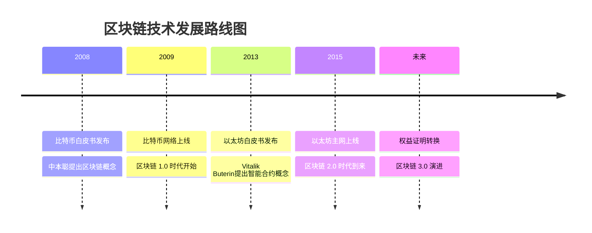

### 比特币与以太坊核心对比

| 特性 | 比特币 (BTC) | 以太坊 (ETH) |
|------|-------------|-------------|
| 发布时间 | 2009年 | 2015年 |
| 技术代际 | 区块链 1.0 | 区块链 2.0 |
| 主要用途 | 数字货币 | 智能合约平台 |
| 出块时间 | 10分钟 | 10几秒 |
| 共识机制 | 工作量证明 | 工作量证明 → 权益证明 |
| 货币符号 | BTC | ETH |
| 最小单位 | 1聪 | 1Wei |

## 以太坊的系统改进

以太坊在系统设计上，针对比特币运行过程中出现的一些问题进行了改进：

### 1. 出块时间优化

- **比特币**：出块时间为 10 分钟
- **以太坊**：出块时间大幅降低到 10 几秒

#### 出块时间对比可视化

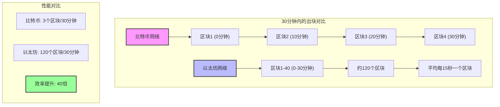

#### 出块时间效率对比

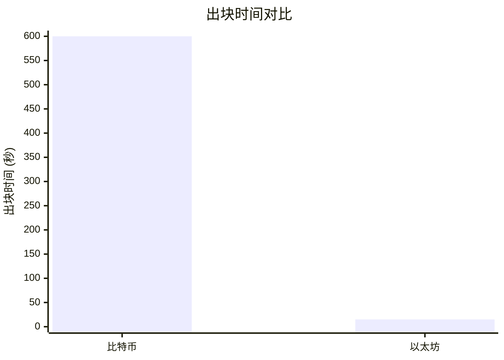

*注：图表清晰显示比特币10分钟 vs 以太坊15秒的巨大差异*

#### 性能提升对比

| 性能指标 | 比特币 | 以太坊 | 改进倍数 |
|---------|--------|--------|----------|
| 出块时间 | 10分钟 | 15秒 | 约40倍提升 |
| 交易吞吐量 | 3-7 TPS | 15-25 TPS | 约4倍提升 |
| 确认时间 | 60分钟 | 5分钟 | 约12倍提升 |

很多人觉得比特币的出块时间太长，影响了系统的 throughput，也影响了响应时间。为了适应这种新的出块时间，以太坊设计了一套基于 GHOST 协议的共识机制。

### 2. 挖矿算法改进

比特币的 mining puzzle 是计算密集型的，比拼的是计算哈希值的算力。这造成了挖矿设备专业化的结果：

- 很多年以前，用普通桌面机挖矿就已经无利可图
- 现在大家用的清一色都是 ASIC 芯片的矿机

#### 挖矿设备演进历程

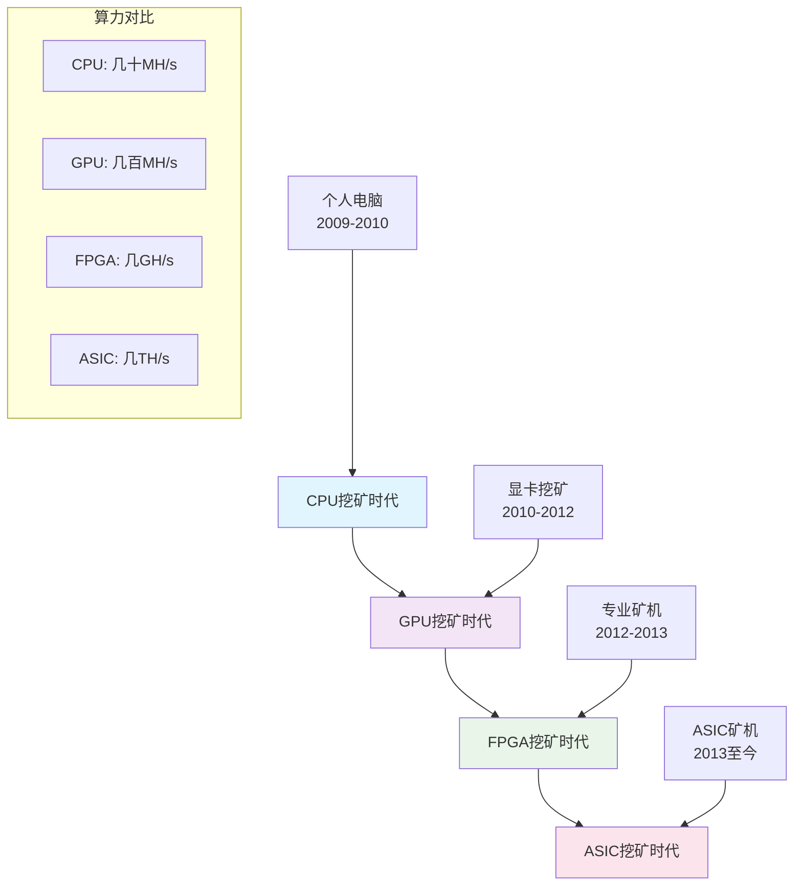

#### 挖矿算法对比分析

| 算法特征 | 比特币 SHA-256 | 以太坊 Ethash |
|---------|---------------|---------------|
| 算法类型 | 计算密集型 | 内存密集型 |
| 主要资源需求 | 算力（Hash/s） | 内存（Memory） |
| ASIC抗性 | 无 | 有 |
| 设备民主化 | 低 | 相对较高 |
| 专业化程度 | 极高 | 中等 |

很多人认为这种做法与当初区块链所宣扬的去中心化理念不符。

**以太坊的解决方案**：

以太坊设计的 mining puzzle 对内存的要求很高，叫做 **Memory Hard Mining Puzzle**。这样设计的目的是在一定程度上限制 ASIC 芯片的使用，我们管它叫做 **ASIC Resistance**。

#### ASIC抗性原理图

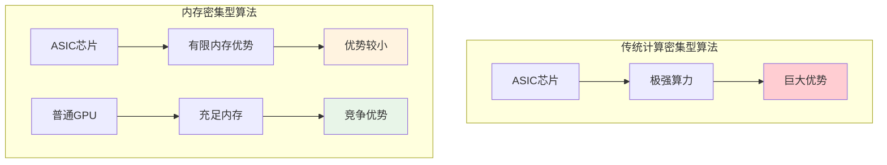

### 3. 未来的革命性改变

将来以太坊还有更加革命性的改变——用权益证明（Proof of Stake）替代工作量证明（Proof of Work）。

#### 共识机制演进路线图

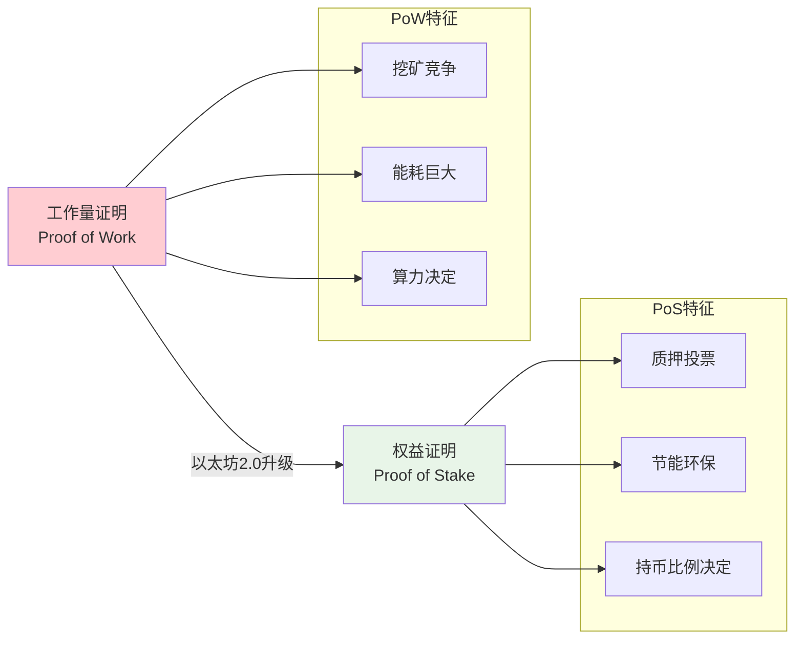

#### 共识机制对比

| 特征 | 工作量证明 (PoW) | 权益证明 (PoS) |
|------|------------------|----------------|
| 选择机制 | 算力竞争 | 质押投票 |
| 能源消耗 | 极高 | 极低 |
| 硬件要求 | 专业矿机 | 普通服务器 |
| 准入门槛 | 硬件投资 | 代币质押 |
| 安全模型 | 经济激励 | 经济激励 + 惩罚 |

- **Proof of Work**：工作量证明，通俗来说就是挖矿。为了发布区块，你需要做很多工作
- **Proof of Stake**：权益证明，不再挖矿，而是按照类似股份投票的方法决定下一个区块如何产生

## 智能合约的引入

除了系统设计的改变，以太坊还增加了一个重要功能：对智能合约（Smart Contract）的支持。

### 什么是智能合约？

比特币实现的是一种去中心化的货币。比特币成功后，很多人思考一个问题：

> **If we can decentralize currency, what else can we decentralize?**  
> 如果货币可以去中心化，还有什么可以去中心化？

#### 去中心化演进过程

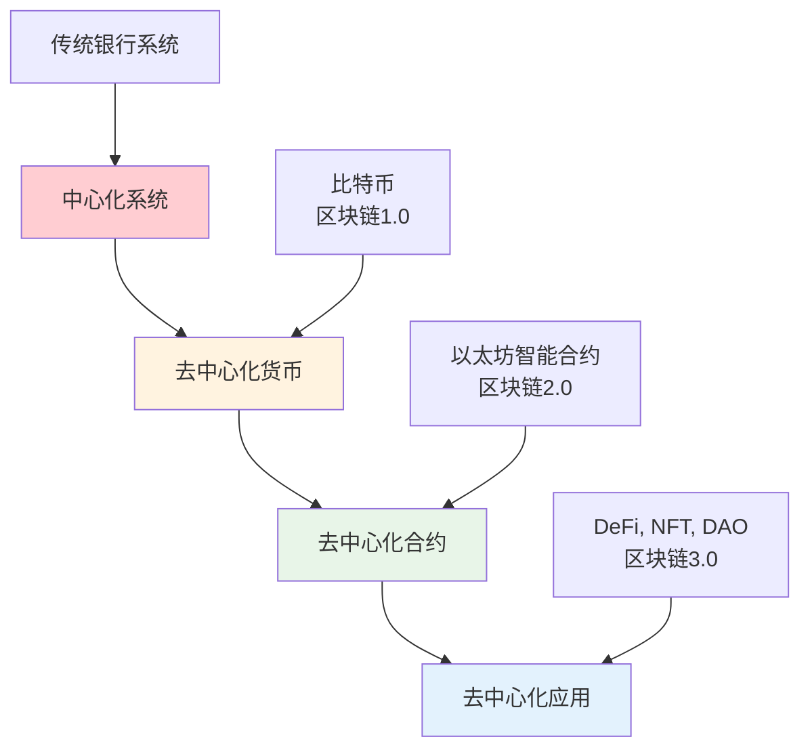

以太坊的特性就是增加了去中心化合约的支持。

### 货币符号和计量单位

#### 货币体系对比

| 项目 | 比特币 | 以太坊 |
|------|--------|--------|
| 货币符号 | BTC | ETH |
| 货币名称 | 比特币 | 以太/以太币 |
| 最小单位 | 1 聪 (Satoshi) | 1 Wei |
| 单位换算 | 1 BTC = 10⁸ 聪 | 1 ETH = 10¹⁸ Wei |
| 纪念人物 | 中本聪 | Wei Dai |

- **比特币**：符号为 BTC，最小单位为 1 聪（为纪念中本聪）
- **以太坊**：符号为 ETH，货币通常称为「以太」或「以太币」，最小单位为 1 Wei（人名）

#### 以太坊货币单位层次结构

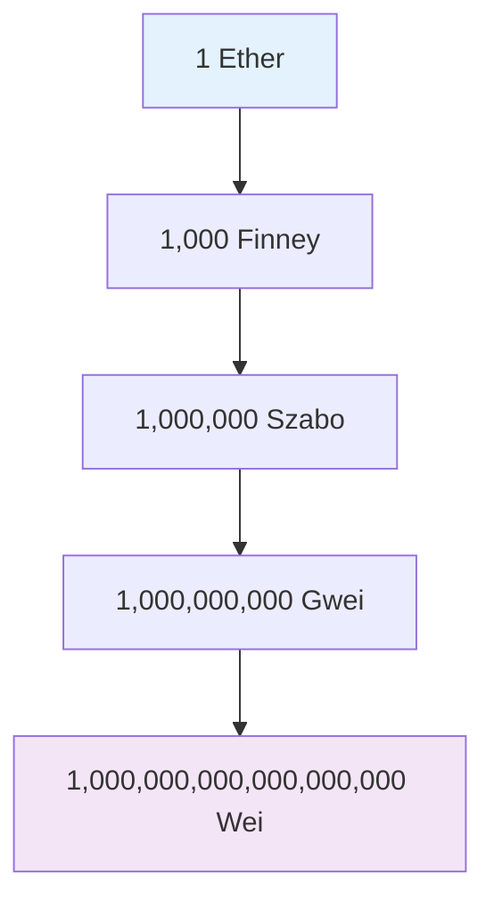

## 去中心化合约的原理

### 传统合约体系

现实社会中，合约的有效性通过司法手段和政府来维护：

#### 传统合约执行流程

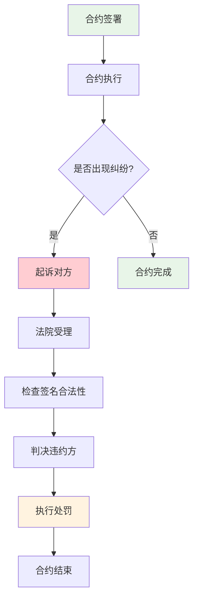

1. 签署合同
2. 出现纠纷时通过打官司、法院判决
3. 法院检查合同签名的合法性
4. 确定违约方和处罚方式

### 智能合约的技术替代

智能合约的设计目的是用技术手段替代司法手段：

#### 智能合约执行流程

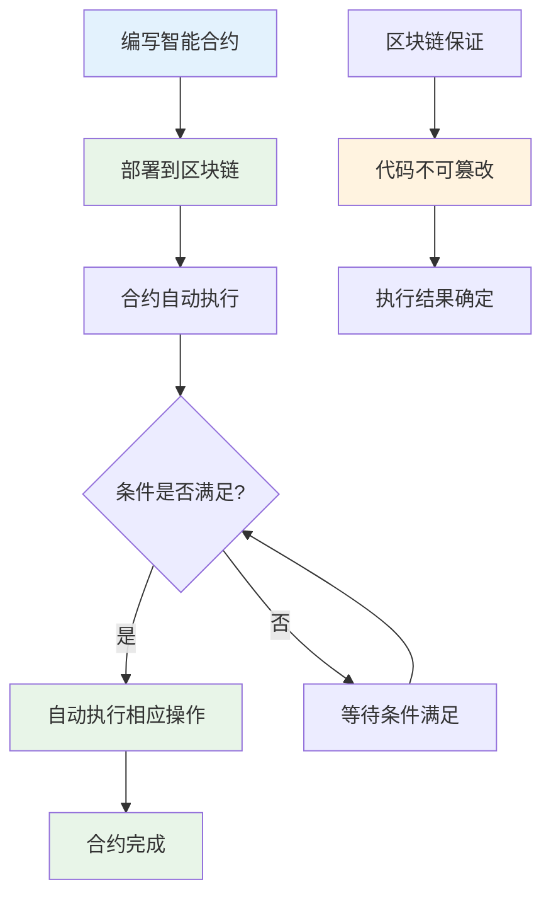

#### 传统合约 vs 智能合约对比

| 特征 | 传统合约 | 智能合约 |
|------|----------|----------|
| 执行方式 | 人工执行 | 自动执行 |
| 争议解决 | 司法仲裁 | 代码逻辑 |
| 信任基础 | 法律系统 | 区块链技术 |
| 执行成本 | 高（律师费、时间成本） | 低（Gas费） |
| 执行速度 | 慢（可能需要数月） | 快（几分钟到几小时） |
| 适用范围 | 所有合约 | 可编程合约 |

- 如果合同内容可以通过程序代码实现，就将代码放到区块链上
- 通过区块链的不可篡改性保证代码的正确运行
- 当然，不是所有合同内容都可以用编程语言实现，也不是所有合同条款都可以量化
- 但逻辑简单、清晰的合同可以写成智能合约形式

## 去中心化合约的应用场景

### 1. 跨国场景

**类比去中心化货币的优势**：
- 跨国转账：从美国转账到埃及，用法币很麻烦（时间长、手续多、费用高）
- 用比特币转账相对更快捷

#### 跨国合约场景对比

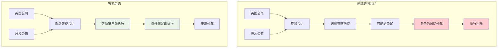

**智能合约的类似应用**：
- 合同签署方来自世界各地，没有统一的司法管辖权
- 例如：网上众筹项目，参与方遍布全球，彼此不认识
- 通过预先编写的程序代码保证每个人只能按规则执行

#### 众筹智能合约示例

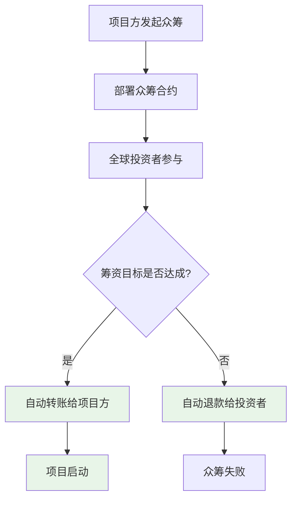

### 2. 本地场景的优势

即使合同参与方在同一司法管辖权下，通过司法手段维护合同执行也是费时费力的过程：

#### 传统合约纠纷解决流程分析

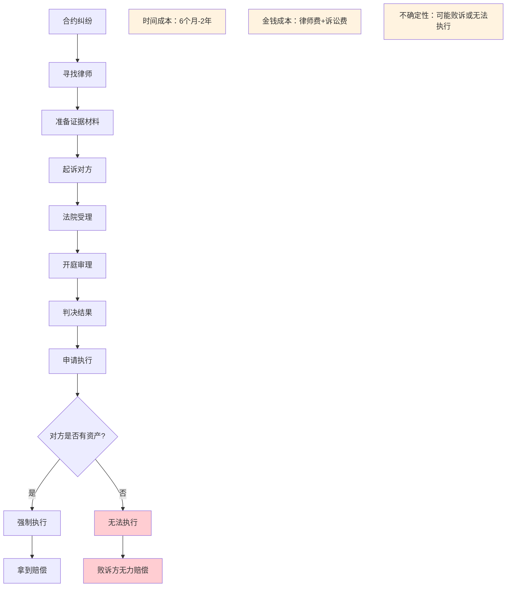

- 打官司需要大量时间和精力
- 即使官司胜诉，也不一定能拿到钱
- 需要申请冻结对方资产、申请强制执行等

#### 智能合约优势总结

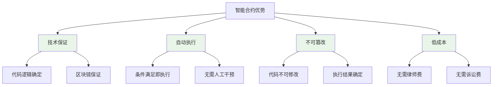

**智能合约的优势**：
- 用技术手段保证合同参与方从一开始就不可能违约
- 代码一旦发布到区块链上，区块链的不可篡改性确保谁也改不了代码
- 包括代码作者自己也无法修改
- 保证大家只能按照代码中制定的规则执行

## 后续将了解一下内容：

### 学习路线图

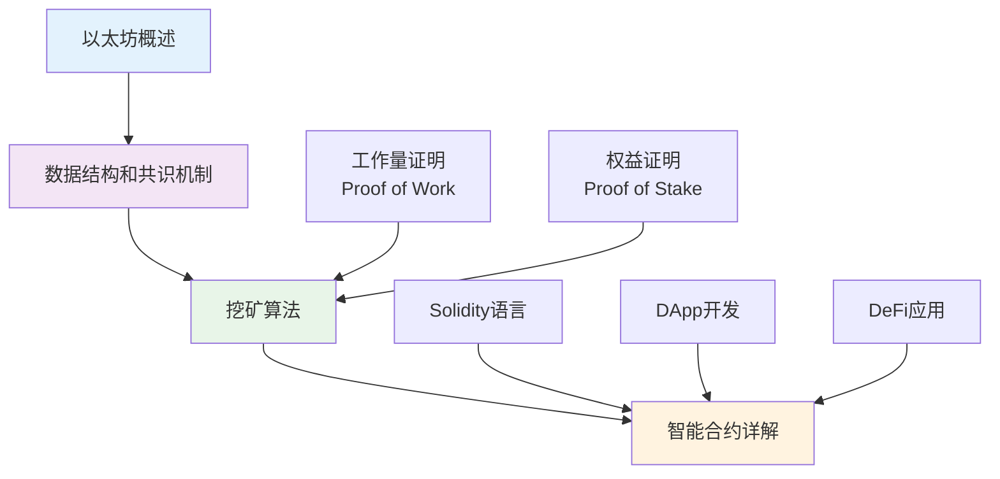

1. **以太坊的数据结构和共识机制**
2. **挖矿算法**
   - 现在使用的工作量证明（Proof of Work）
   - 未来将使用的权益证明（Proof of Stake）
3. **智能合约详解**