**15-ETH-账户优化版 (Av37065233, P15.2)**

## 以太坊账户模式概述

首先我们讲一下以太坊系统中采用的账户模式。

### 账户模式核心对比

| 特征 | 比特币 | 以太坊 |
|------|--------|--------|
| 账户模式 | 基于交易的账本 | 基于账户的模型 |
| 余额记录 | 通过UTXO推算 | 直接记录账户余额 |
| 转账复杂度 | 需要说明币的来源 | 只需检查余额是否足够 |
| 使用体验 | 复杂，需要管理UTXO | 简单，类似银行账户 |
| 隐私保护 | 较好 | 一般 |

### 比特币的交易模式

比特币中使用的是基于交易的账本（Transaction-based Ledger）。这种模式下：

- 系统中并没有显式记录每个账户上有多少钱
- 需要根据 UTXO 里的信息推算余额
- 想知道某人总资产，需要计算其所有账户（有私钥的账户）在 UTXO 里的总数

#### 比特币UTXO模式示意图

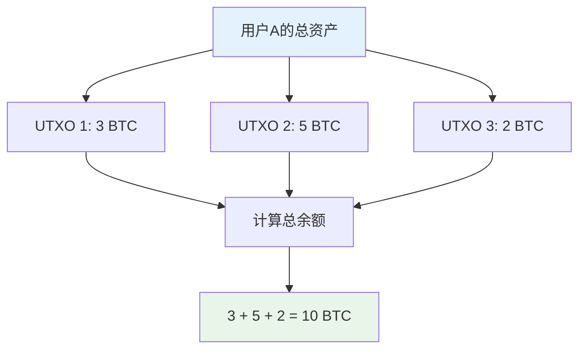

**优点**：
- 隐私保护比较好
- 你有多少钱可能连你自己都说不清楚，别人就更搞不明白了

**缺点**：
- 使用上比较别扭，与日常体验不太一样
- 转账时需要说明币的来源
- 必须一次性花完所有收到的币

### 比特币转账的复杂性

#### 比特币转账流程图

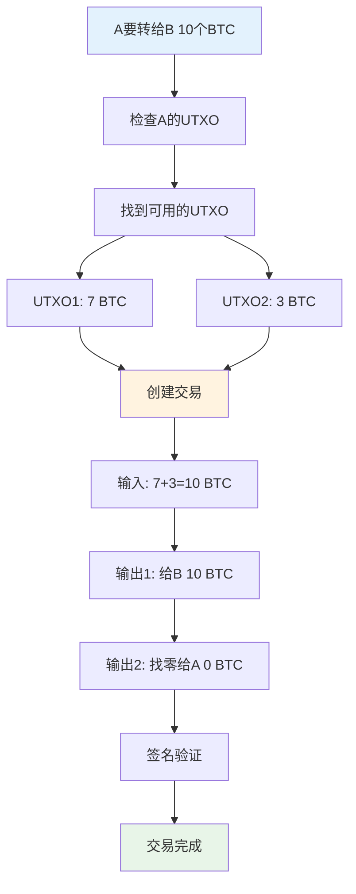

**转账过程**：
- A 要转给 B 10 个比特币
- A 需要说明这 10 个币的来源：
  - 7 个比特币来自前面某个交易
  - 3 个比特币来自之前另一个交易
- 证明交易中币来源的合法性

#### 银行 vs 比特币转账对比

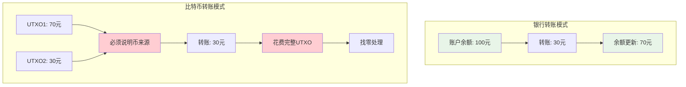

**与银行体验的差异**：
- **银行**：存钱时需要说明来源，花钱时不用说明每笔钱的来源
- **比特币**：每次花钱都要说明来源

**强制性全额花费**：
- 收到的币必须一次性全部花出去
- 不能只花一部分
- 例如：B 收到 10 个比特币，要转给 C 3 个比特币
- 必须把剩下的 7 个比特币转回给自己的另一个地址
- 否则剩余的币会被当作矿工费

## 以太坊的账户模式

以太坊系统采用的是基于账户的模型（Account-based Model）。

### 账户模式的特点

这种模型与日常银行账户比较相似：

- 系统中显式记录每个账户上有多少个以太币
- 转账时只需检查发送方账户余额是否足够
- 不需要说明具体转移哪些币
- 不需要说明币的来源
- 支持部分金额转账

#### 以太坊账户模式示意图

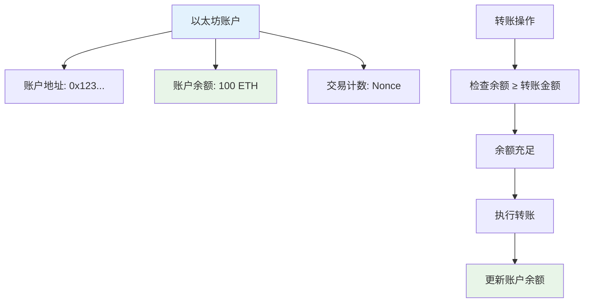

### 转账示例

#### 以太坊转账流程对比

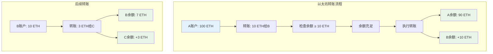

**以太坊转账过程**：
- A 转给 B 10 个以太币
- 系统检查 A 账户余额（假设有 100 个以太币）
- 转账合法，执行转账
- 不需要说明这 100 个以太币中具体转移了哪 10 个
- B 转给 C 3 个以太币时，剩余 7 个以太币直接保留在 B 账户中

## 账户模式的优势

### 1. 天然防御双花攻击

以太坊这种基于账户的模式对于双花攻击（Double Spending Attack）有天然的防御作用：

#### 双花攻击防御机制

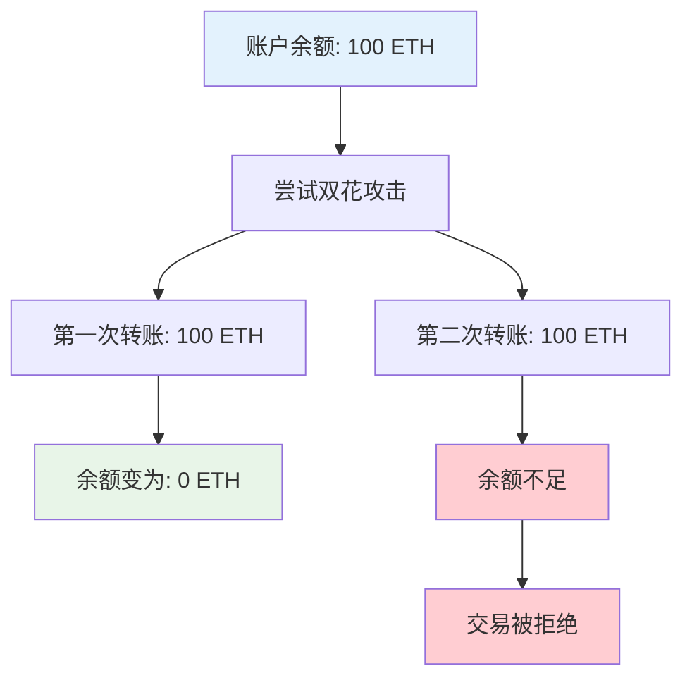

- 不需要管币的来源
- 每花一次钱就从账户余额中扣除
- 双花攻击时，系统会扣除两次余额
- 余额不足时自动阻止交易

### 2. 使用体验更自然

#### 用户体验对比

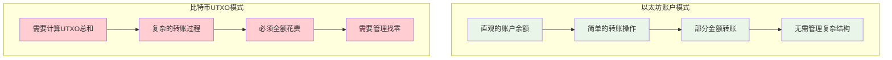

- 符合日常银行使用习惯
- 支持部分金额转账
- 无需管理复杂的 UTXO
- 余额概念清晰明确

## 账户模式的安全问题

### 重放攻击（Replay Attack）

虽然账户模式对双花攻击有天然防御，但会面临重放攻击：

#### 重放攻击流程图

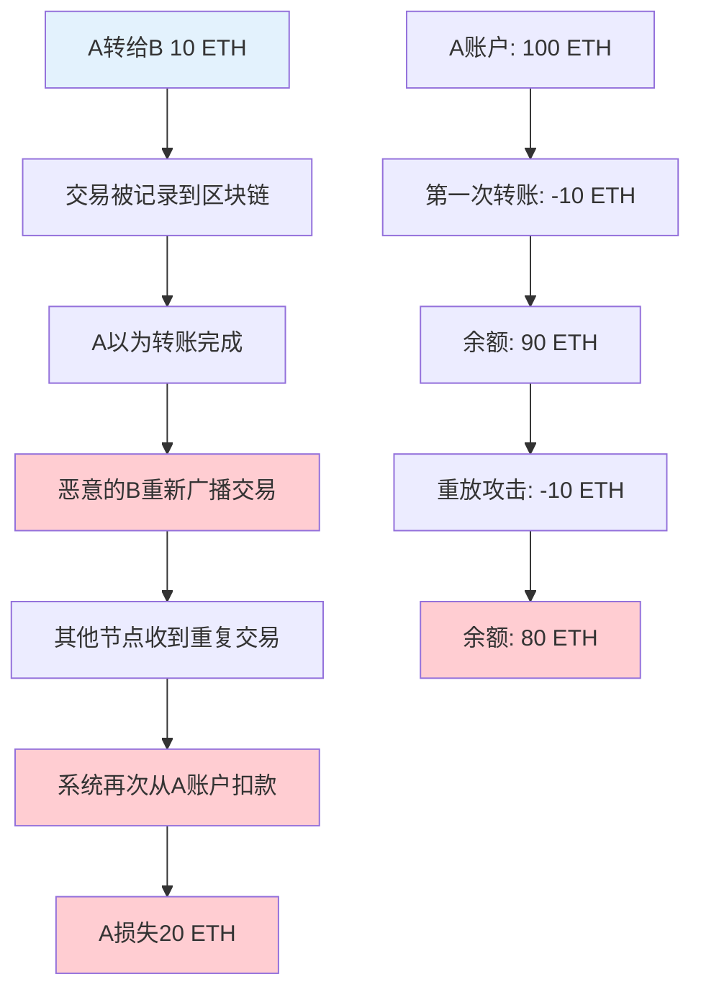

**攻击过程**：
1. A 转给 B 10 个以太币
2. 交易被写入区块链，A 以为转账完成
3. 恶意的 B 把这个交易重新广播一遍
4. 其他节点以为这是新的转账，再次从 A 账户扣款

**为什么比特币没有这个问题**：
- 比特币中重放攻击等同于明显的双花攻击
- 系统会自动拒绝重复的交易

### 防范重放攻击的方案

**解决方案**：添加交易计数器（Nonce）

#### Nonce防护机制图

```mermaid
graph TD
    subgraph "正常交易流程"
        A1[A账户 Nonce: 20]
        A2[创建交易 Nonce: 21]
        A3[签名交易]
        A4[广播交易]
        A5[节点验证 Nonce]
        A6[执行交易]
        A7[A账户 Nonce: 21]
        
        A1 --> A2 --> A3 --> A4 --> A5 --> A6 --> A7
    end
    
    subgraph "重放攻击防护"
        B1[恶意重播交易]
        B2[节点检查 Nonce: 21]
        B3[发现 Nonce 已使用]
        B4[拒绝执行交易]
        
        B1 --> B2 --> B3 --> B4
    end
    
    style A6 fill:#e8f5e8
    style A7 fill:#e8f5e8
    style B3 fill:#ffcdd2
    style B4 fill:#ffcdd2
```

**实现机制**：
- 每个账户维护一个计数器，记录历史交易次数
- 交易时将当前计数器值包含在交易内容中
- 整个内容受到发送方签名保护
- 系统节点同时维护每个账户的计数器状态

#### 交易结构示例

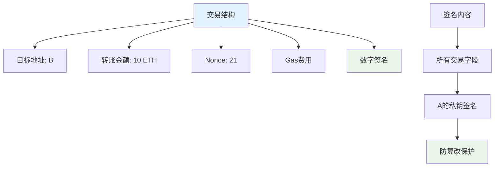

**具体示例**：
```
A 转给 B 10 个以太币
A 账户历史交易次数：20
当前交易序号：21
交易内容：{ to: B, amount: 10 ETH, nonce: 21 }
签名：由 A 的私钥签名
```

**防护机制**：
- 节点收到交易后检查 nonce 值
- 如果 nonce 值已经被使用过，拒绝执行
- 每执行一个交易，对应账户的 nonce 值加 1
- 重放攻击时，系统发现 nonce 值重复，自动拒绝

## 以太坊的两类账户

### 账户类型总览

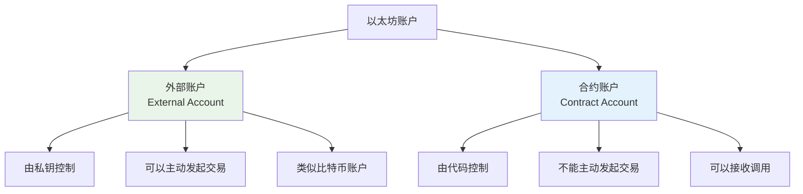

### 1. 外部账户（External Account）

**特征**：
- 类似于比特币中的账户
- 通过公私钥对控制
- 谁有私钥就掌握账户控制权
- 也称为普通账户

#### 外部账户状态结构

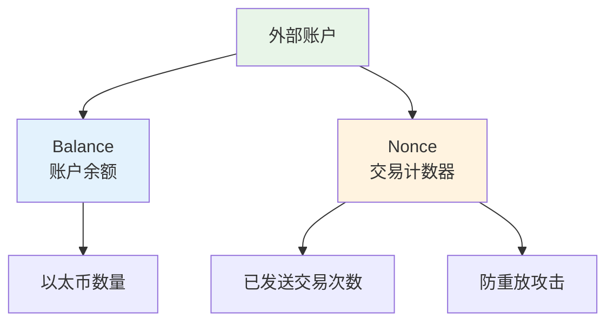

**账户状态**：
- **Balance**：账户余额
- **Nonce**：交易计数器（注意：这与挖矿时的 nonce 不同）
  - 挖矿的 nonce 是随机数
  - 这里的 nonce 是计数器，也可称为 Counter 或 Sequence Number

### 2. 合约账户（Contract Account）

**特征**：
- 不通过公私钥对控制
- 没有私钥概念
- 通过合约代码控制

#### 合约账户状态结构

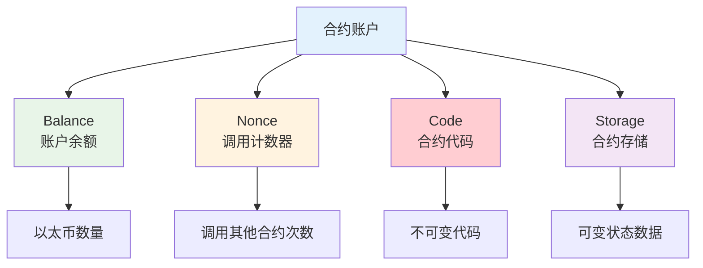

**账户状态**：
- **Balance**：账户余额
- **Nonce**：调用计数器（合约可以调用其他合约）
- **Code**：合约代码（不可变）
- **Storage**：合约存储（可变，包含各变量的取值）

#### 合约调用流程

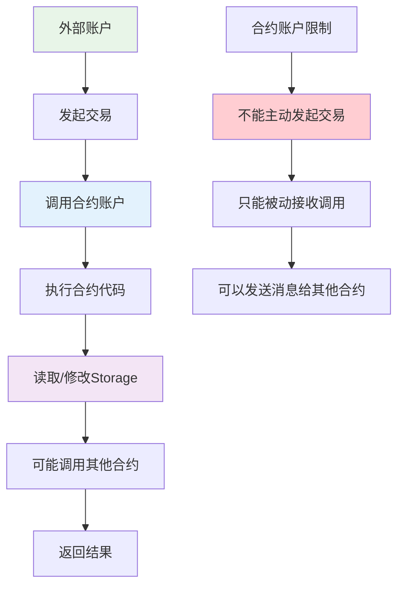

**使用限制**：
- 合约账户不能主动发起交易
- 所有交易只能由外部账户发起
- 合约账户可以发送消息（Message）调用其他合约
- 合约被调用时，状态（Storage）会发生变化，但代码不变

**合约调用机制**：
- 创建合约时会返回一个地址
- 知道合约地址就可以调用该合约
- 调用过程中状态会变化，代码保持不变

## 为什么选择账户模式？

### 设计考虑

以太坊创始人 Vitalik（创建时 19 岁）在设计时面临选择：

#### 设计方案权衡

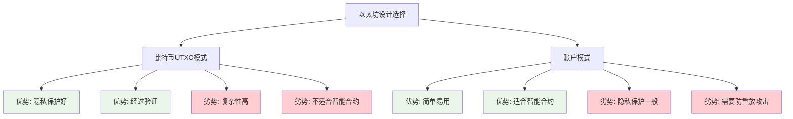

**可选方案**：
- 沿用比特币的基于交易的账户模型
- 创建新的基于账户的模型

**比特币模型的优势**：
- 隐私保护较好
- 每次交易可以换新账户（打一枪换一个地方）

### 智能合约的需求

**以太坊的核心功能**：支持智能合约

#### 智能合约身份需求分析

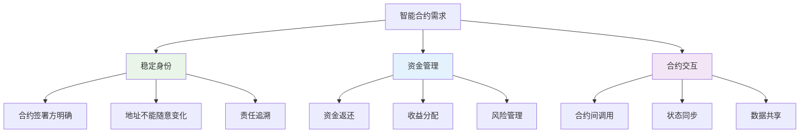

**智能合约的要求**：
- 参与者需要有比较稳定的身份
- 类似于现实生活中的合同签署

**身份稳定性的重要性**：
- 签合同时需要确定的身份
- 签完合同后不能随意改变身份
- 需要明确合同的签署方
- 出现纠纷时需要找到责任方

### 实际应用场景

#### 金融衍生品应用示例

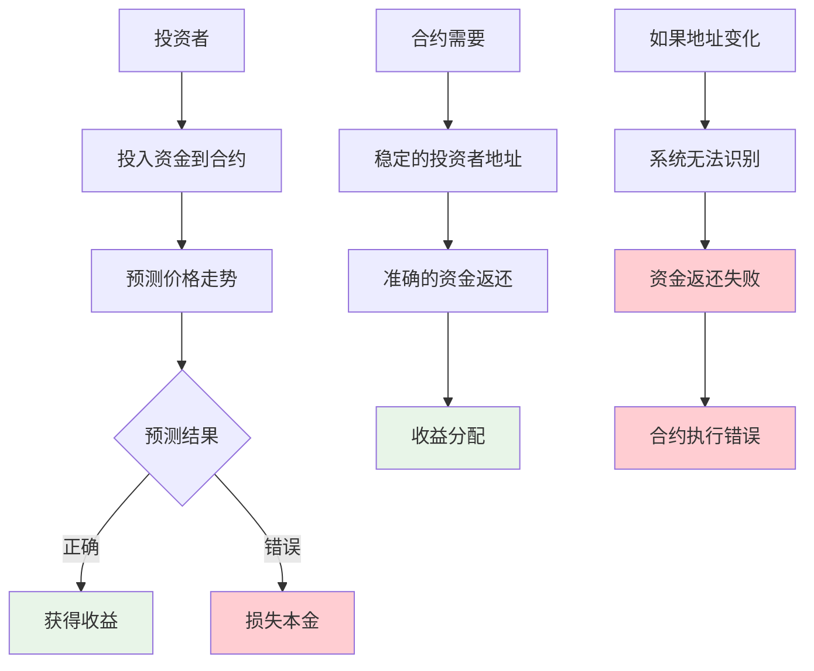

**金融衍生品（Financial Derivatives）**：
- 期权、期货等金融产品
- 向合约投入资金，预测价格走势
- 预测正确时获得收益
- 需要稳定的账户地址来返还资金

**问题场景**：
- 如果投资账户在投资后地址发生变化
- 系统无法确定如何返还资金
- 合约账户地址变化问题更加严重

## 总结

从目前情况看，以太坊选择基于账户的模型是比较合适的决策：

### 设计决策总结

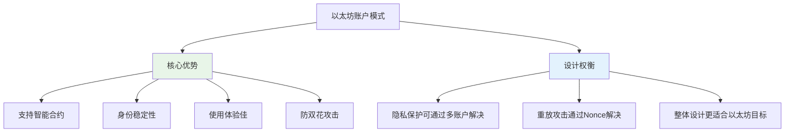

**设计原则**：
- 账户保持稳定性（个人账户和合约账户）
- 支持智能合约的稳定身份需求
- 兼顾隐私保护（可创建多个账户）

**灵活性**：
- 如有隐私保护需求，可创建多个账户
- 根据不同情况使用不同账户进行交易