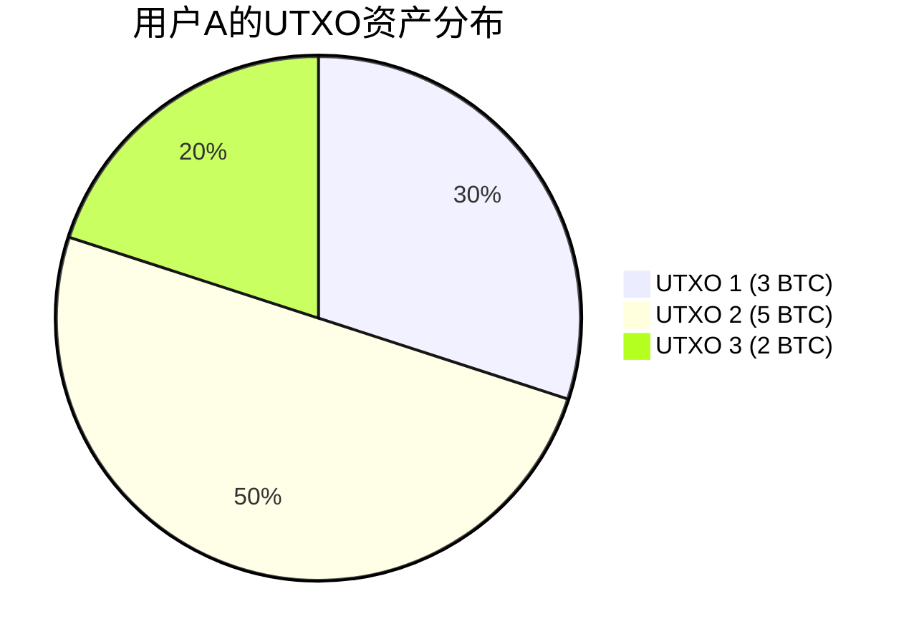
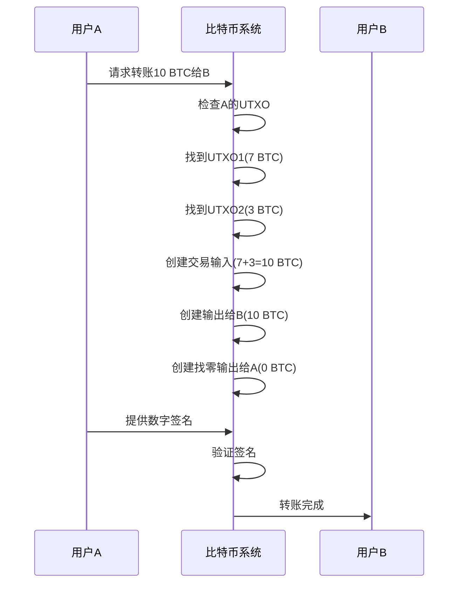
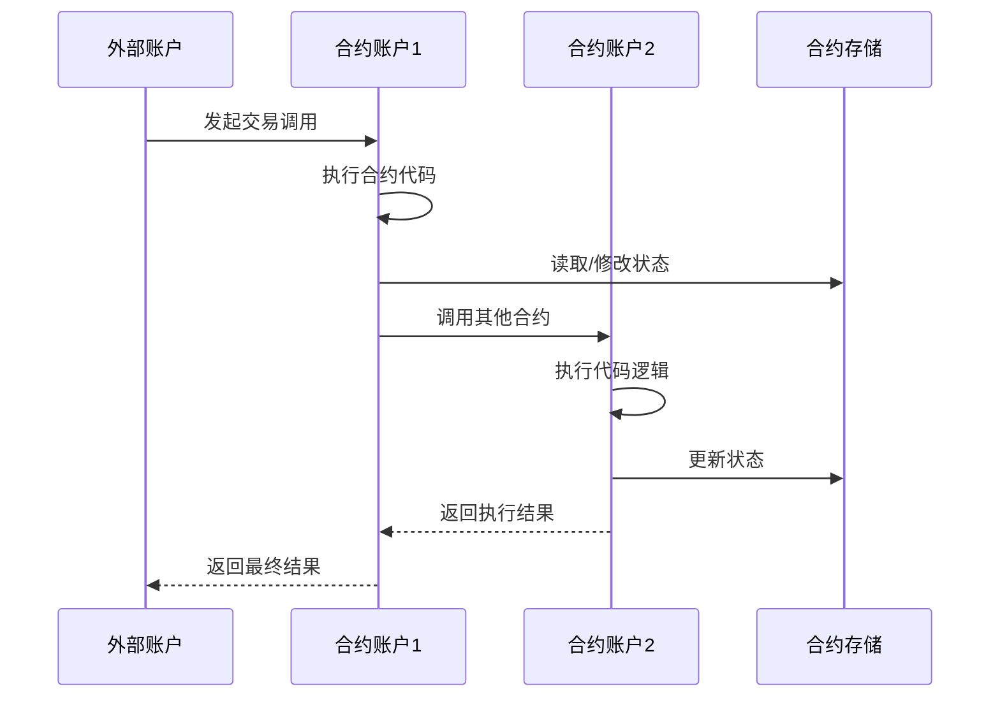
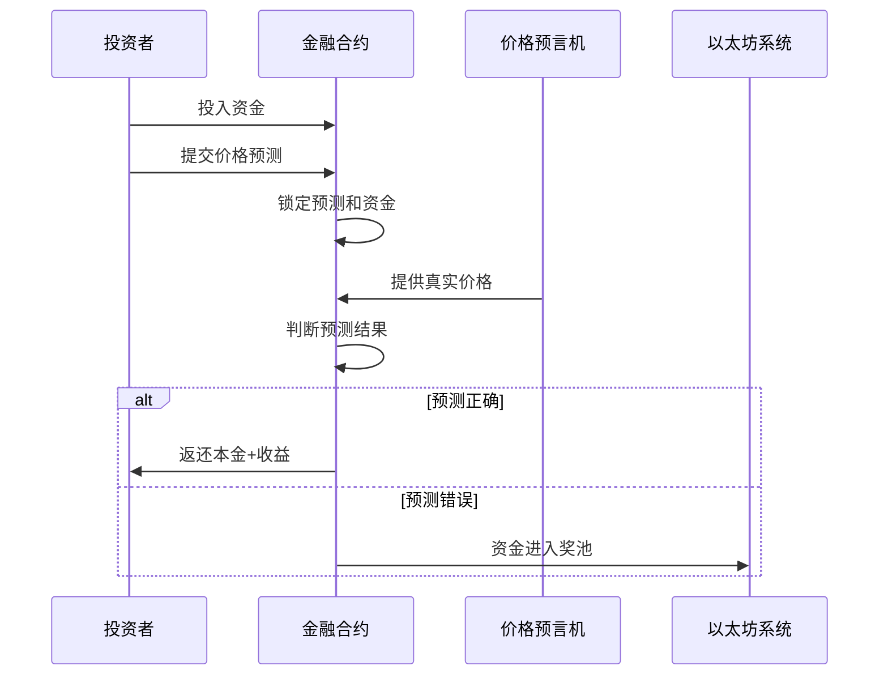

**15-ETH-账户优化版 (Av37065233, P15.2)**

## 以太坊账户模式概述

首先我们讲一下以太坊系统中采用的账户模式。

### 账户模式核心对比

| 特征 | 比特币 | 以太坊 |
|------|--------|--------|
| 账户模式 | 基于交易的账本 | 基于账户的模型 |
| 余额记录 | 通过UTXO推算 | 直接记录账户余额 |
| 转账复杂度 | 需要说明币的来源 | 只需检查余额是否足够 |
| 使用体验 | 复杂，需要管理UTXO | 简单，类似银行账户 |
| 隐私保护 | 较好 | 一般 |

### 比特币的交易模式

比特币中使用的是基于交易的账本（Transaction-based Ledger）。这种模式下：

- 系统中并没有显式记录每个账户上有多少钱
- 需要根据 UTXO 里的信息推算余额
- 想知道某人总资产，需要计算其所有账户（有私钥的账户）在 UTXO 里的总数

#### 比特币UTXO模式示意图



**UTXO资产统计**：
- UTXO 1: 3 BTC (30%)
- UTXO 2: 5 BTC (50%) 
- UTXO 3: 2 BTC (20%)
- **总计余额**: 10 BTC

**优点**：
- 隐私保护比较好
- 你有多少钱可能连你自己都说不清楚，别人就更搞不明白了

**缺点**：
- 使用上比较别扭，与日常体验不太一样
- 转账时需要说明币的来源
- 必须一次性花完所有收到的币

### 比特币转账的复杂性

#### 比特币转账时序流程



**转账过程**：
- A 要转给 B 10 个比特币
- A 需要说明这 10 个币的来源：
  - 7 个比特币来自前面某个交易
  - 3 个比特币来自之前另一个交易
- 证明交易中币来源的合法性

#### 银行 vs 比特币转账体验对比

| 对比维度 | 银行转账 | 比特币转账 | 复杂度评级 |
|----------|----------|------------|------------|
| **余额查询** | 直接显示余额 | 需计算UTXO总和 | 简单 vs 复杂 |
| **转账过程** | 直接扣减余额 | 说明币的来源 | 简单 vs 复杂 |
| **部分转账** | 支持任意金额 | 必须全额花费 | 灵活 vs 受限 |
| **找零处理** | 无需找零 | 必须处理找零 | 简单 vs 复杂 |
| **来源追踪** | 存钱时需说明 | 花钱时需说明 | 入口控制 vs 出口控制 |
| **用户习惯** | 符合日常习惯 | 违背日常习惯 | 熟悉 vs 陌生 |

## 以太坊的账户模式

以太坊系统采用的是基于账户的模型（Account-based Model）。

### 账户模式的特点

这种模型与日常银行账户比较相似：

- 系统中显式记录每个账户上有多少个以太币
- 转账时只需检查发送方账户余额是否足够
- 不需要说明具体转移哪些币
- 不需要说明币的来源
- 支持部分金额转账

#### 以太坊账户基本架构

| 账户组件 | 功能说明 | 数据类型 | 特点 |
|----------|----------|----------|------|
| **账户地址** | 唯一标识符 | 0x123... | 永久固定 |
| **账户余额** | 持有以太币数量 | 100 ETH | 动态变化 |
| **交易计数** | Nonce值 | 整数 | 防重放攻击 |
| **状态管理** | 余额直接记录 | 实时更新 | 简单直观 |

### 转账示例

#### 以太坊转账操作步骤表

| 步骤 | 操作 | 检查条件 | 结果状态 |
|------|------|----------|----------|
| **1** | A发起转账请求 | A余额: 100 ETH | 请求待处理 |
| **2** | 系统检查余额 | 余额 ≥ 10 ETH? | 检查通过 ✓ |
| **3** | 执行转账操作 | 扣减A账户余额 | A: 90 ETH |
| **4** | 增加接收方余额 | 增加B账户余额 | B: +10 ETH |
| **5** | 完成转账 | 更新系统状态 | 转账完成 ✓ |

**后续转账示例**：
- B账户收到10 ETH后
- B转给C 3 ETH
- B余额自动保留7 ETH
- 无需处理找零

## 账户模式的优势

### 1. 天然防御双花攻击

以太坊这种基于账户的模式对于双花攻击（Double Spending Attack）有天然的防御作用：

#### 双花攻击防御逻辑表

| 攻击场景 | 系统响应 | 防御结果 | 防御机制 |
|----------|----------|----------|----------|
| **初始状态** | 账户余额: 100 ETH | 正常状态 | 余额记录 |
| **第一次转账** | 转账100 ETH | 余额: 0 ETH | 自动扣减 |
| **尝试二次转账** | 再转100 ETH | 余额不足 | 自动拒绝 |
| **攻击被阻止** | 交易无法执行 | 双花失败 | 天然防护 |

- 不需要管币的来源
- 每花一次钱就从账户余额中扣除
- 双花攻击时，系统会扣除两次余额
- 余额不足时自动阻止交易

### 2. 使用体验更自然

#### 用户体验评分对比表

| 体验维度 | 以太坊账户模式 | 比特币UTXO模式 | 体验优势 |
|----------|----------------|----------------|----------|
| **直观性** | ⭐⭐⭐⭐⭐ 直观余额显示 | ⭐⭐☆☆☆ 需计算UTXO | 以太坊领先 |
| **简单性** | ⭐⭐⭐⭐⭐ 简单转账操作 | ⭐⭐☆☆☆ 复杂转账过程 | 以太坊领先 |
| **灵活性** | ⭐⭐⭐⭐⭐ 支持部分转账 | ⭐⭐☆☆☆ 必须全额花费 | 以太坊领先 |
| **管理性** | ⭐⭐⭐⭐⭐ 无需管理复杂结构 | ⭐⭐☆☆☆ 需要管理UTXO | 以太坊领先 |
| **习惯性** | ⭐⭐⭐⭐⭐ 符合银行习惯 | ⭐⭐☆☆☆ 违背日常习惯 | 以太坊领先 |
| **隐私性** | ⭐⭐⭐☆☆ 地址可追踪 | ⭐⭐⭐⭐☆ 更好隐私 | 比特币领先 |

## 账户模式的安全问题

### 重放攻击（Replay Attack）

虽然账户模式对双花攻击有天然防御，但会面临重放攻击：

#### 重放攻击时间线分析

```mermaid
gantt
    title 重放攻击发生时间线
    dateFormat HH:mm
    axisFormat %H:%M
    
    section 正常流程
    A发起转账          :done, normal1, 09:00, 09:01
    交易写入区块链      :done, normal2, 09:01, 09:02
    A认为转账完成      :done, normal3, 09:02, 09:03
    
    section 攻击流程
    B重新广播交易      :active, attack1, 09:05, 09:06
    其他节点收到       :attack2, 09:06, 09:07
    系统再次扣款       :crit, attack3, 09:07, 09:08
    A损失翻倍         :crit, attack4, 09:08, 09:09
```



**攻击过程**：
1. A 转给 B 10 个以太币
2. 交易被写入区块链，A 以为转账完成
3. 恶意的 B 把这个交易重新广播一遍
4. 其他节点以为这是新的转账，再次从 A 账户扣款

**为什么比特币没有这个问题**：
- 比特币中重放攻击等同于明显的双花攻击
- 系统会自动拒绝重复的交易

### 防范重放攻击的方案

**解决方案**：添加交易计数器（Nonce）

#### Nonce防护状态表

| Nonce状态 | 系统行为 | 安全级别 | 攻击结果 |
|-----------|----------|----------|----------|
| **Nonce: 20** | 接受新交易 | 🟢 安全 | 正常执行 |
| **Nonce: 21** | 创建新交易 | 🟢 安全 | 签名保护 |
| **重放Nonce: 21** | 检测重复使用 | 🔴 危险 | 自动拒绝 |
| **Nonce: 22** | 等待下个交易 | 🟢 安全 | 防护生效 |

**实现机制**：
- 每个账户维护一个计数器，记录历史交易次数
- 交易时将当前计数器值包含在交易内容中
- 整个内容受到发送方签名保护
- 系统节点同时维护每个账户的计数器状态

#### 交易数据结构表

| 字段名称 | 数据内容 | 数据类型 | 安全作用 |
|----------|----------|----------|----------|
| **目标地址** | B账户地址 | Address | 接收方标识 |
| **转账金额** | 10 ETH | uint256 | 转账数量 |
| **Nonce值** | 21 | uint256 | 防重放核心 |
| **Gas费用** | 21000 | uint256 | 手续费 |
| **数字签名** | 签名数据 | bytes | 防篡改保护 |

**具体示例**：
```
A 转给 B 10 个以太币
A 账户历史交易次数：20
当前交易序号：21
交易内容：{ to: B, amount: 10 ETH, nonce: 21 }
签名：由 A 的私钥签名
```

**防护机制**：
- 节点收到交易后检查 nonce 值
- 如果 nonce 值已经被使用过，拒绝执行
- 每执行一个交易，对应账户的 nonce 值加 1
- 重放攻击时，系统发现 nonce 值重复，自动拒绝

## 以太坊的两类账户

### 账户类型分类表

| 账户特征 | 外部账户(EOA) | 合约账户(CA) |
|----------|---------------|--------------|
| **英文名称** | External Account | Contract Account |
| **控制方式** | 私钥控制 | 代码控制 |
| **主动能力** | 可主动发起交易 | 不能主动发起交易 |
| **相似性** | 类似比特币账户 | 智能合约载体 |
| **私钥** | 有私钥 | 无私钥 |
| **调用方式** | 签名授权 | 代码执行 |

### 1. 外部账户（External Account）

**特征**：
- 类似于比特币中的账户
- 通过公私钥对控制
- 谁有私钥就掌握账户控制权
- 也称为普通账户

#### 外部账户状态属性表

| 状态属性 | 数据说明 | 存储内容 | 功能作用 |
|----------|----------|----------|----------|
| **Balance** | 账户余额 | 以太币数量 | 资产记录 |
| **Nonce** | 交易计数器 | 已发送交易次数 | 防重放攻击 |

**账户状态说明**：
- **Balance**：账户余额
- **Nonce**：交易计数器（注意：这与挖矿时的 nonce 不同）
  - 挖矿的 nonce 是随机数
  - 这里的 nonce 是计数器，也可称为 Counter 或 Sequence Number

### 2. 合约账户（Contract Account）

**特征**：
- 不通过公私钥对控制
- 没有私钥概念
- 通过合约代码控制

#### 合约账户状态属性表

| 状态属性 | 数据说明 | 存储内容 | 可变性 |
|----------|----------|----------|--------|
| **Balance** | 账户余额 | 以太币数量 | 可变 |
| **Nonce** | 调用计数器 | 调用其他合约次数 | 可变 |
| **Code** | 合约代码 | 智能合约字节码 | 不可变 |
| **Storage** | 合约存储 | 状态变量数据 | 可变 |

**账户状态说明**：
- **Balance**：账户余额
- **Nonce**：调用计数器（合约可以调用其他合约）
- **Code**：合约代码（不可变）
- **Storage**：合约存储（可变，包含各变量的取值）

#### 合约调用时序图



**使用限制**：
- 合约账户不能主动发起交易
- 所有交易只能由外部账户发起
- 合约账户可以发送消息（Message）调用其他合约
- 合约被调用时，状态（Storage）会发生变化，但代码不变

**合约调用机制**：
- 创建合约时会返回一个地址
- 知道合约地址就可以调用该合约
- 调用过程中状态会变化，代码保持不变

## 为什么选择账户模式？

### 设计考虑

以太坊创始人 Vitalik（创建时 19 岁）在设计时面临选择：

#### 设计方案SWOT分析

**比特币UTXO模式**
| 优势(Strengths) | 劣势(Weaknesses) |
|-----------------|------------------|
| ✅ 隐私保护好 | ❌ 复杂性高 |
| ✅ 经过验证 | ❌ 不适合智能合约 |

**以太坊账户模式**
| 优势(Strengths) | 劣势(Weaknesses) |
|-----------------|------------------|
| ✅ 简单易用 | ❌ 隐私保护一般 |
| ✅ 适合智能合约 | ❌ 需要防重放攻击 |

**可选方案**：
- 沿用比特币的基于交易的账户模型
- 创建新的基于账户的模型

**比特币模型的优势**：
- 隐私保护较好
- 每次交易可以换新账户（打一枪换一个地方）

### 智能合约的需求

**以太坊的核心功能**：支持智能合约

#### 智能合约身份需求分析表

| 需求类别 | 具体要求 | 重要性 | UTXO适配性 | 账户适配性 |
|----------|----------|--------|------------|------------|
| **身份稳定** | 合约签署方明确 | 🔴 关键 | ❌ 不适合 | ✅ 适合 |
| **地址固定** | 地址不能随意变化 | 🔴 关键 | ❌ 不适合 | ✅ 适合 |
| **责任追溯** | 出现纠纷需找到责任方 | 🔴 关键 | ❌ 不适合 | ✅ 适合 |
| **资金管理** | 资金返还给正确方 | 🔴 关键 | ❌ 不适合 | ✅ 适合 |
| **收益分配** | 按约定分配收益 | 🟡 重要 | ❌ 困难 | ✅ 简单 |
| **风险控制** | 合约执行风险管理 | 🟡 重要 | ❌ 困难 | ✅ 简单 |

**智能合约的要求**：
- 参与者需要有比较稳定的身份
- 类似于现实生活中的合同签署

**身份稳定性的重要性**：
- 签合同时需要确定的身份
- 签完合同后不能随意改变身份
- 需要明确合同的签署方
- 出现纠纷时需要找到责任方

### 实际应用场景

#### 金融衍生品操作时序图



**金融衍生品（Financial Derivatives）**：
- 期权、期货等金融产品
- 向合约投入资金，预测价格走势
- 预测正确时获得收益
- 需要稳定的账户地址来返还资金

**问题场景**：
- 如果投资账户在投资后地址发生变化
- 系统无法确定如何返还资金
- 合约账户地址变化问题更加严重

## 总结

从目前情况看，以太坊选择基于账户的模型是比较合适的决策：

### 设计决策总结表

| 决策维度 | 设计考量 | 实现效果 | 战略价值 |
|----------|----------|----------|----------|
| **核心优势** | 支持智能合约 | ✅ 实现目标 | 🔴 战略关键 |
| **身份管理** | 保持身份稳定性 | ✅ 地址固定 | 🔴 基础要求 |
| **用户体验** | 类似银行体验 | ✅ 简单易用 | 🟡 用户友好 |
| **安全防护** | 天然防双花攻击 | ✅ 内置防护 | 🔴 安全保障 |
| **隐私保护** | 可通过多账户解决 | ✅ 灵活应对 | 🟡 可接受 |
| **重放攻击** | 通过Nonce机制解决 | ✅ 有效防护 | 🟡 技术解决 |
| **整体适配** | 更适合以太坊目标 | ✅ 战略一致 | 🔴 架构匹配 |

**设计原则**：
- 账户保持稳定性（个人账户和合约账户）
- 支持智能合约的稳定身份需求
- 兼顾隐私保护（可创建多个账户）

**灵活性**：
- 如有隐私保护需求，可创建多个账户
- 根据不同情况使用不同账户进行交易