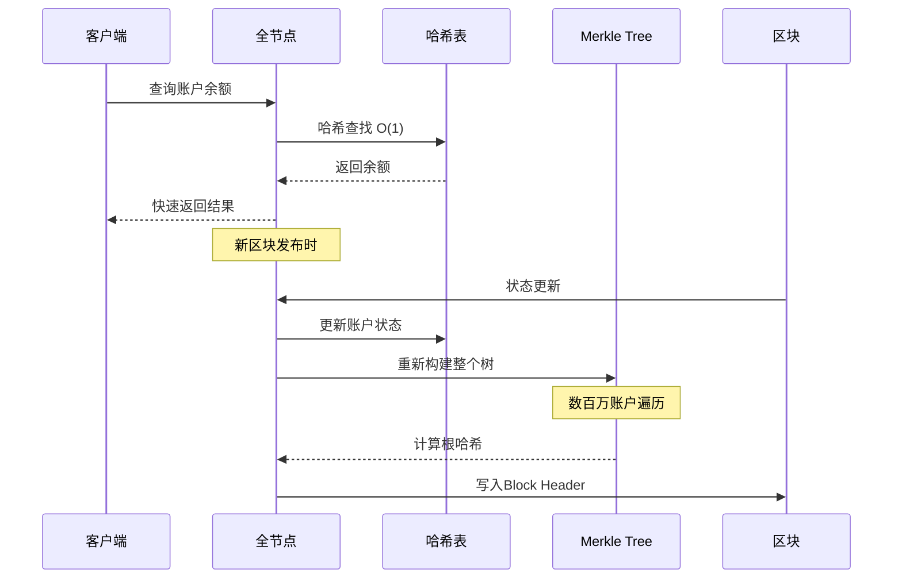
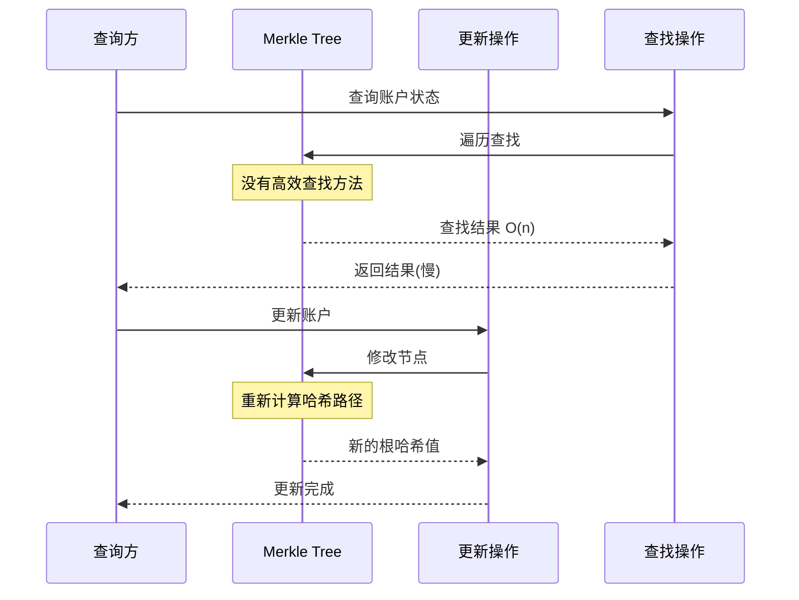
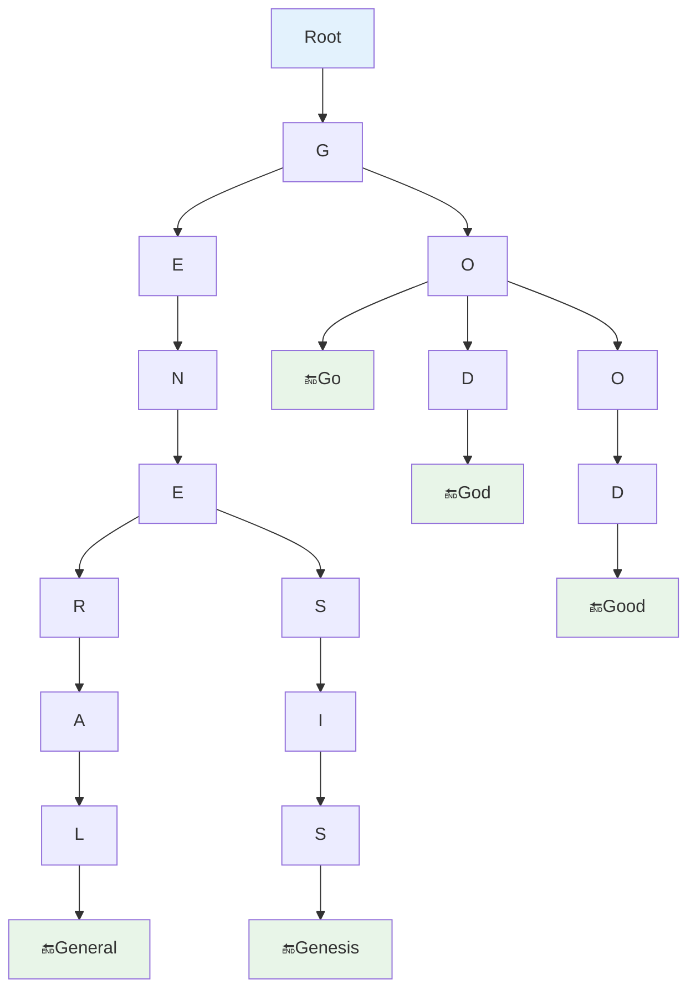
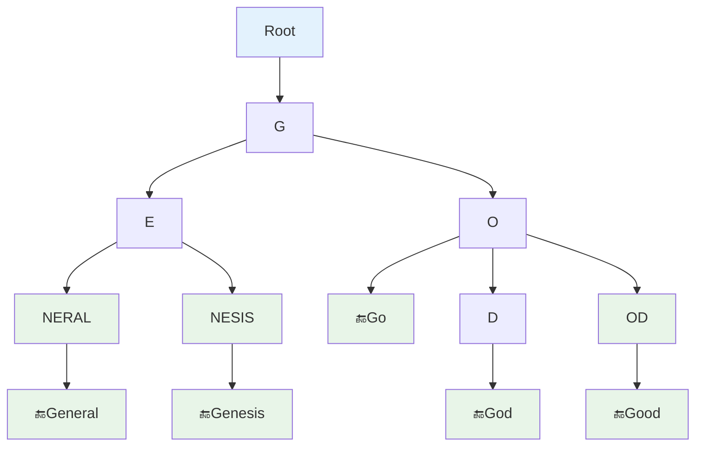
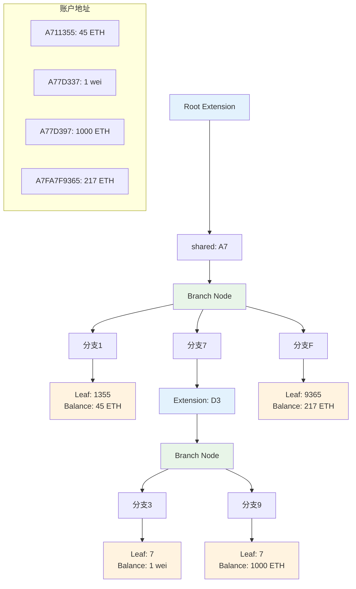
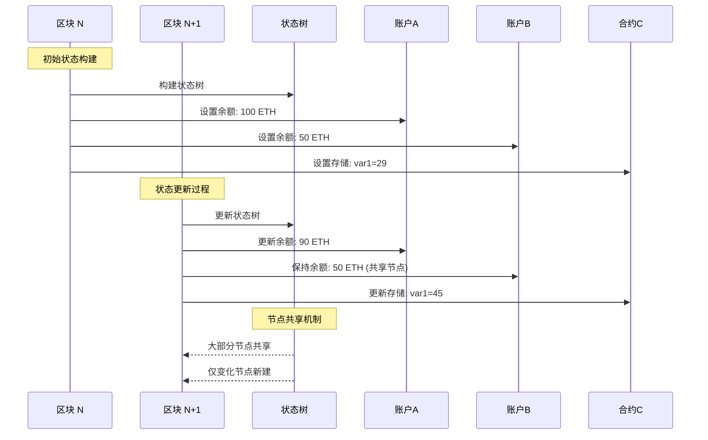

**16. ETH 状态树**

第15章节介绍了以太坊中采用的是一种基于账户的模式，系统中显式地维护每个账户上有多少余额。本章节分析用什么样的数据结构来实现这样一个 account-based 的架构。

## 设计目标

需要完成的功能是一个从账户地址到账户状态的映射。

### 地址到状态映射关系表

| 映射组件 | 数据规格 | 具体内容 | 功能作用 |
|----------|----------|----------|----------|
| **账户地址** | 160位 | 20个字节 | 唯一标识符 |
| **地址格式** | 16进制 | 40个16进制数 | 0x123...格式 |
| **外部账户状态** | 2个字段 | Balance + Nonce | 余额和交易计数 |
| **合约账户状态** | 4个字段 | Balance + Nonce + Code + Storage | 完整智能合约状态 |
| **映射需求** | 高效性 | O(1)查询和更新 | 支持百万级账户 |
| **证明需求** | 密码学 | Merkle Proof支持 | 轻节点验证 |

**映射关系说明**：
- **地址 (Address)**：账户的地址，以太坊中使用的账户地址是 160 位的，也就是 20 个字节，一般把它表示成 40 个 16 进制的数。
- **状态 (State)**：上个章节介绍的外部账户和合约账户的状态，包括余额、交易次数等。对于合约账户还包括代码和存储。

### 技术需求分析

| 需求 | 描述 | 重要性 |
|------|------|--------|
| 高效查询 | 根据地址快速查找账户状态 | 高 |
| 高效更新 | 快速更新账户状态 | 高 |
| Merkle证明 | 提供账户状态的密码学证明 | 高 |
| 状态一致性 | 维护全节点间的状态一致性 | 高 |
| 存储效率 | 节省存储空间 | 中 |
| 不存在证明 | 能够证明某个账户不存在 | 中 |

## 数据结构设计思路

需要设计什么样的数据结构来实现这个映射？这从直观上看像是个很典型的 Key-Value 对。给出一个账户地址，需要找到相应的账户状态。

### 候选方案对比分析表

| 方案 | 查询效率 | 更新效率 | Merkle证明 | 重构成本 | 插入代价 | 适用性评分 |
|------|----------|----------|------------|----------|----------|------------|
| **方案一: 哈希表** | ✅ O(1) | ✅ O(1) | ❌ 困难 | ❌ 很高 | ✅ O(1) | ⭐⭐☆☆☆ |
| **方案二: 直接Merkle Tree** | ❌ O(n) | ❌ O(n) | ✅ 天然支持 | ❌ 很高 | ❌ O(n) | ⭐☆☆☆☆ |
| **方案三: MPT** | ✅ O(log n) | ✅ O(log n) | ✅ 支持 | ✅ 低 | ✅ O(log n) | ⭐⭐⭐⭐⭐ |

**评分说明**：⭐⭐⭐⭐⭐ 最适合，⭐☆☆☆☆ 不适合

### 方案一：哈希表

一个比较直观的想法是使用一个哈希表来实现。系统中的全节点维护一个哈希表：
- 每次有一个新的账户，插入到哈希表里面
- 要查询账户的余额，就直接在哈希表中查询

#### 哈希表方案流程时序图

如果不考虑哈希碰撞的话，那么基本上这个查询的效率是常数时间内完成的，更新也是很容易在哈希表中更新。

#### 哈希表方案问题分析表

| 问题类别 | 具体问题 | 影响程度 | 解决难度 |
|----------|----------|----------|----------|
| **Merkle证明困难** | 如何提供Merkle Proof? | 🔴 致命 | 🔴 极难 |
| **重构成本巨大** | 每次都要重新组织Merkle Tree | 🔴 致命 | 🔴 极难 |
| **计算代价过大** | 需要遍历数百万账户 | 🔴 致命 | 🔴 极难 |
| **状态一致性** | 各节点间状态同步困难 | 🟡 严重 | 🟡 困难 |

**问题分析：**

这个方案存在什么问题？

最大的问题是：如果需要提供 Merkle Proof 如何提供？

比如要跟一个人签合同，希望他能证明一下他有多少钱，证明一下账户余额，如何提供这个证明？

一种方法是把这个哈希表中的元素组织成一颗 Merkle Tree，然后算出一个根哈希值。这个根哈希值要保存在 Block Header 里，就像前面说的，比特币当中也有 Merkle Tree，也有根哈希值保存在 Block Header 里公布出去。那么这个根哈希值只要是正确的，就能保证底下的树不会被篡改。

但是这存在什么问题？

**问题在于：** 如果有个新区块发布如何处理？新区块中包含有新的交易，需要执行这个交易，就必然会使这个哈希表的内容发生变化。发布下一个区块的时候，需要把这些哈希表中的内容再重新组织成一颗 Merkle Tree。

这个代价是否太大了？实际上真正发生变化的账户状态只是一小部分。因为只有那个区块里包含的交易所关联的账户才会发生变化，大多数账户的状态是不变的。所以每次都重新构造一颗 Merkle Tree，这个代价是很大的。

#### 比特币 vs 以太坊数量级对比表

| 系统 | 处理对象 | 数量规模 | 处理方式 | 可行性 |
|------|----------|----------|----------|--------|
| **比特币** | 区块中的交易 | 数百~数千个 | 一次性构建Merkle Tree | ✅ 可行 |
| **以太坊哈希表方案** | 全部账户状态 | 数百万个 | 每次重新构建 | ❌ 不可行 |
| **数量级差异** | - | 1000倍+ | - | 🔴 关键差异 |

**与比特币的区别：**

比特币系统当中不也是每出一个新的区块，也要构造一个 Merkle Tree。为什么比特币没有这个问题？

那个 Merkle Tree 的作用是把区块里包含的那些交易组织成一个 Merkle Tree。每次发布一个新的区块，又有一系列新的交易。所以比特币中的 Merkle Tree 是 immutable 的，就是每次发布一个新的区块对应着一颗 Merkle Tree。然后这颗 Merkle Tree 构建完之后是不会再改的，下次再发布一个新的区块，再构建一个新的。

区块里有多少个交易？最多差不多 4000 个，按照 1MB 每个交易大概是 250 个字节左右，最多 4000 个。这个其实是一个上限。因为在区块链上看过一些区块，很多区块里的交易数目根本到不了 4000 个，有好多区块就只有几百个，甚至还有的可能更少。

所以每次发布一个区块，比特币里构建一个 Merkle Tree，是要把这几百个到几千个交易构建成一个 Merkle Tree。这里如果采用这种方法会是什么情况？

需要把所有的以太坊账户一起构建成一个 Merkle Tree。这个数目就比刚才说的每个区块当中的几百个几千个交易要高出好几个数量级。相当于每次发布一个区块，需要把所有的账户遍历一遍，构建出一个 Merkle Tree。下次再有个新的区块，再把所有的账户遍历一遍，构建出新的 Merkle Tree。

除了提供 Merkle Proof 证明这个账户上有多少钱之外，这个 Merkle Tree 还有另外一个很重要的作用：**维护各个全节点之间状态的一致性。**

如果没有这个根哈希值公布出来，每个节点就是在内部本地维护一个数据结构。那如何知道数据结构的状态跟别人数据结构的状态是否一致？各个全节点之间要保持状态的一致才行。这其实也是比特币中为什么把这个根哈希值写在块头里的一个原因。就是对于当前这个区块中包含哪些交易，所有的全节点要有一个共识。

**结论：** 如果就简单的每个全节点在本地维护一个哈希表，需要构建 Merkle Tree 的时候，构建出 Merkle Tree 根哈希值放到区块头里，这个方法是不可行的。哈希表本身的效率是比较好的，插入更改，效率都很好。但是每次去构建这个 Merkle Tree 的代价太大。

### 方案二：直接使用 Merkle Tree

考虑第二种方案，能否不要哈希表，直接使用一颗 Merkle Tree，所有的账户都放进去。要改的时候直接在那 Merkle Tree 里改。因为每个区块更新的只是一小部分账户，所以改的只是 Merkle Tree 中的一小部分，这个方法是否可行？

#### 直接Merkle Tree操作时序图

#### 直接Merkle Tree问题分析表

| 问题维度 | 不排序版本 | 排序版本 | 问题严重程度 |
|----------|------------|----------|--------------|
| **查找效率** | 遍历查找，速度慢 | 二分查找，较快 | 🔴 严重 |
| **证明不存在** | 无法证明 | 可以证明 | 🟡 中等 |
| **树结构唯一性** | 不唯一，各节点不一致 | 唯一 | 🔴 致命 |
| **插入代价** | 随意插入 | 重构大部分树 | 🔴 致命 |
| **节点一致性** | 无法保证 | 可以保证 | 🔴 致命 |

**问题分析：**

这个方法的问题在于：Merkle Tree 没有提供一个高效的查找和更新的方法。比特币当中的 Merkle Tree 是怎么构建的？是最底下一层是 transaction，然后哈希值放到上面节点里两两结合，然后再取个哈希往上等。这从底下一层往上去，它没有提供一个快速查找和更新的方法。

还有一个问题：如果这样构建 Merkle Tree，就直接把账户都放在一个大的 Merkle Tree 里，这个 Merkle Tree 是否需要排序？

#### 比特币 vs 以太坊交易发布对比表

| 方面 | 比特币 | 以太坊(如果采用此方案) | 可行性 |
|------|--------|----------------------|--------|
| **决策者** | 获得记账权的矿工 | 所有节点需要一致 | ❌ 困难 |
| **发布内容** | 区块中的交易 | 所有账户状态 | ❌ 不现实 |
| **数据量** | 数千个交易 | 数百万个账户 | ❌ 相差数量级 |
| **必要性** | 交易必须发布 | 状态可以本地维护 | ❌ 浪费资源 |
| **发布频率** | 10分钟一次 | 15秒一次 | ❌ 频率过高 |

如果不排序会怎么样？

1. 不排序的话查找速度会慢
2. 更重要的是，如果不排序，就没法证明某个账户不存在

在比特币中，要证明一个交易包含在区块里是不用排序的。要证明一个交易没有包含在区块里，是需要用排序的版本，否则的话证明的代价就变成了线性的，变成 O(n) 了。

不排序还有另外一个问题：这些账户组成这个 Merkle Tree 叶节点是这些账户的信息，如果不规定这些账户在叶节点的出现顺序，那么这样构建出来的 Merkle Tree 不是唯一的。

比如说系统中有那么多全节点，每个全节点按照自己的某个顺序，比如说他听到某个交易的顺序构建一个 Merkle Tree。那叶节点的顺序是乱的，每个节点自己决定的，最后构建出来的 Merkle Tree 是不一样的，算出的根哈希值也是不一样的。

**与比特币的区别：**

比特币当中不也是不排序。为什么比特币当中就没有这个问题？

比特币当中其实每个全节点收到的交易的顺序也是不一样的。从理论上说，这样构建出的 Merkle Tree 根哈希值也是不一样。但是比特币有一个区别：**最后是谁说了算？获得记账权的那个节点说了算。**

所以比特币中的运行情况是：每个节点在本地组装一个候选区块，这个节点自己决定哪些交易应该被打包到这个区块里，以什么样的顺序打包在这个区块里，是这个节点自己决定的。然后去挖矿，去竞争记账权。如果他没有抢到记账权，他做的决定别人是没必要知道的。只有他获得记账权，他发布出去了，而且这个区块最终成为一个被大家接受的区块。那么这个时候顺序是谁确定的？发布这个区块的节点确定了。

那这里为什么不能这么做？

如果以太坊中也这么做，需要怎么样？需要把这个账户的状态发布到区块里。也可以说是每个全节点自己决定怎么把账户组织成一个 Merkle Tree，算出根哈希值去挖矿，但是要让别人知道这个顺序，得把它发布到区块里。但发布的是一个所有账户的状态，不是发布的区块里包含的交易。

这差好几个数量级。发布一个交易的话，只需要几百个几千个交易，而且这个交易是必须得发布的，这个代价必须得付出。不发布怎么办？别人怎么知道这个交易？所以这个交易是必须得发布的。

账户状态是可以维护在本地的，而且大多数账户状态是不变的。一个区块里那些交易只能改很少的一些账户，大多数账户状态是不变的。而且重复发布，每隔十几秒发布一个新区块，把所有状态都打包发布一遍，下次再过十几秒再发布一遍，这个是不可行的。

**排序的问题：**

接着这个方案继续分析。刚才只是说明了不排序的 Merkle Tree 是不可行的，存在好多问题。那么排序，使用排序的 Merkle Tree 是否就没问题？

可能会有什么问题？

**问题：** 新增一个账户如何处理？产生一个新账户的账户地址是随机的，他插入到叶节点中的位置很可能是插在中间的。随机产生的一个账户地址，那后面这些树的结构都得变。那得重新再产生一遍 Merkle Tree，这又变成了每次需要产生一遍 Merkle Tree。

严格地说，产生账户的时候，别人是没必要知道的。只有这个账户对外发生了一些交互，比如他往外转账或者别人往里面转账，这个系统才需要知道。

新产生一个账户，对外发生了交互，需要把它加入到数据结构里，这话没有错。但问题是这个加入的代价有多大？如果就直接用哈希表的话，这代价是常数的。要用 Merkle Tree 的话，可能有大半棵树得重构，这就是代价。这个代价同样是太大了。

所以用排序的 Merkle Tree 也有问题，插入的话代价太大。删除代价也大。删除其实可以不删，而且说实在的，区块链里删东西难度是比较大的。区块链所谓叫不可篡改的账本，是说往里添东西容易，想删东西难。其实以太坊中没有显式的删除账户的操作。有的账户上就一点钱，就一两个 wei，也不能把它删掉。

## 以太坊的解决方案：MPT

已经达成一致，这两个简单的数据结构是不可行的，那如何解决？

以太坊采用的方法是用一个叫 MPT 的结构：**Merkle Patricia Tree**。

### MPT解决方案优势表

| 需求 | Trie树特性 | Patricia路径压缩 | Merkle密码学 | 综合效果 |
|------|------------|------------------|--------------|----------|
| **查找效率** | ✅ O(key长度) | ✅ 减少访问次数 | ➖ 无影响 | 🟢 高效 |
| **更新效率** | ✅ 局部更新 | ✅ 压缩路径 | ➖ 无影响 | 🟢 高效 |
| **避免碰撞** | ✅ 不同地址不同分支 | ➖ 无影响 | ➖ 无影响 | 🟢 安全 |
| **顺序无关** | ✅ 树结构唯一 | ➖ 无影响 | ➖ 无影响 | 🟢 一致 |
| **Merkle证明** | ➖ 无直接支持 | ➖ 无影响 | ✅ 根哈希验证 | 🟢 支持 |
| **防篡改** | ➖ 无直接保护 | ➖ 无影响 | ✅ 密码学保护 | 🟢 安全 |

在讲 MPT 之前，先讲一个简单的数据结构。

### Trie 树

这个 Trie 是从哪儿来的？英文中有个单词叫 retrieval，从这里来的，信息检索。一般来说，这个中文翻译成中文叫字典树，叫前缀树。它也是一种 Key-Value Store。

#### Trie树结构示例

一般来说这个 key 是字符串，用的比较多。比如说有一些单词，把它组织成一个 Trie 的树形结构。比如说有这几个单词：

- General
- Genesis
- God
- Go
- Good

还记得 Genesis 是什么意思吗？前面提到区块链的第一个区块叫什么？Genesis Block 创世块。

下面分析一下组织成一个 Trie 的结果：

这几个单词都是以 G 开头的。一开始是这个 G，然后第二个字母就开始分叉了，左边是 E，右边是 O。前两个单词接下来都是 N 和 E，然后在下面再分开，左边是 R，右边是 S。右边这个分支 O 这个分支，Go 就已经结束了。

在这个例子中可以看到单词有可能在这个 Trie 的一个中间节点结束。左边是 D，右边是 O，左边变成了 God，右边下来是 Good。这就是这个 Trie 的结构。

#### Trie树特点分析表

| 特点类别 | 具体特点 | 以太坊应用 | 优势说明 |
|----------|----------|------------|----------|
| **分支数目** | 取决于Key元素取值范围 | 16进制: 17个分支 | 固定分支数，结构稳定 |
| **查找效率** | 取决于Key长度 | 40位固定长度 | 查找时间可预测 |
| **无碰撞** | 不同地址映射不同分支 | 避免哈希碰撞 | 比哈希表更安全 |
| **构建顺序无关** | 插入顺序不影响树结构 | 保证全节点一致性 | 解决分布式一致性问题 |
| **更新局部性** | 更新只影响相关分支 | 其他分支不受影响 | 支持增量更新 |

**Trie 的特点：**

1. **分支数目取决于 Key 值里每个元素的取值范围**
   - 这个例子当中每个都是英文单词，而且是小写的，所以每个节点的分叉数目最多是 26 个
   - 加上一个结束标志位，表示到这个地方这个单词是否就结束了
   - 在以太坊里面，地址是表示成 40 个 16 进制的数，所以这个分叉数目（有时候管它叫 branching factor）是 17，因为是 16 进制的 0 到 F 加上一个结束标志符，所以是 17

2. **Trie 的查找效率取决于 Key 的长度**
   - 键值越长，查找需要访问内存的次数就越多
   - 在应用当中这个 Key 值有多长？所有的键值都是一样长，都是 40，因为地址都是 40 位 16 进制的数
   - 顺便说一句，比特币跟以太坊的地址是不通用的，两个地址的格式长度都是不一样的。这有一点是类似的，就是以太坊中的地址也是公钥经过转换得来的，其实就是公钥取了哈希，然后截取一段，只要后面的部分就得到一个 160 bit 的地址

3. **Trie 不会出现碰撞**
   - 如果使用哈希表来存储这个 Key-Value 对，从理论上说是有可能出现哈希碰撞的
   - 有可能有两个账户，这两个账户的地址是不一样的，但是恰好映射到了哈希表的同一个位置
   - 那 Trie 呢？只要两个地址不一样，最后肯定映射到树中的两个不同分支
   - 所以 Trie 是不会出现碰撞的

4. **构建顺序无关性**
   - 前面讲 Merkle Tree，如果不排序的话，一个问题是这个账户插入到 Merkle Tree 中的顺序不一样，得到的树的结构也不一样
   - 那 Trie 呢？比如说这五个单词，换一个顺序插到树里面，得到的是一棵不同的树。是一样的
   - 这就是一个特点：只要给定一组输入，这个输入不变，不论这个输入怎么打乱重排，最后插入到这个 Trie 当中，构成的 Trie 是同一棵树
   - 这个对应用来说也是很有用的。不同的节点，不论怎么按照顺序去插入这些账户，最后构造出来的树是一样的

5. **更新的局部性**
   - 前面提到每次发布一个区块，系统中绝大多数账户的状态是不变的，只有个别受到影响的账户的状态才会变
   - 所以更新操作的局部性很重要
   - 这个的局部性，比如说要更新 Genesis 这个 key 对应的 value，在这个图当中只画出了 Key，没有画出 value
   - 要更新这个 Genesis 对应的 value，只用访问这下面这个分支，其他分支是不用访问的，也不用遍历整棵树
   - 所以这是它的更新的局部性是很好的

### Patricia Tree（路径压缩）

说了 Trie 的这么多优点，Trie 就没有缺点吗？

其实 Trie 的缺点也挺明显的：**存储浪费**。

#### 路径压缩效果分析表

| 场景类型 | 键值分布特征 | 压缩效果 | 以太坊适用性 |
|----------|--------------|----------|--------------|
| **稀疏分布** | 长单词，数量少 | ✅ 效果很好 | ✅ 完全适用 |
| **密集分布** | 短单词，数量多 | ❌ 效果一般 | ➖ 不适用 |
| **以太坊地址** | 2^160空间，使用极少 | ✅ 效果极佳 | ✅ 理想场景 |

像这些节点，都只有一个子节点。对于这种一脉单传的情况，如果能把这些节点进行合并，那么可以减少存储的开销，同时也提高查找的效率，不用一次一个一个往下找了。

这就引入了所说的 **Patricia Tree**。

#### Patricia Tree路径压缩示例

也有人把它写成 **Radix Tree**，这个都没什么太大关系。就是这种经过了路径压缩的前缀树，有时候管它叫压缩前缀树。

那么这个例子如果进行路径压缩是什么样子的？

这就是 Patricia Tree 的结果。可以看到一开始的时候，这个 G 下面还是 E 跟 O 进行分叉。E 下面之后跟着都是 NE，然后再往下又是 E 跟 S 分叉，然后后面几个都合在一起了。右边这个分支也是一样的。

所以这样压缩之后有什么好处？直观上看这个树的高度明显缩短了，这树变得比较浅了，这样访问内存的次数就会大大减少，效率就提高了。

**注意：** 对于这个 Patricia Tree 来说，如果新插入一个单词，原来压缩的路径可能需要扩展开来。

比如说这个例子当中，假设又加入个词：Geometry。

如果加入 Geometry 的话，左边这个分支就不能这么压缩了。

**路径压缩在什么情况下效果比较好？**

就这个例子中效果很明显，但也可能有些例子当中效果就不明显。什么情况下它效果会比较好？

更严格地说叫什么？**这个树中插入的这些键值的分布，如果是比较稀疏的情况下，做路径压缩效果比较好。**

比如说这个例子当中是用英文单词。如果这个英文单词每个单词都很长，但是一共没有几个单词，那这个时候举个例子：

- Misunderstanding
- Decentralization（去中心化）
- Disintermediation

这个词知道什么意思吗？intermediary 是中间商的意思，disintermediation 是把中间商去掉。区块链的一个应用场景就是 disintermediation。区块链的价值是什么？就去掉这些中间商，让这个系统中的价值提供者跟消费者直接进行交互。

这三个单词如果插入到一个 Trie 里面，普通的 Trie 里面会是什么样的？

基本上退化成一条线了。如果用 Patricia Tree 呢？

这个树的高度明显改善多了。

所以**键值分布比较稀疏的时候，路径压缩效果比较好。**

**那在这个应用场景当中，键值分布是否稀疏？**

是的。在应用中键值是什么？是地址。地址是 160 位的，所以整个地址空间有多大？2^160，这是一个非常大的数。如果设计一个计算机程序的算法，它需要进行的运算次数是 2^160，那这个代价整个所有人的有生之年都不可能算出来。这是个非常大的数。

以太坊中的账户数目，全世界的账户数目加在一起也远远没有这么大，跟这个数比是微乎其微的，所以他是非常稀疏的。

#### 地址空间稀疏性必要性分析表

| 需求 | 原因 | 必要性 | 安全影响 |
|------|------|--------|----------|
| **防止地址被破解** | 密码学安全要求 | 🔴 关键 | 账户安全 |
| **无中央分配机构** | 去中心化原则 | 🔴 关键 | 系统独立性 |
| **用户独立创建账户** | 降低使用门槛 | 🔴 关键 | 用户体验 |
| **防止账户碰撞** | 概率 < 地球爆炸概率 | 🔴 关键 | 系统可靠性 |

**为什么搞得这么稀疏？**

为什么不把地址长度缩短一点，这样访问效率还快，也没必要那么稀疏了。

如果地址容易被破解，就会有安全问题。或者换种说法，之前讨论过一个密码学原理：

以太坊跟比特币中——以太坊中的普通账户创建方法跟比特币是一样的。就是没有一个中央的节点，每个用户自己独立创建账户。在本地产生一个公私钥对，就是一个账户。那如何防止两个人的账户正好碰撞？产生了一样的账户地址？

这种可能性是存在的，但是之前说过，这个概率比地球爆炸的概率还要小。如何达到这么小的概率？就是地址要足够长，要分布足够稀疏，才不会产生碰撞。

这个可能看上去有点浪费，但这是一个去中心化的系统，防止账户冲突的唯一办法。所以它是非常稀疏的，这就是为什么在这个数据结构中要用路径压缩。

### MPT（Merkle Patricia Tree）

讲了 Trie，讲了 Patricia Tree，MPT 是什么？

**Merkle Patricia Tree。**

那 MPT 跟 PT 有什么区别？Merkle Patricia Tree 跟 Patricia Tree 有什么区别？

先说一说 Merkle Tree 跟普通的树有什么区别？

区块链和链表有什么区别？把普通指针换成了哈希指针。

那么这里也是一样的，**把普通指针换成了哈希指针**。

#### MPT结构组成表

| 组成部分 | 功能特性 | 贡献作用 | 适用场景 |
|----------|----------|----------|----------|
| **Patricia Tree基础** | 路径压缩、高效查找、避免碰撞 | 提供高效的存储和查找 | 稀疏键值分布 |
| **Merkle Tree特性** | 哈希指针、根哈希值、防篡改 | 提供密码学保证 | 分布式验证 |
| **综合效果** | 高效 + 安全 | 平衡性能和安全 | 区块链状态管理 |

就是所有的账户组织成一个 Patricia Tree，用路径压缩提高效率，然后把普通指针换成哈希指针，所以就可以计算出一个根哈希值，这个根哈希值也是写在 Block Header 里的。

#### 以太坊与比特币Block Header对比表

| 区块链 | 根哈希数量 | 树的类型 | 存储内容 |
|--------|------------|----------|----------|
| **比特币** | 1个 | 交易Merkle Tree | 区块中的交易 |
| **以太坊** | 3个 | StateRoot: 账户状态MPT | 所有账户状态 |
|  |  | TransactionRoot: 交易Merkle Tree | 区块中的交易 |
|  |  | ReceiptRoot: 收据MPT | 交易执行收据 |

比特币的 Block Header 里只有一个根哈希值，就是这个区块里包含的交易组成的 Merkle Tree 的根哈希值。以太坊中有三个，以太坊中也有一个交易组成的叫交易树。现在讲的是叫状态树，账户状态组织成了一个 Merkle Patricia Tree，它的根哈希值。

#### MPT根哈希值作用表

| 作用类别 | 具体功能 | 实现方式 | 应用场景 |
|----------|----------|----------|----------|
| **防止篡改** | 保证完整性、根哈希不变、树无法篡改 | 密码学哈希验证 | 数据完整性保护 |
| **Merkle Proof** | 证明账户余额、提供分支证明、轻节点验证 | 提供分支路径 | 轻客户端验证 |
| **证明不存在性** | 证明账户不存在、应该存在的分支证明 | 排序Merkle Tree方法 | 负向证明 |

**这个根哈希值的作用：**

1. **防止篡改**：只要根哈希值不变，整个树的任何部分都没有办法被篡改。也就是说每个账户的状态都能保证它的完整性 (integrity) 是没有被篡改过的。

2. **Merkle Proof**：这个树能证明什么？
   - 能证明有多少钱，证明账户上的余额是多少
   - 如何证明？就是这个账户所在的那个分支，整个分支作为 Merkle Proof 发给这个轻节点，轻节点就可以验证一下账户上多少钱

3. **证明不存在性**：能否证明某个账户是不存在的？
   - 前面提到排序的 Merkle Tree 的一个好处是可以证明 non-membership，这个能否证明？
   - 能。如果想给一个地址转账之前，想验证一下这个全节点里有没有这个账户信息，这个能证出来
   - 或者说得更直白一点，能否证明这个 MPT 中某个键值是不存在的？能
   - 如何证明？其实证明方法跟那个排序 Merkle Tree 类似。如果存在的话，它应该在什么样的分支里？把这个分支作为 Merkle Proof 发过去，可以证明它是不存在的

## Modified MPT

以太坊中用到的还不是原生版的 MPT，用的叫 **Modified MPT**。

就对这个 MPT 的结构做一些修改，这些修改不是很本质的修改。看一个例子：

### Modified MPT节点类型表

| 节点类型 | 功能 | 存储内容 | 使用场景 |
|----------|------|----------|----------|
| **Extension Node** | 路径压缩节点 | 存储共享前缀，指向下一个节点 | 一脉单传的路径 |
| **Branch Node** | 分支节点 | 最多17个分支(16个十六进制 + 1个结束符) | 地址分叉点 |
| **Leaf Node** | 叶子节点 | 存储键值对，路径终点 | 账户状态存储 |

这个例子当中有四个账户，右上角这四个账户。为了简单起见，这个账户地址都比较短，假设只有 7 位的地址，而不是 40 位的。然后账户状态也只显示了余额，其他的账户状态没有显示出来。

- 第一个账户有 45 个以太币
- 第二个账户比较穷，只有 1 wei，这是以太坊中最小的计量单位，1 wei 基本上可以忽略不计

然后它的节点，这个树中的节点是分为三种：

1. **Extension Node**：如果这个树的某个部位出现了路径压缩，就会有一个 Extension Node
2. **Branch Node**：分支节点
3. **Leaf Node**：叶子节点

### Modified MPT示例

所以这四个地址，前两位开头都是一样的 A7，所以它的根节点就是一个 Extension，这写 shared nibble（一个 nibble 就是一个 16 进制数）。

然后第三位开始就分开了，有 1、7、F，所以就有一个 Branch Node。

先说 1，这个 1 后面就是 1355，他只有这一个地址，所以就是跟着一个 Leaf Node 1355。

7 这个位置有两个地址，这两个地址接下来都是 D 和 3，所以连着是个 Extension，也是路径压缩 D 和 3。然后再往下是 3 和 9 分开了，所以跟着一个 Branch Node 分支节点 3 和 9。

然后下面两个叶子节点就是最后一位，这个例子当中最后一位都是 7。

最后这个 F 就是上面分开的 FA7F，下面就是 9365，就跟着一个 Leaf Node 9365。

这就是这个状态树。

### 哈希指针机制对比表

| 指针类型 | 存储内容 | 查找方式 | 安全性 | 篡改检测 |
|----------|----------|----------|--------|----------|
| **普通指针** | 内存地址 | 直接指向节点 | ❌ 可能被篡改 | ❌ 无法检测 |
| **哈希指针** | 哈希值 | 通过哈希值查找 | ✅ 防止篡改 | ✅ 自动检测 |

**Modified MPT 的特点：**

它是用哈希指针。这个意思不是说简单指针。比如说 7 这个位置，它连着一个 Extension Node，是说 7 这个位置里面存的值是下面这个节点的哈希值。

如果是普通指针的话，7 这个位置存的这个值是下面这个节点的地址。只不过把这个地址换成了哈希值。

## 状态树的版本管理

每次发布一个新的区块的时候，这个状态树中有一些节点的值会发生变化。这些改变不是在原地改的，而是新建一些分支，原来的状态其实是保留下来的。

### 版本管理机制特点表

| 机制特点 | 实现方式 | 优势 | 应用价值 |
|----------|----------|------|----------|
| **节点共享** | 大部分节点共享、只有变化节点新建 | 节省存储空间 | 效率优化 |
| **增量更新** | 不在原地修改、新建分支 | 保持历史状态 | 状态回溯 |
| **历史保留** | 支持回滚、审计功能、历史查询 | 完整审计链 | 合规要求 |

### 状态变化时序分析

这个例子当中，显示有两个区块，这是两个相邻的区块。这个 State Root 就是状态树的根哈希值，下面显示的是这棵树。这个是新的区块的状态树。

可以看到虽然每个区块有一个状态树，但是这两棵树的大部分节点是共享的。像右边这个树主要都是指向左边这棵树的节点，只有那些发生改变的节点是需要新建一个分支。

### 以太坊嵌套MPT结构表

| 层级 | 结构类型 | 映射关系 | 存储内容 | 嵌套特点 |
|------|----------|----------|----------|----------|
| **主状态树** | 大MPT | 账户地址 → 账户状态 | 外部账户、合约账户状态 | 包含子树指针 |
| **合约存储树** | 小MPT | 变量名 → 变量值 | Key-Value存储 | 每个合约一棵 |
| **嵌套关系** | 树中树 | 主树节点指向子树 | 存储树根哈希 | 大MPT包含小MPT |

这个例子当中，是这个账户发生了变化。这个账户是一个合约账户，因为他有 code，有代码还有存储。合约账户的存储也是用 MPT 的形式保存下来的。

这个存储是什么？其实也是一个 Key-Value Store，就是维护的是从这个变量到这个变量取值的一个映射。它也是一个 Key-Value Store，在以太坊当中也是用了一颗 MPT。

所以**以太坊中的这个结构是一个大的 MPT 包含很多小的 MPT**，每一个合约账户的存储都是一颗小的 MPT。

回到这个例子，这个账户在新的区块中，这个交易次数 nonce 发生变化了，这个 balance 余额也发生了变化，这个代码是不变的。所以这个 code hash 是指向原来的这个节点，原来树中的节点。

存储是变了的，但是存储底下这个就叫存储树，存储树中大部分节点也是没有改变。这个例子当中，只有这底下的一个节点，这个整数变量从 29 变成了 45，所以新建的一个分支。

所以**系统中每个全节点需要维护的不是一颗 MPT，而是每次出现一个区块都要新建一个 MPT**。只不过这些状态树中大部分的节点是共享的，只有少数发生变化的节点是要新建分支。

### 为什么要保留历史状态？

问一个问题，为什么要保留历史状态？为什么不在原地直接改了？

#### 历史状态保留原因分析表

| 原因 | 具体需求 | 技术实现 | 重要性 |
|------|----------|----------|--------|
| **审计 (Audit)** | 查看账户历史、追溯资金来源 | 保留完整历史记录 | 🔴 关键 |
| **回滚 (Rollback)** | 分叉处理、状态恢复 | 维护历史状态快照 | 🔴 关键 |
| **智能合约复杂性** | 图灵完备、状态不可逆推 | 必须保存前置状态 | 🔴 关键 |

**原因一：审计 (Audit)**

假设有一个账户没有经过授权就擅自被人改掉了，然后收到这样一个消息之后，可以查一下历史记录，这个账户原来一笔一笔是怎么来的，就像银行一样，银行实际上是保留账户的历史信息的。查过去什么交易都可以查得到。

**原因二：回滚 (Rollback)**

前面说系统当中有的时候会出现分叉。临时性的分叉其实是很普遍的。以太坊把出块时间降到十几秒之后，这种临时性的分叉是一种常态。因为这个区块在网上传播时间可能也需要十几秒。

假设有一个分叉，两个节点同时获得记账权，这两个分叉最后会有一个胜出。比如说上面那个节点胜出了，下面这个分叉的节点该怎么办？

**回滚**。如何回滚？就是把当前节点的状态——接受下面这个区块的状态要取消掉，退回到上一个区块的状态，然后再沿着上面这条链往下推进。

有的时候可能需要把当前状态退回到没有处理这个区块中交易的前一个状态。那如何实现回滚？

就是要维护这些历史记录。

#### 比特币 vs 以太坊回滚对比表

| 方面 | 比特币 | 以太坊 | 可行性 |
|------|--------|--------|--------|
| **交易类型** | 简单转账 | 智能合约执行 | - |
| **状态推算** | 反向操作可推算 | 无法自动推算 | ✅ vs ❌ |
| **回滚方式** | 计算反向操作 | 保存历史状态 | 简单 vs 复杂 |
| **编程复杂度** | 简单脚本 | 图灵完备 | 可逆 vs 不可逆 |

**与比特币的区别：**

这个跟比特币还不太一样。如果是比特币的话，它交易类型比较简单，有的时候可以通过这种反向操作推算出前一个状态。

比如说如果就是简单的转账交易，A 转给 B 十个比特币，那这个对账户余额有什么影响？A 的账户上少了十个比特币，B 的账户多了十个比特币。假设这个交易要回滚了，退回到前一个状态，那就把 B 这个账户减少十个比特币，把 A 这个账户加回去十个比特币就行了。

这个是简单的转账交易，要回滚其实是比较容易的。

**以太坊中为什么不行？**

以太坊中有智能合约。以太坊的智能合约是图灵完备的，它编程功能是很强的，从理论上说可以实现很复杂的功能，它跟比特币的那个简单的脚本还不一样。

所以以太坊中如果不保存以前的状态，智能合约执行完之后，想再推算出前面是什么状态，这是不可能的。合约里代码是怎么写的，没有办法自动推算出前面的状态。

所以要想支持回滚，必须得保存历史状态。

## 以太坊中的数据结构

下面分析一下以太坊中代码的一些数据结构，这个是 Block Header 块头的定义：

### Block Header字段定义表

| 字段名称 | 功能描述 | 相关章节 |
|----------|----------|----------|
| **ParentHash** | 父区块的哈希值 | 区块链基础 |
| **UncleHash** | 叔叔区块的哈希值 | 共识协议 |
| **Coinbase** | 矿工地址 | 挖矿机制 |
| **StateRoot** | 状态树的根哈希值 | 本章重点 |
| **TransactionRoot** | 交易树的根哈希值 | 交易处理 |
| **ReceiptRoot** | 收据树的根哈希值 | 交易收据 |
| **BloomFilter** | 高效查询过滤器 | 日志检索 |
| **Difficulty** | 挖矿难度 | 难度调整 |
| **GasLimit/GasUsed** | 汽油费限制/使用 | 费用机制 |
| **Timestamp** | 区块产生时间 | 时间戳 |
| **MixDigest/Nonce** | 挖矿相关 | 工作量证明 |

下面这三个就是跟这几个章节讲的很相关的了：

**三棵树的根哈希**：

- **StateRoot**：本章节讲的状态树的根哈希值
- **TransactionHash**：交易树的根哈希值，这个有点类似于比特币系统中的那个根哈希值
- **ReceiptHash**：收据树的根哈希值，这是一个新的

### 区块结构组成表

| 组成部分 | 数据类型 | 内容说明 | 发布时机 |
|----------|----------|----------|----------|
| **Header** | 指针 | 指向Block Header | 区块发布 |
| **Uncle** | 数组 | 叔叔区块头指针 | 包含叔叔块时 |
| **Transaction** | 列表 | 区块中的交易 | 每个区块 |
| **StorageBlock** | 结构体 | 网络发布的实际内容 | 网络传播 |

**区块的结构：**

对于理解来说，比较相关的就是前面三个域：

- **Header**：指向 Block Header 的指针
- **Uncle**：指向叔叔区块的头的指针，而且它是个数组，因为一个区块可以有多个叔叔区块
- **Transaction**：这个区块中的交易的列表

**StorageBlock**：这个区块真正在网上发布的时候发布的就是这些信息，其实就是刚才看到的前三项。

## RLP 编码

讲了半天状态树中保存的是 Key-Value Pair。

Key 就是地址，讲到现在主要讲的是这个键值，这个地址的管理方式。那么这个 Value，这个账户的状态，它是如何存储在状态树当中的？

实际上它是要经过一个序列化的过程，**RLP 编码**，用这个编码做序列化之后再存储。

### RLP编码特点对比表

| 特点 | RLP编码 | Protocol Buffers | 设计理念 |
|------|---------|------------------|----------|
| **复杂度** | 极简主义 | 功能丰富 | 越简单越好 |
| **支持类型** | 仅Nested Array of Bytes | 多种复杂类型 | 推给应用层 |
| **实现难度** | 很容易 | 相对复杂 | 最小化核心 |
| **适用场景** | 区块链存储 | 通用序列化 | 专用优化 |

**RLP 是什么意思？**

**Recursive Length Prefix**，是一种做序列化的方法。特点是简单，是极简主义，越简单越好。

听说过 Protocol Buffers 吗？这是个很有名的做序列化的库，很常用的做序列化库。

跟这些库相比，RLP 的理念就是越简单越好，它只支持一种类型：

**Nested Array of Bytes**

说白了就是字节数组，有一个一个字节组成的数组，可以嵌套。

以太坊中所有的其他类型——整数也好，比较复杂的数据结构也好，最后都要变成这个 Nested Array of Bytes。

所以要实现一个 RLP 比实现 Protocol Buffers 要容易很多，因为复杂的东西它都不做，都推给应用层做。

---

## 章节总结

### 核心设计决策总结表

| 设计选择 | 技术方案 | 关键优势 | 解决问题 |
|----------|----------|----------|----------|
| **账户模式** | 基于账户而非UTXO | 简单直观、符合习惯 | 用户体验和智能合约需求 |
| **数据结构** | MPT而非哈希表或纯Merkle Tree | 平衡效率和安全 | 查询效率+密码学证明 |
| **路径压缩** | Patricia Tree优化 | 适应稀疏分布 | 存储和访问效率 |
| **哈希指针** | Merkle特性集成 | 防篡改和证明能力 | 分布式安全验证 |
| **版本管理** | 历史状态保留 | 审计和回滚能力 | 智能合约复杂性 |

**总结：**

本章节内容比较多，从以太坊中设计的理念开始分析，为什么要这样设计？一步一步分析到这里。

下个章节会分析一下以太坊中另外两棵树：交易树和收据树。