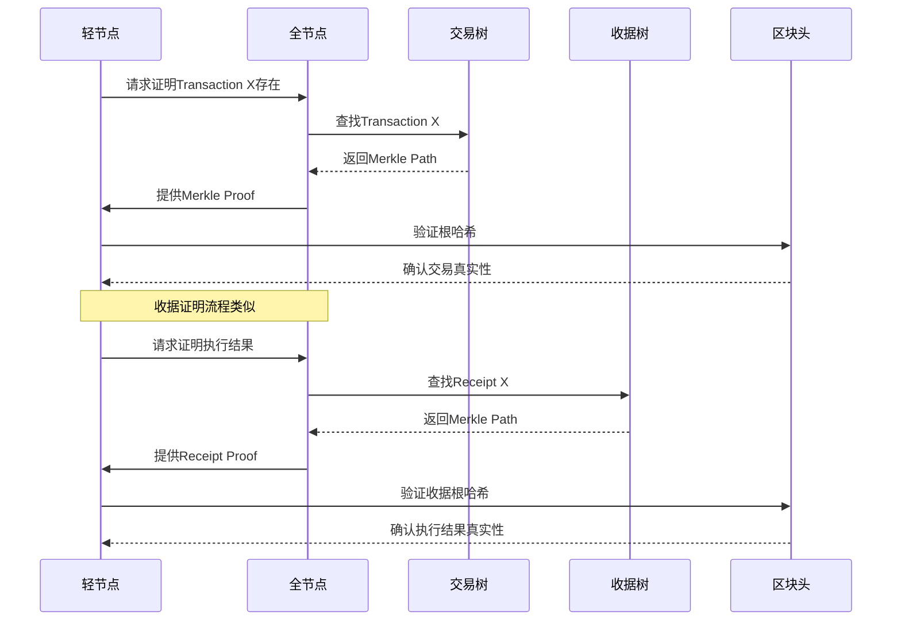
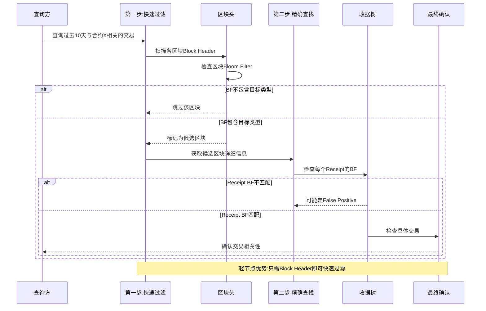
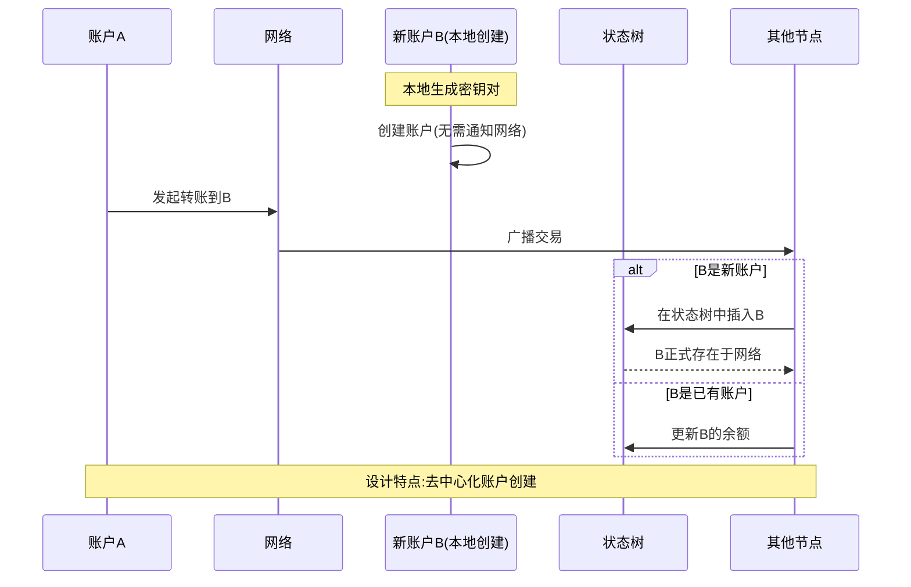
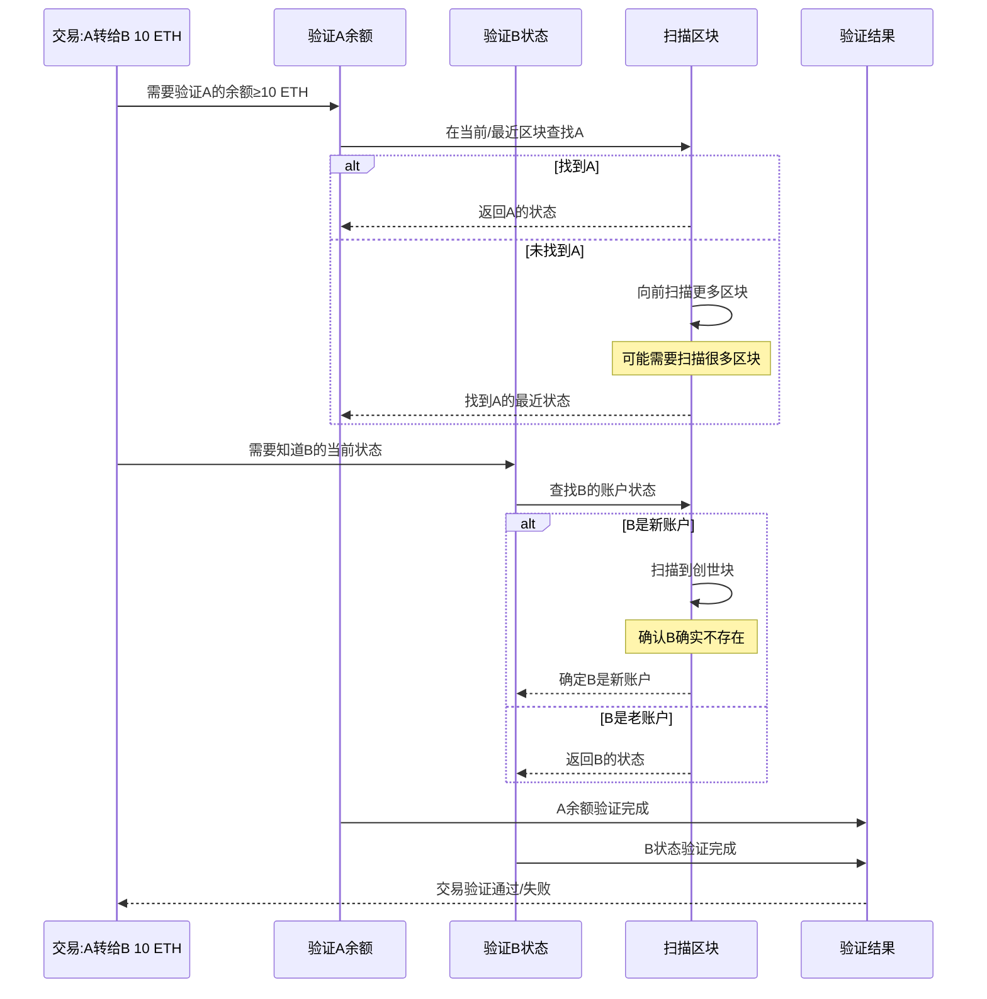

**17. ETH 交易树和收据树**

上个章节讲述了以太坊中的状态树，以太坊中还有另外两棵树：交易树和收据树。

## 交易树和收据树概述

### 以太坊三棵树架构层次表

| 层次 | 组件 | 树结构 | 数据范围 | 节点共享 | 主要功能 |
|------|------|--------|----------|----------|----------|
| **区块头层** | StateRoot | 状态树 MPT | 所有账户状态 | ✅ 跨区块共享 | 账户状态管理 |
| **区块头层** | TransactionRoot | 交易树 MPT | 当前区块交易 | ❌ 独立不共享 | 交易存在证明 |
| **区块头层** | ReceiptRoot | 收据树 MPT | 当前区块收据 | ❌ 独立不共享 | 执行结果证明 |
| **区块头层** | Bloom Filter | 布隆过滤器 | 收据汇总 | ❌ 独立构建 | 快速查询过滤 |
| **区块体层** | Transactions | 交易列表 | 具体交易数据 | ❌ 每区块独立 | 交易内容存储 |
| **区块体层** | Uncles | 叔叔区块 | 孤立区块头 | ❌ 每区块独立 | 奖励分配 |

每次发布一个区块时，该区块包含的交易会组织成一棵交易树，这是一颗 Merkle Tree，与比特币中的情况类似。同时以太坊还增加了一个收据树，每个交易执行完后会形成一个收据，记录该交易的相关信息。交易树与收据树上面的节点是一一对应的。

### 交易与收据的一对一映射关系表

| 交易序号 | 交易类型 | 执行状态 | 收据生成 | 树中位置 | 对应关系 |
|----------|----------|----------|----------|----------|----------|
| **Tx #1** | 转账交易 | ✅ 成功执行 | ✅ Receipt #1 | Node #1 | 一一对应 |
| **Tx #2** | 合约调用 | ✅ 成功执行 | ✅ Receipt #2 | Node #2 | 一一对应 |
| **Tx #3** | 合约部署 | ❌ 执行失败 | ✅ Receipt #3 | Node #3 | 一一对应 |
| **Tx #4** | 代币转移 | ✅ 成功执行 | ✅ Receipt #4 | Node #4 | 一一对应 |
| **...** | 其他交易 | 各种状态 | ✅ 必定生成 | Node #n | 严格对应 |

**重要特点**：
- 无论交易执行成功还是失败，都会生成对应收据
- 交易树和收据树的节点位置严格一一对应
- 通过序号可以在两棵树中找到对应节点

增加收据树主要是考虑到以太坊的智能合约执行过程比较复杂，通过增加收据树结构，有利于快速查询执行结果。

从数据结构上看，交易树和收据树都是 MPT，即上个章节介绍的 Merkle Patricia Tree。

### 与比特币的数据结构对比表

| 对比维度 | 比特币 | 以太坊 | 差异原因 |
|----------|--------|--------|----------|
| **树的数量** | 1棵 | 3棵 | 功能需求不同 |
| **树的类型** | 普通Merkle Tree | MPT (Merkle Patricia Tree) | 查询需求不同 |
| **数据组织** | 仅交易组织 | 状态+交易+收据 | 账户模型差异 |
| **查询能力** | 不支持键值查找 | 支持高效键值查找 | 数据结构优势 |
| **证明类型** | 仅交易存在证明 | 多种证明类型 | 应用场景扩展 |
| **节点共享** | 无状态共享概念 | 状态树跨区块共享 | 状态管理需求 |

这个数据结构与比特币有所区别。比特币中的交易树使用普通的 Merkle Tree，将区块里的所有交易组织成一个普通的 Merkle Tree。

MPT 也是一种 Merkle Tree，称为 Merkle Patricia Tree，但与比特币中使用的不完全一样。

**产生差异的原因：**

这种差异可能是为了方便以太坊中的三棵树都使用相同的数据结构，使代码比较统一，便于管理。

### MPT查找优势对比表

| 树类型 | 查找键值 | 查找方式 | 时间复杂度 | 应用场景 |
|--------|----------|----------|------------|----------|
| **状态树** | 账户地址 | 从顶向下路径查找 | O(log n) | 快速定位账户状态 |
| **交易树** | 交易序号 | 从顶向下索引查找 | O(log n) | 快速定位具体交易 |
| **收据树** | 交易序号 | 从顶向下索引查找 | O(log n) | 快速定位执行收据 |

使用 MPT 的一个好处是支持查找操作，可以通过键值从顶向下沿着树进行查找：

- 对于状态树，查找的键值是账户地址
- 对于交易树和收据树，查找的键值是交易在发布区块里的序号

交易的排列顺序由发布区块的节点决定。

### 三棵树的重要区别对比表

| 特征维度 | 状态树 | 交易树和收据树 | 设计意图 |
|----------|--------|----------------|----------|
| **数据范围** | 所有账户状态 | 仅当前区块数据 | 全局 vs 局部 |
| **跨区块性** | 跨区块存在 | 每区块独立 | 状态延续 vs 独立快照 |
| **节点共享** | ✅ 大量共享 | ❌ 完全独立 | 效率优化 vs 独立验证 |
| **更新频率** | 部分节点更新 | 每次完全重建 | 增量 vs 全量 |
| **存储效率** | 高效复用 | 独立存储 | 优化 vs 简化 |
| **查询范围** | 历史状态可查 | 仅当前区块 | 历史追溯 vs 当前验证 |

这三棵树有一个重要区别：

- **交易树和收据树**：只包含当前发布区块的交易
- **状态树**：包含系统中所有账户的状态，无论这些账户是否与当前区块的交易相关

从数据结构角度看，上个章节提到多个区块的状态树是共享节点的。每次新发布区块时，只有该区块中的交易影响并改变了状态的节点需要新建分支，其他节点都沿用原来存在的节点。

相比之下，交易树和收据树，每个区块的交易树和收据树都是独立的，不会共享节点，因为不同区块发布的交易本身也是独立的。

## 交易树和收据树的用途

### 基本用途：提供 Merkle Proof



交易树和收据树的用途之一是提供 Merkle Proof，就像比特币中交易树可以证明某个交易被打包到某个区块里，可以向轻节点提供这样的 Merkle Proof。收据树也类似，要证明某个交易的执行结果，也可以在收据树里面提供 Merkle Proof。

### 高级用途：复杂查询操作

#### 复杂查询需求分析表

| 查询类型 | 具体需求 | 传统方法问题 | 解决方案 | 效果提升 |
|----------|----------|--------------|----------|----------|
| **智能合约查询** | 过去十天与合约X相关的交易 | 需要扫描所有区块，O(n)复杂度 | Bloom Filter快速过滤 | 🟢 显著提升 |
| **事件类型查询** | 所有众筹事件 | 轻节点无完整交易列表 | 区块头Bloom Filter | 🟢 轻节点可查 |
| **代币操作查询** | 所有发币事件 | 需要下载完整区块数据 | 分层过滤机制 | 🟢 减少网络传输 |
| **时间范围查询** | 指定时间段的活动 | 无法高效过滤 | 紧凑摘要支持 | 🟢 快速定位 |

此外，以太坊还支持更加复杂的查询操作。比如查找过去十天中所有与某个智能合约相关的交易。

**传统方法的问题：**

一种方法是扫描过去十天产生的所有区块，查看其中哪些交易与该智能合约相关。但这种方法的复杂度较高，而且对于轻节点来说，轻节点没有交易列表，只有块头信息，无法通过扫描所有交易列表的方法来找到符合查询条件的交易。

**类似的查询需求：**

比如查找过去十天中符合某种类型的所有事件：
- 所有的众筹事件
- 所有的发行新币事件

这些都需要比较高效的方法支持。

**解决方案：** 以太坊中引入了 **Bloom Filter** 数据结构。

## Bloom Filter 原理

### 基本概念

#### 查询问题对比分析表

| 方法类型 | 时间复杂度 | 存储需求 | 轻节点适用性 | 查询准确性 |
|----------|------------|----------|--------------|------------|
| **传统遍历方法** | O(n) | 需要完整集合 | ❌ 无法实现 | 🟢 100%准确 |
| **Bloom Filter方法** | O(1) | 紧凑摘要即可 | ✅ 完全适用 | 🟡 可能误报 |

Bloom Filter 数据结构可以支持比较高效的查找某个元素是否在一个较大的集合里面。比如有一个包含很多元素的集合，现在想知道某个指定元素是否在这个集合里。

**传统方法：**

一个简单的方法是遍历集合中的元素，查看是否有要找的元素。这个复杂度是线性的，为 O(n)。

另外还有一个前提：需要有足够的存储来保存整个集合的元素。对于轻节点来说，没有完整的交易列表，没有整个集合的元素信息，所以这种方法无法使用。

### Bloom Filter 工作原理

#### 构建过程步骤表

| 步骤 | 操作 | 输入 | 输出 | 示例 |
|------|------|------|------|------|
| **1. 初始化** | 创建位向量 | 向量长度n | 全0向量 | [0,0,0,0,0,0,0,0] |
| **2. 元素A处理** | 计算H(A) | 元素A | 位置索引 | H(A) = 位置2 |
| **3. 位置设置** | 置1操作 | 位置2 | 更新向量 | [0,0,1,0,0,0,0,0] |
| **4. 元素B处理** | 计算H(B) | 元素B | 位置索引 | H(B) = 位置5 |
| **5. 位置设置** | 置1操作 | 位置5 | 更新向量 | [0,0,1,0,0,1,0,0] |
| **6. 元素C处理** | 计算H(C) | 元素C | 位置索引 | H(C) = 位置1 |
| **7. 最终设置** | 置1操作 | 位置1 | 最终BF | [0,1,1,0,0,1,0,0] |

Bloom Filter 使用一个巧妙的思想：为包含很多元素的大集合计算出一个紧凑的摘要，比如一个 128 位的向量。

**例子说明：**

假设有一个集合 {A, B, C}，要为它计算出一个 digest。

下面是一个位向量，这个向量初始时都是 0，然后有一个哈希函数 H，它把每个元素映射到向量中的某个位置：

1. A 这个元素取哈希后映射到某个位置，将这个位置的元素从 0 变成 1
2. B 可能映射到另一个位置，该位置也置成 1
3. C 映射到第三个位置，也变成 1

将每个元素都取哈希，找到向量中的对应位置，然后置成 1。所有元素都处理完后，得到的向量就是原来集合的摘要。

**这个摘要比原来的集合小很多**，在这个例子中，比如用一个 128 位就可以表示。

### 查询操作

#### 查询决策表

| 查询元素 | 哈希计算 | 位置检查 | 位置值 | 判断结果 | 结果类型 |
|----------|----------|----------|--------|----------|----------|
| **元素D** | H(D) = 位置3 | 检查位置3 | 0 | ❌ 确定不在集合中 | True Negative |
| **元素X** | H(X) = 位置2 | 检查位置2 | 1 | ⚠️ 可能在集合中 | 可能是True Positive |
| **元素Y** | H(Y) = 位置2 | 检查位置2 | 1 | ⚠️ 可能在集合中 | 可能是False Positive |

假设有一个元素 D，想知道 D 是否在这个集合里。但这个集合本身不一定能够保存下来，应该怎么办？

使用哈希函数对 D 取哈希值，比如取完后发现映射到某个地方：

1. **映射到一个为 0 的位置**：说明这个元素一定不在集合里
2. **映射到一个为 1 的位置**：无法确定

为什么不能确定？

如果 D 映射到一个为 1 的地方，有可能它确实是集合中的元素（比如 D 等于 A，所以找到了），也有可能它不在集合里面，但是出现了哈希碰撞，恰好映射到了与集合中某个元素相同的位置。

### Bloom Filter 的特性

#### 特性分析对比表

| 特性类型 | 具体表现 | 产生原因 | 影响程度 | 应对策略 |
|----------|----------|----------|----------|----------|
| **可能误报 (False Positive)** | 不在集合的元素被判断为在集合中 | 哈希碰撞 | 🟡 中等影响 | 增加向量长度/多哈希函数 |
| **不会漏报 (No False Negative)** | 在集合的元素一定被判断为在集合中 | 设计保证 | 🟢 无影响 | 天然保证 |
| **不支持删除** | 删除操作可能影响其他元素 | 位置共享 | 🔴 设计限制 | 使用计数器(违背初衷) |

使用 Bloom Filter 时，要注意它可能出现 **False Positive**，但不会出现 **False Negative**：

- **可能出现误报**：不在集合里的元素可能被判断为在集合里
- **不会出现漏报**：在集合里的元素一定会被判断为在集合里

这是 Bloom Filter 的基本工作原理。

### Bloom Filter 的变种

#### 单哈希 vs 多哈希函数对比表

| 方案类型 | 哈希函数数量 | 误报率 | 计算复杂度 | 实现难度 | 适用场景 |
|----------|--------------|--------|------------|----------|----------|
| **单哈希函数** | 1个 | 🔴 较高 | 🟢 低 | 🟢 简单 | 简单应用 |
| **多哈希函数** | k个 (k>1) | 🟢 较低 | 🟡 中等 | 🟡 中等 | 准确性要求高 |

Bloom Filter 有各种变种，比如为了解决哈希碰撞问题，有的 Bloom Filter 设计使用的不是一个哈希函数，而是一组哈希函数。每个哈希函数独立地将元素映射到向量中的某个位置。

使用一组哈希函数的好处是：如果出现哈希碰撞，一般来说不会所有哈希函数都同时出现碰撞。

### Bloom Filter 的局限性

#### 删除操作问题分析表

| 操作场景 | 问题描述 | 后果分析 | 解决方案 | 代价评估 |
|----------|----------|----------|----------|----------|
| **删除元素A** | 位置2被A和B共享 | 如果置0，B查询失败 | 使用计数器 | 🔴 复杂度大增 |
| **保持位置1** | A仍可查到 | 删除操作失效 | 重建整个BF | 🔴 违背设计初衷 |
| **计数器方案** | 记录映射次数 | 支持删除但复杂 | 增加存储开销 | 🔴 背离简洁原则 |

从集合中删除一个元素该怎么操作？

**答案是：无法操作。**

Bloom Filter 数据结构的一个局限性是不支持删除操作。原因是：比如删除 A 这个元素，对应位置是 1，是否要改成 0？如果改成 0，这个集合中可能有另外一个元素也映射到这个位置，即哈希碰撞是可能的。

如果要支持删除操作，这个地方就不能使用 binary bit，不能是 0 和 1。需要将它改成计数器，记录这个位置有多少个元素映射过来。而且还要考虑计数器是否会 overflow。这样数据结构就复杂多了，与当初设计 Bloom Filter 的初衷相违背。

所以一般来说，Bloom Filter 不支持删除操作。

## 以太坊中的 Bloom Filter 应用

### 结构设计

#### 以太坊Bloom Filter层次结构表

| 层次 | 组件 | 生成输入 | 合并方式 | 存储位置 | 用途 |
|------|------|----------|----------|----------|------|
| **交易级** | Receipt Bloom Filter | 交易执行的Logs | 基于单个交易 | Receipt结构中 | 单交易过滤 |
| **区块级** | Block Bloom Filter | 所有Receipt BF | OR操作合并 | Block Header中 | 整区块过滤 |

每个交易执行完后会形成一个收据。这个收据里面包含了一个 Bloom Filter，记录这个交易的类型、地址等其他信息。

发布的区块在其块头里也有一个总的 Bloom Filter，这个总的 Bloom Filter 是该区块里所有交易的 Bloom Filter 的并集。

### 查询流程



回到之前的例子，比如要查找过去十天发生的与某个智能合约相关的所有交易，如何查找？

1. **第一步：快速过滤**
   - 先查看哪个区块的块头里的 Bloom Filter 有要找的交易类型
   - 如果块头的 Bloom Filter 里没有，那么可以确定这个区块不是需要的

2. **第二步：精确查找**
   - 如果块头的 Bloom Filter 有，再去查找这个区块里包含的交易所对应的收据树里面的那些 Bloom Filter
   - 查看每个收据的 Bloom Filter 哪个有，也可能都没有（因为可能是 False Positive）
   - 如果有，再找到相对应的交易，直接进行确认

### 优势

#### Bloom Filter优势对比分析表

| 优势类别 | 具体表现 | 与传统方法对比 | 性能提升 | 应用价值 |
|----------|----------|----------------|----------|----------|
| **快速过滤** | 大量无关区块快速排除 | 避免逐一检查所有交易 | 🟢 数量级提升 | 显著减少工作量 |
| **存储效率** | 紧凑数据结构，固定大小 | 不随元素数量线性增长 | 🟢 空间优化 | 适合轻节点 |
| **轻节点友好** | 只需Block Header | 无需完整交易列表 | 🟢 网络优化 | 降低硬件要求 |
| **查询加速** | 先过滤再精查 | 传统方法需要全量扫描 | 🟢 时间优化 | 用户体验提升 |

这种方法的好处是通过 Bloom Filter 结构，能够**快速过滤掉大量无关的区块**。很多区块通过查看块头的 Bloom Filter 就知道，肯定不会有需要的交易。

然后对剩下的少数候选区块，再仔细查看。比如轻节点只有块头信息，根据块头就已经能够过滤掉很多区块，剩下有可能是想要的那些区块，再去问全节点要进一步的信息。

## 以太坊作为状态机

基本上，以太坊中的三棵树已经讲述完毕。这三个树的根哈希都包括在块头里面。

### 以太坊的状态机模型

#### 状态机组件分析表

| 组件 | 定义 | 具体内容 | 作用机制 | 特性 |
|------|------|----------|----------|------|
| **状态(State)** | 当前系统状态 | 所有账户的状态集合 | 状态树维护 | 可查询、可验证 |
| **交易(Transactions)** | 状态变化驱动力 | 区块中包含的交易 | 驱动状态转移 | 确定性操作 |
| **转移函数** | 状态变化规则 | f(S1, T) → S2 | 确定性计算 | 所有节点一致 |

以太坊的运行过程可以看作是一个**交易驱动的状态机**：

- **状态**：所有账户的状态，即状态树中包含的内容
- **交易**：每次发布的区块里包含的交易

这些交易通过执行会驱动系统从当前状态转移到下一个状态。

### 与比特币的对比

#### 状态机对比分析表

| 对比维度 | 比特币状态机 | 以太坊状态机 | 设计理念差异 |
|----------|--------------|--------------|--------------|
| **状态表示** | UTXO集合(隐式账户) | 账户状态树(显式账户) | 基于交易 vs 基于账户 |
| **状态转移** | 消费UTXO→生成新UTXO | 直接修改账户状态 | 间接 vs 直接 |
| **程序模型** | 简单脚本系统 | 图灵完备虚拟机 | 受限 vs 完整 |
| **状态查询** | 需要扫描UTXO | 直接账户查询 | 间接 vs 直接 |
| **共同特征** | 确定性状态转移 | 确定性状态转移 | 都保证一致性 |

比特币也可以认为是一个交易驱动的状态机：

- **比特币中的状态**：UTXO，没有被花掉的那些输出
- **状态转移**：每次新发布一个区块会从 UTXO 里用掉一些输出，又会增加一些新的输出

所以发布区块会驱动状态机从当前状态转移到下一个状态。UTXO 可以认为是比特币状态机中的状态。

### 确定性特征

#### 确定性保证机制表

| 保证层面 | 具体要求 | 实现机制 | 重要性 | 失败后果 |
|----------|----------|----------|--------|----------|
| **输入确定** | 当前状态已知、交易集合固定、执行顺序确定 | 区块链共识机制 | 🔴 关键 | 无法开始 |
| **处理确定** | EVM虚拟机一致行为、Gas计算确定 | 标准化虚拟机 | 🔴 关键 | 结果分歧 |
| **输出确定** | 新状态唯一、所有节点一致结果 | 密码学验证 | 🔴 关键 | 网络分裂 |

这两个状态机有一个共同特点，即**状态转移都是确定性的**：

对于一个给定的当前状态，一个给定的一组交易（即区块中包含的这些交易），能够确定性地转移到下一个状态。

因为所有的全节点、所有的矿工都要执行相同的状态转移，所以状态转移必须是确定性的。

## 关键问题思考

### 问题一：新账户的处理



比如有人在以太坊上发布一个交易，某个节点收到这个交易。这个交易说转账从 A 转到 B，收款人的地址是否可能是该节点从来没听说过的？

**答案：** 可能。以太坊与比特币一样，创建账户时不需要通知其他人。只有这个账户第一次收到钱时，其他节点才会知道这个账户的存在。这时要在状态树中新插入一个节点，因为这是一个新增加的账户。

### 问题二：状态树设计的思考

#### 状态树设计方案对比表

| 设计方案 | 优势 | 问题 | 适用性评估 |
|----------|------|------|------------|
| **当前设计:包含所有账户** | 便于状态查询、支持快速验证 | 状态树较大 | ✅ 最适合 |
| **替代设计:只包含相关账户** | 减少每个区块存储大小 | 账户查找困难、需要大量回溯 | ❌ 不可行 |

前面讲述状态树和交易树、收据树的一个区别是，状态树要包含系统中所有账户的状态，无论这些账户是否参与了当前区块中的交易。

那么能否将状态树的设计改为每个区块的状态树也只包含该区块中的交易相关的那些账户的状态？

这样就与交易树和收据树一致了，而且可以大幅度削减每个区块所对应的状态树的大小，因为大部分账户状态不会变。

**这样可以吗？**

### 问题分析



如果这么设计，实际上相当于比特币的基于交易的账户模型。

这么设计的一个问题是：**查找某个账户的状态就不方便了。**

比如有个转账交易，A 转给 B 10 个以太币。前面讲过要检查 A 这个账户里是否真的有 10 个以太币。

问题是 A 这个账户在当前区块或最近一个区块对应的状态树可能没有 A 这个账户。所以要往前找，一直找到最近的一个包含 A 账户的区块，然后才能知道 A 的账户余额。

**不方便的地方：** 如果 A 这个账户有比较长一段时间没有发生任何交易，可能要从后往前扫描很多个区块，才能找到他最近一次的账户状态。

**更大的问题：** 

A 转给 B 钱时，要知道 A 账户的状态，才能知道 A 是否有足够的钱转给 B 10 个以太币。也要知道 B 的账户状态，他当前的余额是多少，因为要往上面加 10 个以太币。

所以也要找 B 这个账户的状态，而 B 这个账户可能是个新建的账户，这时要找到哪里去？要从当前区块一直扫描到创世纪块，发现 B 这个账户没有，才知道原来是个新建的账户。

这就是这种设计的问题所在。

## 代码实现细节

下面看一些代码中的具体数据结构。

### 交易树和收据树的创建过程

#### 区块创建和树构建时序流程表

| 阶段 | 步骤 | 函数/操作 | 执行顺序 | 依赖关系 | 输出结果 |
|------|------|----------|----------|----------|----------|
| **区块创建阶段** | 1 | newBlockG函数启动 | 首先执行 | - | 函数初始化 |
| **区块创建阶段** | 2 | 处理交易列表 | 第二步 | 函数启动后 | 交易数据准备 |
| **区块创建阶段** | 3 | 处理收据列表 | 第三步 | 交易列表处理后 | 收据数据准备 |
| **交易树构建** | 4 | 判断交易列表是否为空 | 并行开始 | 交易列表处理 | 空检查结果 |
| **交易树构建** | 5 | DeriveSha计算交易根 | 第五步 | 非空判断后 | 交易树根哈希 |
| **交易树构建** | 6 | 写入header.TxHash | 第六步 | 根哈希计算后 | 区块头更新 |
| **收据树构建** | 7 | 判断收据列表是否为空 | 并行开始 | 收据列表处理 | 空检查结果 |
| **收据树构建** | 8 | DeriveSha计算收据根 | 第八步 | 非空判断后 | 收据树根哈希 |
| **收据树构建** | 9 | CreateBloom创建过滤器 | 第九步 | 收据根计算后 | Bloom Filter |
| **收据树构建** | 10 | 写入header字段 | 最后步骤 | BF创建后 | 完整区块头 |

在 `newBlockG` 函数里面创建了交易树和收据树，并且得到它们的根哈希值。

**交易树的代码：**
```go
// 首先判断交易列表是否为空
if len(transactions) == 0 {
    // 如果是空的，那么区块的块头里的交易树的根哈希值就是一个空的哈希值
    header.TxHash = emptyRootHash
} else {
    // 否则通过调用 DeriveSha 函数来得到交易树的根哈希值
    header.TxHash = DeriveSha(transactions)
}
```

**收据树的代码：**
```go
// 首先判断收据列表是否为空
if len(receipts) == 0 {
    // 如果是空的，那么块头里收据树的根哈希值就是一个空的哈希值
    header.ReceiptHash = emptyRootHash
} else {
    // 如果不为空，那么也是通过调用 DeriveSha 函数来得到收据树的根哈希值
    header.ReceiptHash = DeriveSha(receipts)
    // 然后创建块头里的 Bloom Filter
    header.Bloom = CreateBloom(receipts)
}
```

前面讲过，每个交易执行完后会得到一个收据，所以交易列表的长度与收据列表的长度应该相等。

### DeriveSha 函数

#### DeriveSha函数处理流程表

| 步骤 | 输入 | 处理 | 输出 | 适用对象 |
|------|------|------|------|----------|
| **1** | 交易/收据列表 | 接收输入数据 | 待处理列表 | 状态树、交易树、收据树 |
| **2** | 待处理列表 | 创建Trie数据结构 | 空MPT结构 | 通用处理 |
| **3** | 空MPT结构 | 构建完整MPT | 填充的MPT | 数据组织 |
| **4** | 填充的MPT | 计算根哈希 | 根哈希值 | 最终结果 |

`newBlockG` 函数创建交易树和收据树时，调用的都是 `DeriveSha` 函数。它创建的数据结构是一棵 Trie。

Trie 的数据结构是一棵 MPT（Merkle Patricia Tree），以太坊中的三棵树——状态树、交易树、收据树，使用的都是 MPT。

### Receipt 数据结构

#### Receipt数据结构组成表

| 字段 | 类型 | 用途 | 生成来源 | 重要性 |
|------|------|------|----------|--------|
| **基本字段** | 多种 | 记录交易执行结果、Gas使用量等 | 交易执行过程 | 🔴 核心 |
| **Bloom字段** | Bloom类型 | 该收据的Bloom Filter | 基于Logs生成 | 🟢 重要 |
| **Logs字段** | []*Log数组 | 智能合约事件记录 | 合约执行产生 | 🟢 重要 |

```go
type Receipt struct {
    // ... 其他字段
    Bloom Bloom       // 这个收据的 Bloom Filter
    Logs  []*Log      // Log 数组，每个收据可以包含多个 log
}
```

每个交易执行完后形成一个收据，记录了该交易的执行结果。这里的 `Bloom` 域就是该收据的 Bloom Filter。这个 `Logs` 是个数组，每个收据可以包含多个 log，该收据的 Bloom Filter 就是根据这些 log 产生的。

### 块头中的 Bloom Filter

这是上个章节看过的区块的块头数据结构，里面的 `Bloom` 域就是整个区块的 Bloom Filter。它是由每个收据的 Bloom Filter 合并在一起得到的。

### Bloom Filter 相关函数

#### Bloom Filter生成函数层次表

| 函数名 | 处理层次 | 输入参数 | 主要操作 | 输出结果 |
|--------|----------|----------|----------|----------|
| **CreateBloom** | 区块级 | 区块所有收据 | OR操作合并各收据BF | 区块总Bloom Filter |
| **LogsBloom** | 收据级 | 收据的logs数组 | 处理log地址和topic | 收据Bloom Filter |
| **Bloom9** | 元素级 | 单个数据字节 | 生成三个位置索引 | 位向量更新 |

这是相关的三个函数的代码实现：`CreateBloom`、`LogsBloom` 和 `Bloom9` 这 3 个函数的代码实现。

**CreateBloom 函数：**
```go
func CreateBloom(receipts Receipts) Bloom {
    // 参数是区块的所有收据
    // 通过循环对每个收据调用 LogsBloom 函数来生成该收据的 Bloom Filter
    // 然后把这些 Bloom Filter 合并起来，用 OR 操作合并
    // 得到整个区块的 Bloom Filter
}
```

**LogsBloom 函数：**
```go
func LogsBloom(logs []*Log) *big.Int {
    // 功能是生成每个收据的 Bloom Filter
    // 参数是该收据的 logs 数组
    // 有两层循环：
    // - 外层循环对 log 数组里的每个 log 进行处理
    // - 首先把该 log 的地址加入到 Bloom Filter 里面
    // - 内层循环，把该 logs 中包含的每个 topic 加入到 Bloom Filter 里
    // 这样就得到了该收据的 Bloom Filter
}
```

### Bloom9 哈希函数

#### Bloom9函数算法步骤表

| 步骤 | 操作 | 输入 | 处理方式 | 输出 | 说明 |
|------|------|------|----------|------|------|
| **1** | 哈希计算 | 原始数据 | Keccak256 | 32字节哈希 | 基础哈希 |
| **2** | 取前6字节 | 32字节哈希 | 截取操作 | 6字节数据 | 减少数据量 |
| **3** | 分组处理 | 6字节数据 | 每2字节一组 | 3组数据 | 准备映射 |
| **4** | 位置计算 | 每组2字节 | 按位与2047 | 位置索引 | 映射到2048位 |
| **5** | 位置设置 | 位置索引 | 置1操作 | 更新BF | 标记存在 |
| **6** | 循环完成 | 3个位置 | 重复步骤4-5 | 最终BF | 三位置确认 |

`Bloom9` 是 Bloom Filter 中使用的哈希函数，它与之前讲的有一点区别。之前例子中的哈希函数是把集合中的每个元素映射到 digest 中的某个位置。

这里的 `Bloom9` 函数是把输入映射到位数组中的**三个位置**，也就是说把三个位置都置为 1。

**Bloom9 函数的代码：**
```go
func Bloom9(data []byte) *big.Int {
    // 第一行调用 crypto 里面的函数生成一个 256 位的哈希值
    // 这里的 b 是个 32 字节的哈希值
    b := crypto.Keccak256(data)
    
    // r 是最后要返回的 Bloom Filter，初始化为 0
    r := new(big.Int)
    
    // 循环，把刚才生成的 32 字节的哈希值取前 6 个字节
    // 每两个字节组成一组拼接在一起
    // 然后按位与上 2047，相当于对 2048 取余
    // 得到一个位于 0 到 2047 这个区间里的数
    // 之所以要这样做，是因为以太坊中 Bloom Filter 的长度是 2048 位
    for i := 0; i < 6; i += 2 {
        t := big.NewInt(1)
        b := (uint(b[i+1]) + (uint(b[i]) << 8)) & 2047
        r.Or(r, t.Lsh(t, b))
    }
    
    // 经过三轮循环，把三个位置置为 1 后，返回所创建的 Bloom Filter
    return r
}
```

### Bloom Filter 查询

#### BloomLookup查询操作表

| 步骤 | 操作 | 目的 | 结果判断 | 查询结论 |
|------|------|------|----------|----------|
| **1** | 调用Bloom9 | 将目标topic转换为bit vector | - | 准备查询条件 |
| **2** | AND操作 | BF与bit vector按位与 | - | 提取目标位置状态 |
| **3** | 结果比较 | 比较AND结果与bit vector | 相等 | 🟡 可能在集合中 |
| **3** | 结果比较 | 比较AND结果与bit vector | 不相等 | ✅ 确定不在集合中 |

前面讲的是生成 Bloom Filter 的过程，那么如何查询某个 Bloom Filter 里面是否包含了感兴趣的 topic？

这是通过调用 `BloomLookup` 函数来实现的：

```go
func BloomLookup(bloom Bloom, topic []byte) bool {
    // 需要查看该 Bloom Filter 里有没有包含要找的 topic
    // 首先用刚才讲的 Bloom9 函数把该 topic 转换成一个 bit vector
    // 然后把它与该 Bloom Filter 做按位与操作
    // 看看得到的结果是否与该 bit vector 相等
    
    // 注意：该 Bloom Filter 里面可能还包含有其他的 topic
    // 除了要查找的这个 topic 之外，还可以包含其他的 topic
    // 所以要先做一个 AND，然后再与它自身比较
    // 相当于判断要查找的这个 topic 在 Bloom Filter 中对应的位置是否都是 1
}
```

## 总结

### 章节内容总结

#### 第17章核心知识点总结表

| 知识模块 | 核心概念 | 技术特点 | 应用价值 | 重要性评级 |
|----------|----------|----------|----------|------------|
| **交易树和收据树** | 两树一一对应、MPT结构 | 当前区块独立、不共享节点 | 交易证明、执行结果验证 | ⭐⭐⭐⭐⭐ |
| **Bloom Filter原理** | 紧凑摘要、快速查询 | 可能误报、不会漏报 | 高效查询过滤 | ⭐⭐⭐⭐⭐ |
| **以太坊状态机** | 交易驱动、确定性转移 | 账户模型、智能合约 | 系统状态管理 | ⭐⭐⭐⭐⭐ |
| **代码实现细节** | DeriveSha、Bloom9函数 | 统一MPT结构 | 实际开发参考 | ⭐⭐⭐⭐☆ |

本章节详细介绍了以太坊中交易树和收据树的设计原理、Bloom Filter 的工作机制，以及它们在实际代码中的实现细节。通过这些内容，可以更好地理解以太坊作为一个交易驱动的状态机是如何高效地处理和查询交易数据的。

### 关键要点回顾

#### 技术方案总结对比表

| 概念 | 特点 | 作用 | 与比特币差异 |
|------|------|------|--------------|
| **交易树** | MPT结构，当前区块独立 | 提供交易存在性证明 | 使用MPT而非普通Merkle Tree |
| **收据树** | MPT结构，记录执行结果 | 提供智能合约执行证明 | 比特币无此概念 |
| **Bloom Filter** | 紧凑摘要，支持快速查询 | 高效过滤和查询支持 | 比特币无此优化 |
| **状态机模型** | 确定性转移，交易驱动 | 保证全网状态一致性 | 账户模型vs UTXO模型 |

### 设计哲学

以太坊在交易树和收据树的设计中体现了以下设计哲学：

1. **统一性**：三棵树都使用MPT结构，代码统一管理
2. **效率性**：通过Bloom Filter实现高效查询
3. **完整性**：收据树记录智能合约执行的完整信息
4. **可验证性**：支持轻节点的Merkle Proof验证
5. **扩展性**：为复杂查询需求提供技术基础

这些设计选择使得以太坊能够在保持去中心化特性的同时，支持复杂的智能合约应用和高效的数据查询。
