**17. ETH 交易树和收据树**

上个章节讲述了以太坊中的状态树，以太坊中还有另外两棵树：交易树和收据树。

## 交易树和收据树概述

### 以太坊三棵树架构

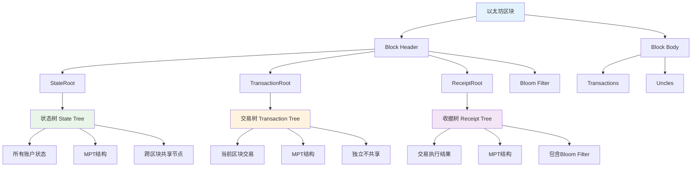

每次发布一个区块时，该区块包含的交易会组织成一棵交易树，这是一颗 Merkle Tree，与比特币中的情况类似。同时以太坊还增加了一个收据树，每个交易执行完后会形成一个收据，记录该交易的相关信息。交易树与收据树上面的节点是一一对应的。

### 交易与收据的对应关系

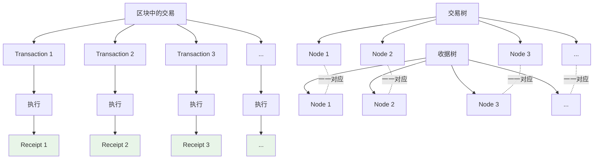

增加收据树主要是考虑到以太坊的智能合约执行过程比较复杂，通过增加收据树结构，有利于快速查询执行结果。

从数据结构上看，交易树和收据树都是 MPT，即上个章节介绍的 Merkle Patricia Tree。

### 与比特币的区别

#### 数据结构对比

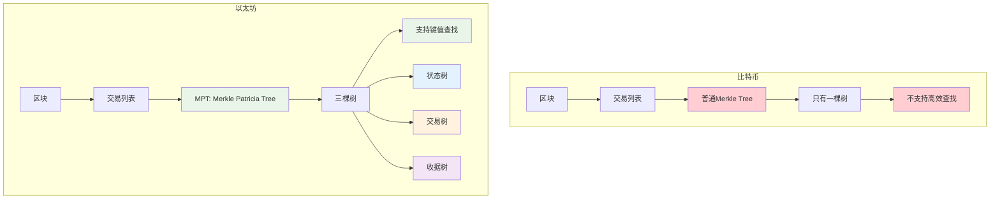

这个数据结构与比特币有所区别。比特币中的交易树使用普通的 Merkle Tree，将区块里的所有交易组织成一个普通的 Merkle Tree。

MPT 也是一种 Merkle Tree，称为 Merkle Patricia Tree，但与比特币中使用的不完全一样。

**产生差异的原因：**

这种差异可能是为了方便以太坊中的三棵树都使用相同的数据结构，使代码比较统一，便于管理。

#### MPT查找机制

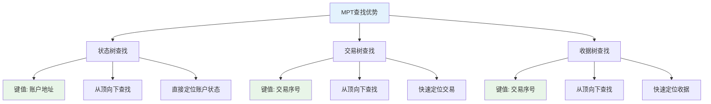

使用 MPT 的一个好处是支持查找操作，可以通过键值从顶向下沿着树进行查找：

- 对于状态树，查找的键值是账户地址
- 对于交易树和收据树，查找的键值是交易在发布区块里的序号

交易的排列顺序由发布区块的节点决定。

### 三棵树的重要区别

#### 数据范围对比

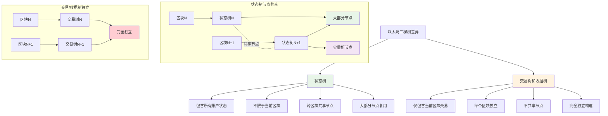

这三棵树有一个重要区别：

- **交易树和收据树**：只包含当前发布区块的交易
- **状态树**：包含系统中所有账户的状态，无论这些账户是否与当前区块的交易相关

从数据结构角度看，上个章节提到多个区块的状态树是共享节点的。每次新发布区块时，只有该区块中的交易影响并改变了状态的节点需要新建分支，其他节点都沿用原来存在的节点。

相比之下，交易树和收据树，每个区块的交易树和收据树都是独立的，不会共享节点，因为不同区块发布的交易本身也是独立的。

## 交易树和收据树的用途

### 基本用途：提供 Merkle Proof

#### Merkle Proof流程

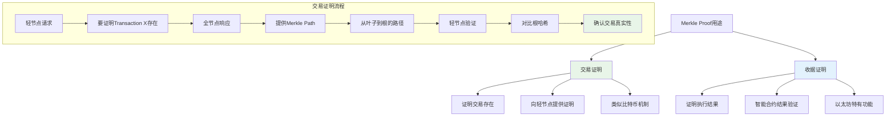

交易树和收据树的用途之一是提供 Merkle Proof，就像比特币中交易树可以证明某个交易被打包到某个区块里，可以向轻节点提供这样的 Merkle Proof。收据树也类似，要证明某个交易的执行结果，也可以在收据树里面提供 Merkle Proof。

### 高级用途：复杂查询操作

#### 查询需求分析

```mermaid
graph TD
    A[复杂查询需求] --> B[智能合约相关交易]
    A --> C[特定事件类型]
    A --> D[时间范围查询]
    
    B --> B1[过去十天与合约X相关的交易]
    C --> C1[所有众筹事件]
    C --> C2[所有发币事件]
    D --> D1[指定时间段的活动]
    
    E[传统方法问题] --> F[需要扫描所有区块]
    F --> G[复杂度高 O(n)]
    G --> H[轻节点无法实现]
    H --> I[没有完整交易列表]
    
    J[解决方案] --> K[Bloom Filter]
    K --> L[快速过滤]
    L --> M[高效查询]
    
    style E fill:#ffcdd2
    style F fill:#ffcdd2
    style G fill:#ffcdd2
    style H fill:#ffcdd2
    style J fill:#e8f5e8
    style K fill:#e8f5e8
    style L fill:#e8f5e8
    style M fill:#e8f5e8
```

此外，以太坊还支持更加复杂的查询操作。比如查找过去十天中所有与某个智能合约相关的交易。

**传统方法的问题：**

一种方法是扫描过去十天产生的所有区块，查看其中哪些交易与该智能合约相关。但这种方法的复杂度较高，而且对于轻节点来说，轻节点没有交易列表，只有块头信息，无法通过扫描所有交易列表的方法来找到符合查询条件的交易。

**类似的查询需求：**

比如查找过去十天中符合某种类型的所有事件：
- 所有的众筹事件
- 所有的发行新币事件

这些都需要比较高效的方法支持。

**解决方案：** 以太坊中引入了 **Bloom Filter** 数据结构。

## Bloom Filter 原理

### 基本概念

#### 问题背景

```mermaid
graph TD
    A[查询问题] --> B[大集合元素查找]
    B --> C[传统方法]
    B --> D[Bloom Filter方法]
    
    C --> C1[遍历所有元素]
    C --> C2[时间复杂度 O(n)]
    C --> C3[需要完整集合存储]
    C --> C4[轻节点无法实现]
    
    D --> D1[紧凑摘要查找]
    D --> D2[时间复杂度 O(1)]
    D --> D3[只需小量存储]
    D --> D4[轻节点可实现]
    
    style C fill:#ffcdd2
    style C1 fill:#ffcdd2
    style C2 fill:#ffcdd2
    style C3 fill:#ffcdd2
    style C4 fill:#ffcdd2
    style D fill:#e8f5e8
    style D1 fill:#e8f5e8
    style D2 fill:#e8f5e8
    style D3 fill:#e8f5e8
    style D4 fill:#e8f5e8
```

Bloom Filter 数据结构可以支持比较高效的查找某个元素是否在一个较大的集合里面。比如有一个包含很多元素的集合，现在想知道某个指定元素是否在这个集合里。

**传统方法：**

一个简单的方法是遍历集合中的元素，查看是否有要找的元素。这个复杂度是线性的，为 O(n)。

另外还有一个前提：需要有足够的存储来保存整个集合的元素。对于轻节点来说，没有完整的交易列表，没有整个集合的元素信息，所以这种方法无法使用。

### Bloom Filter 工作原理

#### 构建过程示例

```mermaid
graph TD
    A[集合 {A, B, C}] --> B[初始位向量]
    B --> C[全部为0]
    
    D[哈希函数 H] --> E[元素A]
    D --> F[元素B]
    D --> G[元素C]
    
    E --> E1[H(A) = 位置2]
    F --> F1[H(B) = 位置5]
    G --> G1[H(C) = 位置1]
    
    H[位向量构建过程]
    I[0 0 0 0 0 0 0 0] --> J[初始状态]
    J --> K[A: 位置2置1]
    K --> L[0 0 1 0 0 0 0 0]
    L --> M[B: 位置5置1]
    M --> N[0 0 1 0 0 1 0 0]
    N --> O[C: 位置1置1]
    O --> P[0 1 1 0 0 1 0 0]
    P --> Q[最终Bloom Filter]
    
    style A fill:#e3f2fd
    style Q fill:#e8f5e8
    style P fill:#e8f5e8
```

Bloom Filter 使用一个巧妙的思想：为包含很多元素的大集合计算出一个紧凑的摘要，比如一个 128 位的向量。

**例子说明：**

假设有一个集合 {A, B, C}，要为它计算出一个 digest。

下面是一个位向量，这个向量初始时都是 0，然后有一个哈希函数 H，它把每个元素映射到向量中的某个位置：

1. A 这个元素取哈希后映射到某个位置，将这个位置的元素从 0 变成 1
2. B 可能映射到另一个位置，该位置也置成 1
3. C 映射到第三个位置，也变成 1

将每个元素都取哈希，找到向量中的对应位置，然后置成 1。所有元素都处理完后，得到的向量就是原来集合的摘要。

**这个摘要比原来的集合小很多**，在这个例子中，比如用一个 128 位就可以表示。

### 查询操作

#### 查询流程图

```mermaid
graph TD
    A[查询元素D] --> B[计算H(D)]
    B --> C[获得位置索引]
    C --> D[检查该位置的值]
    
    D --> E{位置值为0?}
    E -->|是| F[确定不在集合中]
    E -->|否| G[位置值为1]
    
    G --> H{是否在集合中?}
    H --> I[可能在集合中]
    H --> J[也可能是哈希碰撞]
    
    I --> K[True Positive]
    J --> L[False Positive]
    
    subgraph "查询示例"
        M[查询元素X] --> N[H(X) = 位置3]
        N --> O[位置3的值 = 0]
        O --> P[确定X不在集合中]
        
        Q[查询元素Y] --> R[H(Y) = 位置2]
        R --> S[位置2的值 = 1]
        S --> T[Y可能在集合中]
        T --> U[需要进一步确认]
    end
    
    style F fill:#e8f5e8
    style K fill:#e8f5e8
    style L fill:#ffcdd2
    style P fill:#e8f5e8
    style U fill:#fff3e0
```

假设有一个元素 D，想知道 D 是否在这个集合里。但这个集合本身不一定能够保存下来，应该怎么办？

使用哈希函数对 D 取哈希值，比如取完后发现映射到某个地方：

1. **映射到一个为 0 的位置**：说明这个元素一定不在集合里
2. **映射到一个为 1 的位置**：无法确定

为什么不能确定？

如果 D 映射到一个为 1 的地方，有可能它确实是集合中的元素（比如 D 等于 A，所以找到了），也有可能它不在集合里面，但是出现了哈希碰撞，恰好映射到了与集合中某个元素相同的位置。

### Bloom Filter 的特性

#### 特性分析图

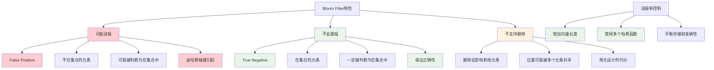

使用 Bloom Filter 时，要注意它可能出现 **False Positive**，但不会出现 **False Negative**：

- **可能出现误报**：不在集合里的元素可能被判断为在集合里
- **不会出现漏报**：在集合里的元素一定会被判断为在集合里

这是 Bloom Filter 的基本工作原理。

### Bloom Filter 的变种

#### 多哈希函数改进

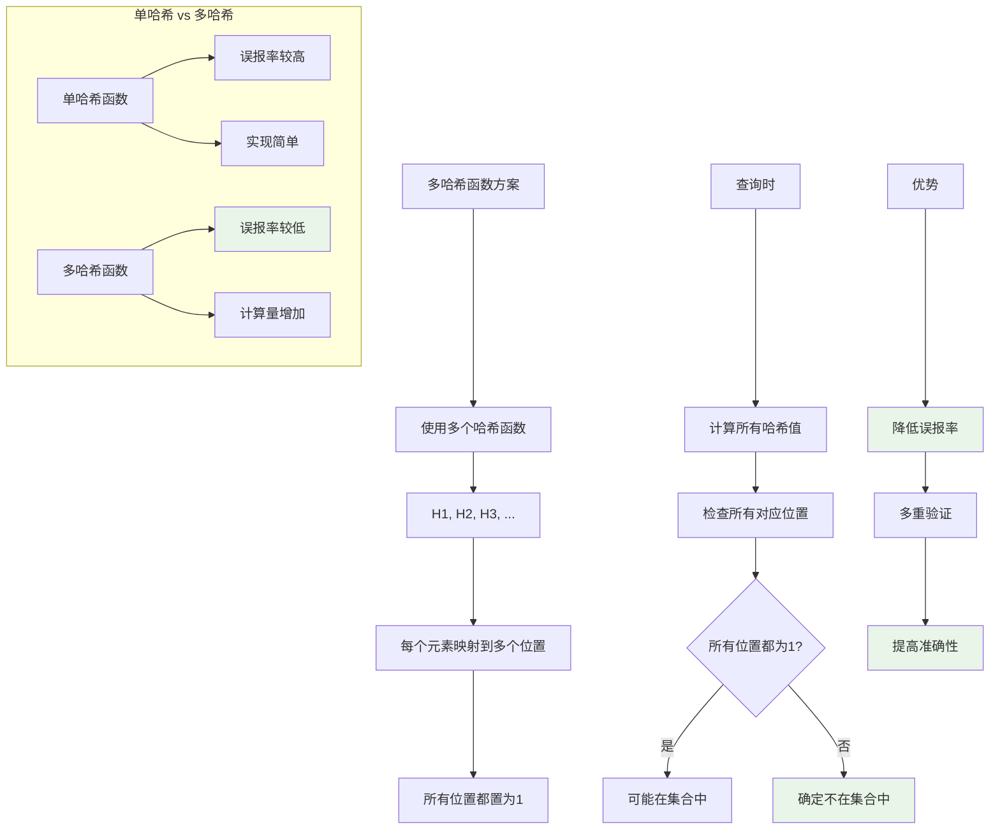

Bloom Filter 有各种变种，比如为了解决哈希碰撞问题，有的 Bloom Filter 设计使用的不是一个哈希函数，而是一组哈希函数。每个哈希函数独立地将元素映射到向量中的某个位置。

使用一组哈希函数的好处是：如果出现哈希碰撞，一般来说不会所有哈希函数都同时出现碰撞。

### Bloom Filter 的局限性

#### 删除操作问题

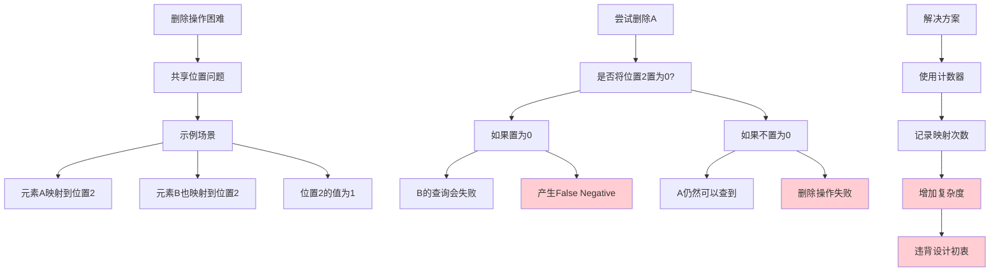

从集合中删除一个元素该怎么操作？

**答案是：无法操作。**

Bloom Filter 数据结构的一个局限性是不支持删除操作。原因是：比如删除 A 这个元素，对应位置是 1，是否要改成 0？如果改成 0，这个集合中可能有另外一个元素也映射到这个位置，即哈希碰撞是可能的。

如果要支持删除操作，这个地方就不能使用 binary bit，不能是 0 和 1。需要将它改成计数器，记录这个位置有多少个元素映射过来。而且还要考虑计数器是否会 overflow。这样数据结构就复杂多了，与当初设计 Bloom Filter 的初衷相违背。

所以一般来说，Bloom Filter 不支持删除操作。

## 以太坊中的 Bloom Filter 应用

### 结构设计

#### 以太坊Bloom Filter层次结构

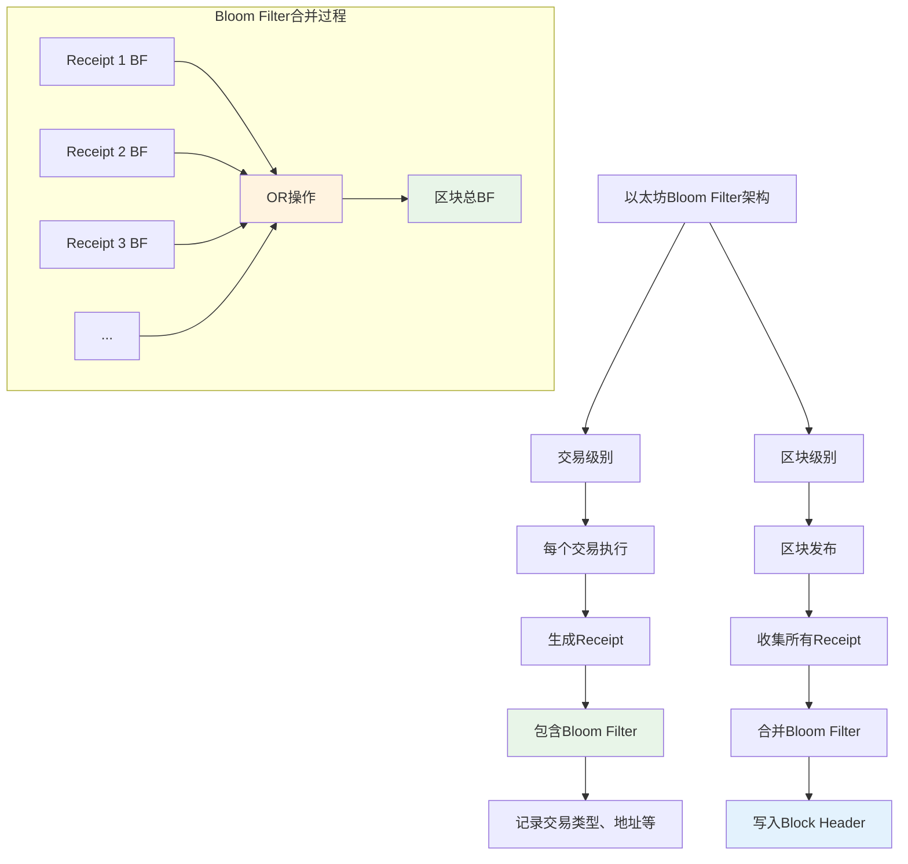

每个交易执行完后会形成一个收据。这个收据里面包含了一个 Bloom Filter，记录这个交易的类型、地址等其他信息。

发布的区块在其块头里也有一个总的 Bloom Filter，这个总的 Bloom Filter 是该区块里所有交易的 Bloom Filter 的并集。

### 查询流程

#### 智能合约相关交易查询流程

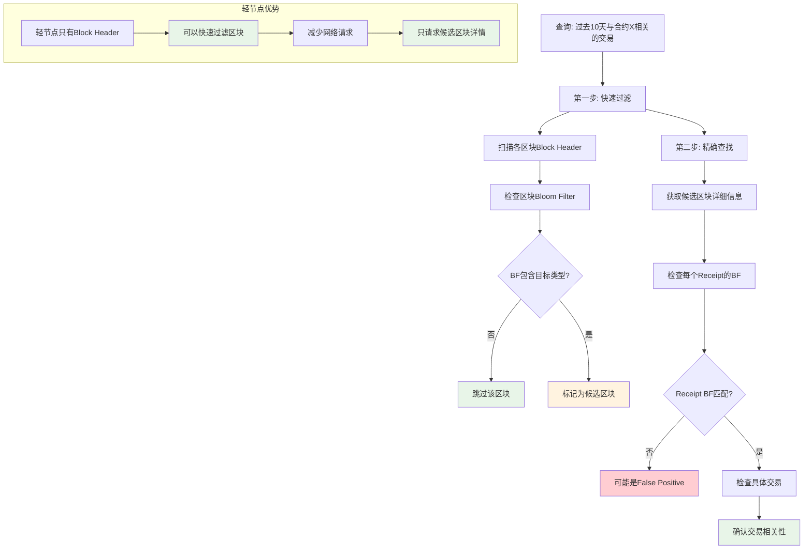

回到之前的例子，比如要查找过去十天发生的与某个智能合约相关的所有交易，如何查找？

1. **第一步：快速过滤**
   - 先查看哪个区块的块头里的 Bloom Filter 有要找的交易类型
   - 如果块头的 Bloom Filter 里没有，那么可以确定这个区块不是需要的

2. **第二步：精确查找**
   - 如果块头的 Bloom Filter 有，再去查找这个区块里包含的交易所对应的收据树里面的那些 Bloom Filter
   - 查看每个收据的 Bloom Filter 哪个有，也可能都没有（因为可能是 False Positive）
   - 如果有，再找到相对应的交易，直接进行确认

### 优势

#### Bloom Filter优势分析

```mermaid
graph TD
    A[Bloom Filter优势] --> B[快速过滤]
    A --> C[存储效率]
    A --> D[轻节点友好]
    
    B --> B1[大量无关区块快速排除]
    B --> B2[减少详细检查的工作量]
    B --> B3[提高查询效率]
    
    C --> C1[紧凑的数据结构]
    C --> C2[固定大小存储]
    C --> C3[不随元素数量线性增长]
    
    D --> D1[只需Block Header]
    D --> D2[无需完整交易列表]
    D --> D3[支持轻量级查询]
    
    E[性能对比] --> F[传统方法]
    E --> G[Bloom Filter方法]
    
    F --> F1[扫描所有交易]
    F --> F2[O(n)时间复杂度]
    F --> F3[需要完整数据]
    
    G --> G1[先过滤再精查]
    G --> G2[大部分情况O(1)]
    G --> G3[只需要摘要信息]
    
    style B fill:#e8f5e8
    style C fill:#e8f5e8
    style D fill:#e8f5e8
    style F fill:#ffcdd2
    style G fill:#e8f5e8
```

这种方法的好处是通过 Bloom Filter 结构，能够**快速过滤掉大量无关的区块**。很多区块通过查看块头的 Bloom Filter 就知道，肯定不会有需要的交易。

然后对剩下的少数候选区块，再仔细查看。比如轻节点只有块头信息，根据块头就已经能够过滤掉很多区块，剩下有可能是想要的那些区块，再去问全节点要进一步的信息。

## 以太坊作为状态机

基本上，以太坊中的三棵树已经讲述完毕。这三个树的根哈希都包括在块头里面。

### 以太坊的状态机模型

#### 状态机架构图

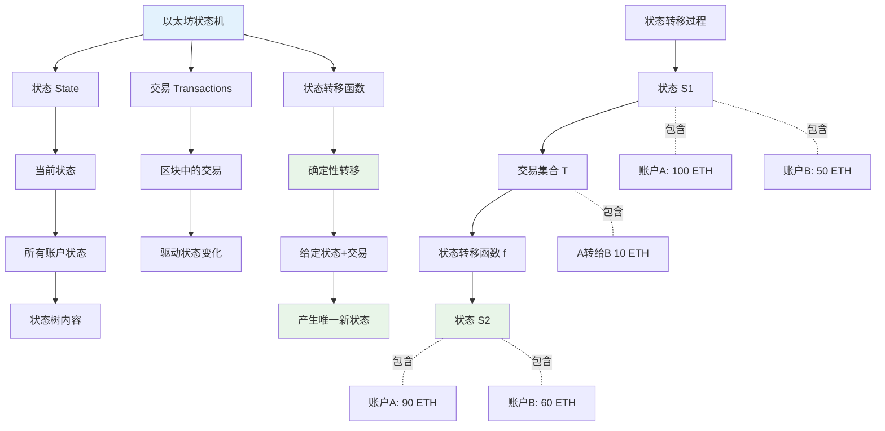

以太坊的运行过程可以看作是一个**交易驱动的状态机**：

- **状态**：所有账户的状态，即状态树中包含的内容
- **交易**：每次发布的区块里包含的交易

这些交易通过执行会驱动系统从当前状态转移到下一个状态。

### 与比特币的对比

#### 状态机对比图

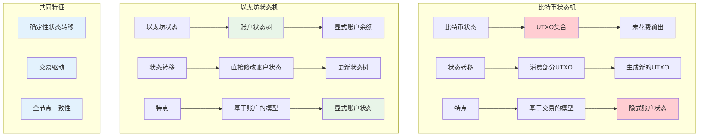

比特币也可以认为是一个交易驱动的状态机：

- **比特币中的状态**：UTXO，没有被花掉的那些输出
- **状态转移**：每次新发布一个区块会从 UTXO 里用掉一些输出，又会增加一些新的输出

所以发布区块会驱动状态机从当前状态转移到下一个状态。UTXO 可以认为是比特币状态机中的状态。

### 确定性特征

#### 确定性保证机制

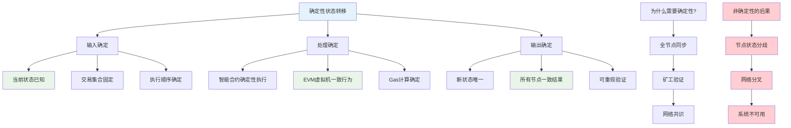

这两个状态机有一个共同特点，即**状态转移都是确定性的**：

对于一个给定的当前状态，一个给定的一组交易（即区块中包含的这些交易），能够确定性地转移到下一个状态。

因为所有的全节点、所有的矿工都要执行相同的状态转移，所以状态转移必须是确定性的。

## 关键问题思考

### 问题一：新账户的处理

#### 新账户创建流程

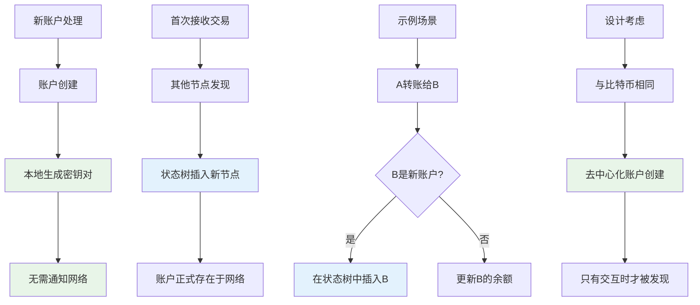

比如有人在以太坊上发布一个交易，某个节点收到这个交易。这个交易说转账从 A 转到 B，收款人的地址是否可能是该节点从来没听说过的？

**答案：** 可能。以太坊与比特币一样，创建账户时不需要通知其他人。只有这个账户第一次收到钱时，其他节点才会知道这个账户的存在。这时要在状态树中新插入一个节点，因为这是一个新增加的账户。

### 问题二：状态树设计的思考

#### 状态树设计方案对比

```mermaid
graph TD
    A[状态树设计思考] --> B[当前设计]
    A --> C[替代设计]
    
    B --> B1[包含所有账户状态]
    B --> B2[便于状态查询]
    B --> B3[支持快速验证]
    
    C --> C1[只包含相关账户]
    C --> C2[类似交易树模式]
    C --> C3[减少存储大小]
    
    D[替代设计问题] --> E[账户状态查找困难]
    E --> F[需要回溯多个区块]
    F --> G[查找A的状态]
    G --> H[A可能很久没有交易]
    H --> I[需要扫描大量区块]
    
    J[更严重的问题] --> K[新账户B的处理]
    K --> L[需要扫描到创世块]
    L --> M[才能确认是新账户]
    M --> N[效率极低]
    
    style B fill:#e8f5e8
    style C fill:#fff3e0
    style E fill:#ffcdd2
    style I fill:#ffcdd2
    style N fill:#ffcdd2
```

前面讲述状态树和交易树、收据树的一个区别是，状态树要包含系统中所有账户的状态，无论这些账户是否参与了当前区块中的交易。

那么能否将状态树的设计改为每个区块的状态树也只包含该区块中的交易相关的那些账户的状态？

这样就与交易树和收据树一致了，而且可以大幅度削减每个区块所对应的状态树的大小，因为大部分账户状态不会变。

**这样可以吗？**

### 问题分析

#### 查找效率分析

```mermaid
graph TD
    A[A转给B 10 ETH的验证过程] --> B[需要验证A的余额]
    A --> C[需要知道B的当前状态]
    
    B --> B1[在当前/最近区块查找A]
    B1 --> B2{找到A?}
    B2 -->|否| B3[向前扫描区块]
    B3 --> B4[继续查找A的最近状态]
    B4 --> B5[可能需要扫描很多区块]
    
    C --> C1[查找B的账户状态]
    C1 --> C2{B是新账户?}
    C2 -->|是| C3[扫描到创世块]
    C3 --> C4[确认B不存在]
    C4 --> C5[创建新账户]
    
    D[效率问题] --> E[大量磁盘IO]
    E --> F[网络延迟]
    F --> G[验证时间过长]
    G --> H[系统性能下降]
    
    style B5 fill:#ffcdd2
    style C3 fill:#ffcdd2
    style C4 fill:#ffcdd2
    style E fill:#ffcdd2
    style F fill:#ffcdd2
    style G fill:#ffcdd2
    style H fill:#ffcdd2
```

如果这么设计，实际上相当于比特币的基于交易的账户模型。

这么设计的一个问题是：**查找某个账户的状态就不方便了。**

比如有个转账交易，A 转给 B 10 个以太币。前面讲过要检查 A 这个账户里是否真的有 10 个以太币。

问题是 A 这个账户在当前区块或最近一个区块对应的状态树可能没有 A 这个账户。所以要往前找，一直找到最近的一个包含 A 账户的区块，然后才能知道 A 的账户余额。

**不方便的地方：** 如果 A 这个账户有比较长一段时间没有发生任何交易，可能要从后往前扫描很多个区块，才能找到他最近一次的账户状态。

**更大的问题：** 

A 转给 B 钱时，要知道 A 账户的状态，才能知道 A 是否有足够的钱转给 B 10 个以太币。也要知道 B 的账户状态，他当前的余额是多少，因为要往上面加 10 个以太币。

所以也要找 B 这个账户的状态，而 B 这个账户可能是个新建的账户，这时要找到哪里去？要从当前区块一直扫描到创世纪块，发现 B 这个账户没有，才知道原来是个新建的账户。

这就是这种设计的问题所在。

## 代码实现细节

下面看一些代码中的具体数据结构。

### 交易树和收据树的创建过程

#### 区块创建流程图

```mermaid
graph TD
    A[newBlockG函数] --> B[处理交易列表]
    A --> C[处理收据列表]
    
    B --> B1{交易列表为空?}
    B1 -->|是| B2[header.TxHash = emptyRootHash]
    B1 -->|否| B3[header.TxHash = DeriveSha(transactions)]
    
    C --> C1{收据列表为空?}
    C1 -->|是| C2[header.ReceiptHash = emptyRootHash]
    C1 -->|否| C3[header.ReceiptHash = DeriveSha(receipts)]
    C3 --> C4[header.Bloom = CreateBloom(receipts)]
    
    subgraph "DeriveSha函数"
        D[输入: 交易/收据列表]
        D --> E[创建MPT]
        E --> F[计算根哈希]
        F --> G[返回根哈希值]
    end
    
    B3 --> D
    C3 --> D
    
    style B2 fill:#e8f5e8
    style B3 fill:#e3f2fd
    style C2 fill:#e8f5e8
    style C3 fill:#e3f2fd
    style C4 fill:#fff3e0
```

在 `newBlockG` 函数里面创建了交易树和收据树，并且得到它们的根哈希值。

**交易树的代码：**
```go
// 首先判断交易列表是否为空
if len(transactions) == 0 {
    // 如果是空的，那么区块的块头里的交易树的根哈希值就是一个空的哈希值
    header.TxHash = emptyRootHash
} else {
    // 否则通过调用 DeriveSha 函数来得到交易树的根哈希值
    header.TxHash = DeriveSha(transactions)
}
```

**收据树的代码：**
```go
// 首先判断收据列表是否为空
if len(receipts) == 0 {
    // 如果是空的，那么块头里收据树的根哈希值就是一个空的哈希值
    header.ReceiptHash = emptyRootHash
} else {
    // 如果不为空，那么也是通过调用 DeriveSha 函数来得到收据树的根哈希值
    header.ReceiptHash = DeriveSha(receipts)
    // 然后创建块头里的 Bloom Filter
    header.Bloom = CreateBloom(receipts)
}
```

前面讲过，每个交易执行完后会得到一个收据，所以交易列表的长度与收据列表的长度应该相等。

### DeriveSha 函数

#### DeriveSha函数工作原理

```mermaid
graph TD
    A[DeriveSha函数] --> B[接收输入列表]
    B --> C[创建Trie数据结构]
    C --> D[构建MPT]
    D --> E[计算根哈希]
    E --> F[返回根哈希值]
    
    G[共同使用] --> H[状态树]
    G --> I[交易树]
    G --> J[收据树]
    
    H --> K[MPT结构]
    I --> K
    J --> K
    
    style A fill:#e3f2fd
    style K fill:#e8f5e8
    style D fill:#e8f5e8
    style E fill:#e8f5e8
```

`newBlockG` 函数创建交易树和收据树时，调用的都是 `DeriveSha` 函数。它创建的数据结构是一棵 Trie。

Trie 的数据结构是一棵 MPT（Merkle Patricia Tree），以太坊中的三棵树——状态树、交易树、收据树，使用的都是 MPT。

### Receipt 数据结构

#### Receipt结构示意图

```mermaid
graph TD
    A[Receipt数据结构] --> B[基本字段]
    A --> C[Bloom字段]
    A --> D[Logs字段]
    
    B --> B1[交易执行结果]
    B --> B2[Gas使用量]
    B --> B3[状态信息]
    
    C --> C1[该收据的Bloom Filter]
    C --> C2[基于Logs生成]
    
    D --> D1[Log数组]
    D --> D2[每个收据可包含多个log]
    D --> D3[智能合约事件记录]
    
    E[Log内容] --> F[地址信息]
    E --> G[Topic信息]
    E --> H[数据内容]
    
    style A fill:#e3f2fd
    style C1 fill:#e8f5e8
    style D1 fill:#e8f5e8
    style D3 fill:#e8f5e8
```

```go
type Receipt struct {
    // ... 其他字段
    Bloom Bloom       // 这个收据的 Bloom Filter
    Logs  []*Log      // Log 数组，每个收据可以包含多个 log
}
```

每个交易执行完后形成一个收据，记录了该交易的执行结果。这里的 `Bloom` 域就是该收据的 Bloom Filter。这个 `Logs` 是个数组，每个收据可以包含多个 log，该收据的 Bloom Filter 就是根据这些 log 产生的。

### 块头中的 Bloom Filter

这是上个章节看过的区块的块头数据结构，里面的 `Bloom` 域就是整个区块的 Bloom Filter。它是由每个收据的 Bloom Filter 合并在一起得到的。

### Bloom Filter 相关函数

#### Bloom Filter生成流程

```mermaid
graph TD
    A[Bloom Filter生成流程] --> B[CreateBloom函数]
    A --> C[LogsBloom函数]
    A --> D[Bloom9函数]
    
    B --> B1[输入: 区块所有收据]
    B1 --> B2[循环处理每个收据]
    B2 --> B3[调用LogsBloom]
    B3 --> B4[OR操作合并]
    B4 --> B5[生成区块BF]
    
    C --> C1[输入: 收据的logs数组]
    C1 --> C2[外层循环: 处理每个log]
    C2 --> C3[加入log地址]
    C3 --> C4[内层循环: 处理每个topic]
    C4 --> C5[生成收据BF]
    
    D --> D1[输入: 数据字节]
    D1 --> D2[生成256位哈希]
    D2 --> D3[取前6字节分组]
    D3 --> D4[映射到3个位置]
    D4 --> D5[返回位向量]
    
    style B5 fill:#e8f5e8
    style C5 fill:#e8f5e8
    style D5 fill:#e8f5e8
```

这是相关的三个函数的代码实现：`CreateBloom`、`LogsBloom` 和 `Bloom9` 这 3 个函数的代码实现。

**CreateBloom 函数：**
```go
func CreateBloom(receipts Receipts) Bloom {
    // 参数是区块的所有收据
    // 通过循环对每个收据调用 LogsBloom 函数来生成该收据的 Bloom Filter
    // 然后把这些 Bloom Filter 合并起来，用 OR 操作合并
    // 得到整个区块的 Bloom Filter
}
```

**LogsBloom 函数：**
```go
func LogsBloom(logs []*Log) *big.Int {
    // 功能是生成每个收据的 Bloom Filter
    // 参数是该收据的 logs 数组
    // 有两层循环：
    // - 外层循环对 log 数组里的每个 log 进行处理
    // - 首先把该 log 的地址加入到 Bloom Filter 里面
    // - 内层循环，把该 logs 中包含的每个 topic 加入到 Bloom Filter 里
    // 这样就得到了该收据的 Bloom Filter
}
```

### Bloom9 哈希函数

#### Bloom9函数详细流程

```mermaid
graph TD
    A[Bloom9函数] --> B[输入数据]
    B --> C[计算Keccak256哈希]
    C --> D[得到32字节哈希值]
    
    D --> E[取前6字节]
    E --> F[每2字节一组处理]
    F --> G[循环3次]
    
    G --> H[第1组: 位置0-1]
    G --> I[第2组: 位置2-3]
    G --> J[第3组: 位置4-5]
    
    H --> H1[计算位置1]
    I --> I1[计算位置2]
    J --> J1[计算位置3]
    
    H1 --> K[按位与2047]
    I1 --> K
    J1 --> K
    
    K --> L[得到0-2047范围位置]
    L --> M[对应位置置1]
    M --> N[返回Bloom Filter]
    
    O[为什么是2047?] --> P[以太坊BF长度2048位]
    P --> Q[2048 = 2^11]
    Q --> R[2047 = 2048-1]
    
    style C fill:#e3f2fd
    style K fill:#e8f5e8
    style M fill:#e8f5e8
    style N fill:#e8f5e8
```

`Bloom9` 是 Bloom Filter 中使用的哈希函数，它与之前讲的有一点区别。之前例子中的哈希函数是把集合中的每个元素映射到 digest 中的某个位置。

这里的 `Bloom9` 函数是把输入映射到位数组中的**三个位置**，也就是说把三个位置都置为 1。

**Bloom9 函数的代码：**
```go
func Bloom9(data []byte) *big.Int {
    // 第一行调用 crypto 里面的函数生成一个 256 位的哈希值
    // 这里的 b 是个 32 字节的哈希值
    b := crypto.Keccak256(data)
    
    // r 是最后要返回的 Bloom Filter，初始化为 0
    r := new(big.Int)
    
    // 循环，把刚才生成的 32 字节的哈希值取前 6 个字节
    // 每两个字节组成一组拼接在一起
    // 然后按位与上 2047，相当于对 2048 取余
    // 得到一个位于 0 到 2047 这个区间里的数
    // 之所以要这样做，是因为以太坊中 Bloom Filter 的长度是 2048 位
    for i := 0; i < 6; i += 2 {
        t := big.NewInt(1)
        b := (uint(b[i+1]) + (uint(b[i]) << 8)) & 2047
        r.Or(r, t.Lsh(t, b))
    }
    
    // 经过三轮循环，把三个位置置为 1 后，返回所创建的 Bloom Filter
    return r
}
```

### Bloom Filter 查询

#### BloomLookup查询流程

```mermaid
graph TD
    A[BloomLookup查询] --> B[输入参数]
    B --> C[Bloom Filter]
    B --> D[要查询的topic]
    
    D --> E[调用Bloom9函数]
    E --> F[生成topic的bit vector]
    
    F --> G[与Bloom Filter做AND操作]
    G --> H[检查结果]
    
    H --> I{结果等于bit vector?}
    I -->|是| J[可能在集合中]
    I -->|否| K[确定不在集合中]
    
    L[为什么要AND操作?] --> M[BF可能包含其他topic]
    M --> N[需要检查目标位置是否都为1]
    N --> O[AND操作提取目标位置]
    
    style K fill:#e8f5e8
    style J fill:#fff3e0
    style O fill:#e8f5e8
```

前面讲的是生成 Bloom Filter 的过程，那么如何查询某个 Bloom Filter 里面是否包含了感兴趣的 topic？

这是通过调用 `BloomLookup` 函数来实现的：

```go
func BloomLookup(bloom Bloom, topic []byte) bool {
    // 需要查看该 Bloom Filter 里有没有包含要找的 topic
    // 首先用刚才讲的 Bloom9 函数把该 topic 转换成一个 bit vector
    // 然后把它与该 Bloom Filter 做按位与操作
    // 看看得到的结果是否与该 bit vector 相等
    
    // 注意：该 Bloom Filter 里面可能还包含有其他的 topic
    // 除了要查找的这个 topic 之外，还可以包含其他的 topic
    // 所以要先做一个 AND，然后再与它自身比较
    // 相当于判断要查找的这个 topic 在 Bloom Filter 中对应的位置是否都是 1
}
```

## 总结

### 章节内容总结

```mermaid
graph TD
    A[第17章总结] --> B[核心概念]
    A --> C[技术特点]
    A --> D[应用价值]
    
    B --> B1[交易树和收据树]
    B --> B2[Bloom Filter原理]
    B --> B3[以太坊状态机]
    B --> B4[MPT数据结构]
    
    C --> C1[快速查询能力]
    C --> C2[紧凑存储设计]
    C --> C3[确定性状态转移]
    C --> C4[三树统一架构]
    
    D --> D1[轻节点支持]
    D --> D2[智能合约查询]
    D --> D3[历史状态追踪]
    D --> D4[网络效率提升]
    
    E[关键设计决策] --> F[为什么使用MPT?]
    E --> G[为什么需要收据树?]
    E --> H[为什么引入Bloom Filter?]
    
    F --> F1[统一数据结构]
    F --> F2[支持高效查找]
    F --> F3[避免哈希碰撞]
    
    G --> G1[智能合约复杂性]
    G --> G2[执行结果验证]
    G --> G3[与交易一一对应]
    
    H --> H1[复杂查询需求]
    H --> H2[轻节点限制]
    H --> H3[网络效率要求]
    
    style A fill:#e3f2fd
    style B1 fill:#e8f5e8
    style C1 fill:#e8f5e8
    style D1 fill:#e8f5e8
    style F1 fill:#e8f5e8
    style G1 fill:#e8f5e8
    style H1 fill:#e8f5e8
```

本章节详细介绍了以太坊中交易树和收据树的设计原理、Bloom Filter 的工作机制，以及它们在实际代码中的实现细节。通过这些内容，可以更好地理解以太坊作为一个交易驱动的状态机是如何高效地处理和查询交易数据的。

### 关键要点回顾

| 概念 | 特点 | 作用 |
|------|------|------|
| **交易树** | MPT结构，当前区块独立 | 提供交易存在性证明 |
| **收据树** | MPT结构，记录执行结果 | 提供智能合约执行证明 |
| **Bloom Filter** | 紧凑摘要，支持快速查询 | 高效过滤和查询支持 |
| **状态机模型** | 确定性转移，交易驱动 | 保证全网状态一致性 |

### 设计哲学

以太坊在交易树和收据树的设计中体现了以下设计哲学：

1. **统一性**：三棵树都使用MPT结构，代码统一管理
2. **效率性**：通过Bloom Filter实现高效查询
3. **完整性**：收据树记录智能合约执行的完整信息
4. **可验证性**：支持轻节点的Merkle Proof验证
5. **扩展性**：为复杂查询需求提供技术基础

这些设计选择使得以太坊能够在保持去中心化特性的同时，支持复杂的智能合约应用和高效的数据查询。
