**18. ETH GHOST 协议**

## 概述

### GHOST协议架构概览

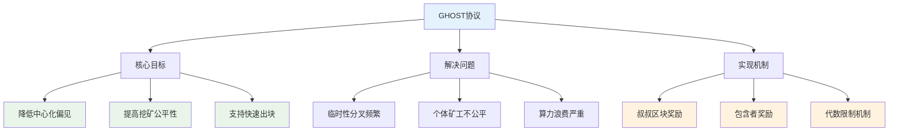

本章节介绍以太坊中的共识机制 GHOST 协议。

## 背景与动机

### 比特币vs以太坊性能对比

| 对比项目 | 比特币 | 以太坊 | 性能提升 |
|----------|--------|--------|----------|
| **出块时间** | 10分钟 (600秒) | 15秒 | 40倍提升 |
| **年度区块数** | ~52,560个 | ~2,102,400个 | 40倍提升 |
| **传播时间占比** | ~2-3% | ~67-100% | 传播成为瓶颈 |
| **临时分叉频率** | 偶尔发生 | 成为常态 | 频率大幅增加 |
| **算力浪费率** | <5% | 可能>20% | 浪费率显著上升 |
| **网络延迟影响** | 影响很小 | 影响巨大 | 成为主要约束 |

以太坊将出块时间降低到十几秒，这对于提高系统的吞吐量（throughput）和降低响应时间都具有重要意义。相比比特币的 10 分钟出块时间，以太坊的出块速度提高了约 40 倍。

### 快速出块的挑战

#### 网络传播问题分析

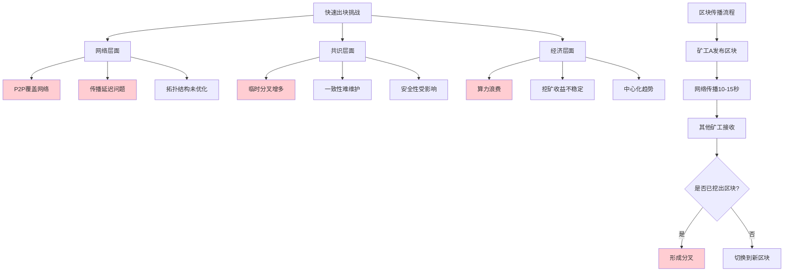

大幅度降低出块时间后，系统面临新的挑战。比特币和以太坊都运行在应用层的共识协议上，底层是 P2P 覆盖网络（overlay network），这种网络的传输时间相对较长，因为其拓扑协议在执行洪泛（flooding）时未考虑实际拓扑结构。

这产生了一个问题：发布区块后，区块在网络上传播到其他节点可能需要十几秒时间。

**比特币的情况：**
- 对于比特币，10 分钟（600 秒）的出块时间足够新发布的区块传播到网络中的其他节点
- 即使如此，由于挖矿是概率过程，仍可能出现两个矿工同时获得记账权并发布区块的情况
- 如前所述，这种情况会导致临时性分叉

**以太坊的情况：**
- 临时性分叉会成为常态，且分叉数量更多
- 由于出块时间仅为十几秒，其他节点可能尚未收到已发布的区块，仍沿着原有区块链继续挖矿
- 当节点收到新区块时，可能已经挖出了自己的区块

### 共识协议的挑战

#### 分叉处理机制对比

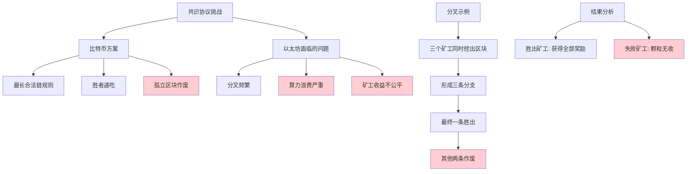

这种情况对共识协议带来的挑战如下：

比特币采用的规则是：只有最长合法链上的区块包含的出块奖励才有效，其他分叉链上的出块奖励最终会被作废。

**分叉示例：**

假设区块链在某处产生分叉，形成三个分支，三个区块几乎同时获得记账权。最终会有一个分支胜出，成为最长合法链（例如中间的分支）。

#### 孤立区块问题

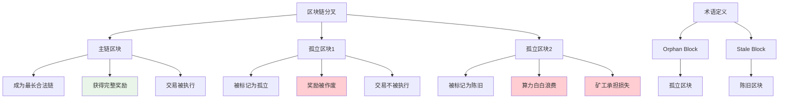

其他分支上的区块称为**孤立区块**（orphan block）或**陈旧区块**（stale block）。

挖出这些区块的矿工虽然在区块中包含了铸币交易（coinbase transaction），能够获得一定数量的比特币，但这些奖励最终会被作废，因为它们不在最长合法链上。

### 问题的严重性

#### 比特币vs以太坊影响对比

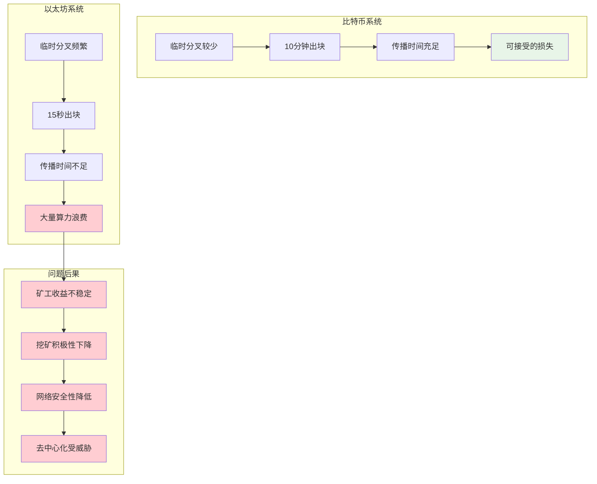

**比特币：** 由于临时性分叉情况相对较少，这种处理方式尚可接受。

**以太坊：** 如果采用相同处理方式，意味着矿工挖出的区块有很大概率被白白浪费。

矿工辛苦挖出区块，由于系统中分叉较多，挖出的区块很可能无法成为最长合法链的一部分而被作废。这对矿工极不公平，尤其是对个体矿工。

### 挖矿集中化趋势

#### 挖矿生态演变

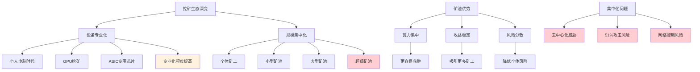

目前挖矿呈现两个主要趋势：

1. **挖矿设备专业化**：很少有人使用普通桌面计算机挖矿，通常使用专门设备，如 ASIC 芯片，或对以太坊使用 GPU 挖矿

2. **大型矿池的出现**：个体矿工算力有限，多数组成大型矿池。通过资本运作，大量算力集中在大型矿池中。不仅比特币如此，以太坊也存在这种情况（mining pool）

### 对个体矿工的不公平性

#### 算力分布不公平分析

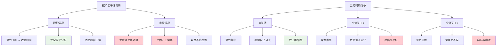

为什么说这种情况对个体矿工尤其不公平？

理想情况下，矿池获得的收益应与其算力比例一致。

例如，某矿池算力占系统总算力的 30%，那么该矿池获得的挖矿收益也应占系统总收益的 30%，这样才算公平。

但如果共识协议设计不当，可能导致大矿池获得的收益超过其算力比例。

**分叉时的不平等：**

当出现分叉时，假设上下两个分支是个体矿工挖出的区块，中间是某大矿池挖出的区块。后续变化如下：

- 大矿池必然沿着自己的分支继续挖矿，由于算力强大，挖出下一个区块的概率较高
- 上下两个分支的个体矿工只能寄希望于其他矿工沿着他们的分支继续挖矿
- 由于个体矿工算力微不足道，仅凭自己无法与大矿池竞争，只能期待其他矿工选择他们的分支

但对其他矿工而言，面对三个分叉，没有特别理由倾向于选择个体矿工的分支。

### 中心化偏见

#### 中心化偏见形成机制

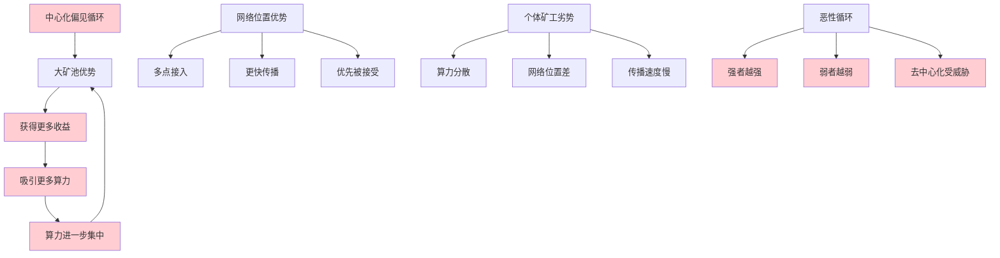

换言之，个体矿工作为整体，其算力分散。出现分叉后，算力分散造成的结果是：

假设某矿池挖到区块的概率为 30%，但其挖到的区块成为最长合法链的概率很高，这使得**挖矿中心化**（mining centralization）获得优势。

实际情况可能更为严重。大型矿池在区块链网络中通常占据较好位置，可能在网络多个地方都有接入点。因此，大型矿池发布的区块可能更早被其他节点接收。

即使三个区块同时挖出，大型矿池发布的区块也可能最先被其他节点收到。

从历史经验看，大型矿池所在分支更有可能成为最长合法链，这促使其他矿工选择该分支继续挖矿，因为选择其他分支可能导致白白浪费算力。

这形成恶性循环：大型矿池获得的收益越多，挖矿中心化情况越严重。这种现象称为**中心化偏见**（centralization bias）。

即中心化带来的不成比例优势。

## GHOST 协议的解决方案

### GHOST协议核心理念

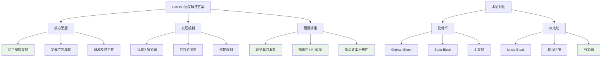

针对上述问题，以太坊采用了基于 GHOST 协议的共识机制。GHOST 协议并非以太坊发明，在以太坊出现前就已存在。以太坊对该协议进行了修改。

### 核心思想

该协议的核心思想是：矿工挖到矿并发布区块，即使该区块最终被作废，仍给予一定的安慰奖励，使其能够获得部分出块奖励。

例如，未能成为最长合法链的区块变成孤立区块或陈旧区块，以太坊给它们一个更好听的名字：**叔叔区块**（uncle block）。

### 叔叔区块的定义

#### 家族关系类比

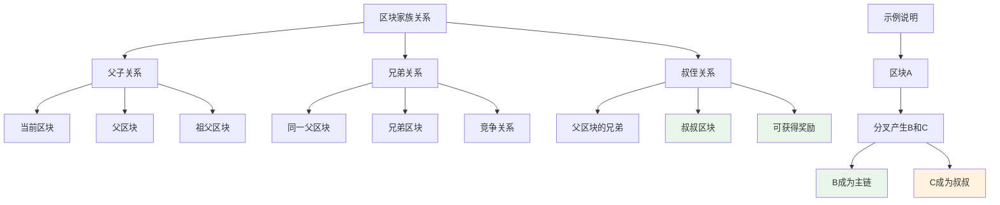

为什么称为"叔叔"？

这个区块相对于最长合法链上的当前区块，与其父区块属于同一辈份，故称为叔叔区块。

### 奖励机制

#### 奖励分配详细图

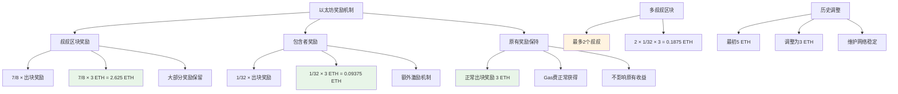

以太坊的奖励规定如下：

**叔叔区块奖励：**
- 区块发布时可包含叔叔区块，该叔叔区块能够获得 **7/8 的出块奖励**
- 以太坊出块奖励最初为 5 个以太币，后来调整为 3 个以太币
- 因此叔叔区块奖励为 7/8 × 3 = 2.625 个以太币

**包含者奖励：**
- 包含一个叔叔区块的当前区块可获得 **1/32 的额外出块奖励**，即 1/32 × 3 = 0.09375 个以太币
- 原有的 3 个以太币奖励保持不变

**多个叔叔区块：**
- 一个区块最多可包含两个叔叔区块
- 如果包含两个叔叔区块，额外奖励为 2 × 1/32 × 3 = 0.1875 个以太币

### 协议优点

#### 协议优势分析

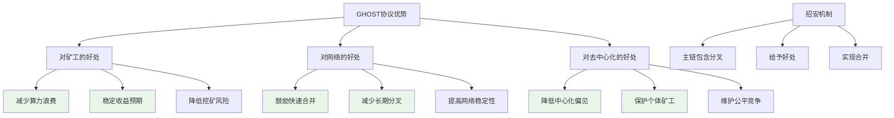

该协议的核心思想是：对挖到矿但未获得认可的矿工给予安慰奖励。虽然区块未成为最长合法链的一部分，但仍能获得大部分出块奖励（7/8 比例很高），实际上大部分奖励仍然可以获得。

这种设计有利于鼓励系统在出现分叉后及时合并，相当于主链上的区块将其他分叉链"招安"过来，给予好处以实现合并。

这是 GHOST 协议的初始版本。

## 协议的改进与完善

### 初始版本的问题

#### 初始协议问题分析

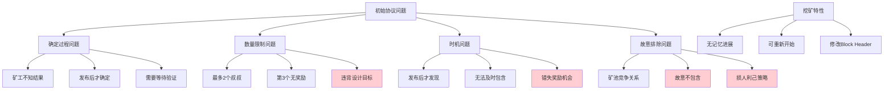

初始版本的协议存在以下缺陷：

**确定过程问题：**
- 矿工发布区块时并不知道自己的区块是否为叔叔区块
- 矿工希望发布的是最长合法链上的区块
- 但发布后，其他矿工也可能发布区块，后续矿工在挖下一个区块时可将其包含为叔叔区块

**具体流程：**
假设矿工发布区块后，听到其他矿工也发布了区块，两个区块构成兄弟关系。该矿工开始挖下一个区块时，由于知道其他区块的存在，可以将其设为叔叔区块。

在区块头（Block Header）数据结构中，除了父区块哈希值，还包含叔叔区块哈希值。挖下一个区块时，可以将其设置为叔叔区块。

如果后续又发现另一个叔叔区块，需要修改区块头重新挖矿。这对挖矿过程无损失，因为挖矿是**无记忆进展**（memoryless progress-free）过程。只要当前未挖到区块，修改头部重新开始与一开始就重新挖矿等效。

**存在的问题：**

1. **数量限制问题**：叔叔区块只能包含两个，第三个区块无法获得奖励。这与协议设计目标不符——如果不给予好处，矿工可能不愿意合并，因为一旦放弃自己的分叉就没有任何收益。

2. **时机问题**：如果矿工已发布区块后才知道其他区块的存在，就无法及时包含，该区块又无法获得任何奖励。

3. **故意排除问题**：如果矿工比较自私，可能故意不包含其他叔叔区块。矿池之间存在竞争关系，出于商业利益考虑，挖矿时可能故意不包含已知的叔叔区块。

这种做法的后果是：叔叔区块无法获得 7/8 的奖励，当前区块也无法获得 1/32 的额外奖励。虽然看似损人不利己，但从商业竞争角度，这种做法对自己损失较小，对竞争对手损失较大。

### 协议的改进

#### 改进方案对比

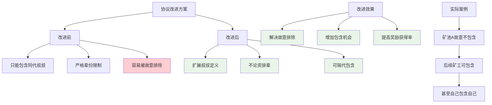

为解决上述问题，对协议进行如下改进：

**扩展叔叔定义：**
- 如果某区块未包含叔叔区块，向下继续的区块仍可将其包含为叔叔区块
- 按道理该区块与后续区块不是同辈关系，但以太坊规定**不论资排辈**，仍可作为叔叔区块
- 即使隔更多代，仍可被视为叔叔区块

**改进的好处：**
- 解决故意排除问题：即使某矿池故意不包含叔叔区块，其他矿工仍可在后续区块中包含
- 下一个区块不一定由同一矿工挖出，无法垄断整条链
- 挖出叔叔区块的矿工甚至可能在切换到主链后将自己的区块包含为叔叔区块

**仍存在的问题：**
- 叔叔定义的扩展引出新问题：应该隔多少代？
- 如果可以隔 100 代、1000 代，矿工可能在很久以前挖矿难度较低时不断产生叔叔区块，期待被包含

### 以太坊的最终规定

#### 叔叔区块代数限制规则

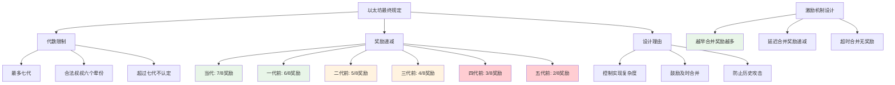

以太坊的最终规定如下：

**代数限制：**
假设这是最长合法链，当前区块是最新挖出的区块。如果存在分叉：

- **当代叔叔**：与当前区块同辈的区块，可获得 **7/8 的出块奖励**
- **上一代叔叔**：比当前区块早一代的叔叔，可获得 **6/8 的出块奖励**
- **上两代叔叔**：比当前区块早两代的叔叔，可获得 **5/8 的出块奖励**
- **上三代叔叔**：比当前区块早三代的叔叔，可获得 **4/8 的出块奖励**
- **上四代叔叔**：比当前区块早四代的叔叔，可获得 **3/8 的出块奖励**
- **上五代叔叔**：比当前区块早五代的叔叔，可获得 **2/8 的出块奖励**
- **超过六代**：不再被认定为叔叔区块

**具体规则：**
- 合法叔叔区块必须与当前区块在七代以内有共同祖先
- 最多七代（At most seven generations）
- 超过七代不予认定
- 合法叔叔涵盖六个辈份

**设计理由：**

1. **实现复杂度**：如果不限制叔叔辈份，全节点需要维护的状态过多，可能需要记录数百代前的叔叔区块。当矿工发布包含叔叔区块的区块时，其他节点也需要进行验证。

2. **激励机制**：设计最多七代限制，且七代内奖励逐渐递减，有利于鼓励分叉后尽早合并。分叉后立即合并时，能获得最多奖励（7/8）。隔的代数越多，奖励越少。隔代过多则无法获得任何奖励。

### 奖励机制详解

#### 完整奖励计算流程

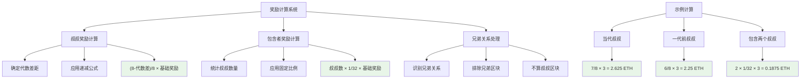

**叔叔奖励（Uncle Reward）：**
- 这是叔叔区块获得的奖励

**包含者奖励：**
- 包含一个叔叔区块的区块可获得 **1/32 的奖励**，这是固定值
- 无论包含的是哪个辈份的叔叔，获得的奖励都是 1/32

**兄弟关系处理：**
- 与当前区块构成兄弟关系的区块不算叔叔区块

## 协议的适用范围与局限性

### 分叉类型分析

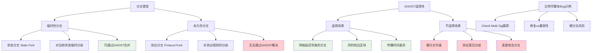

该协议的主要目的是解决系统中的**临时性分叉**问题。

包括比特币和以太坊采用最长合法链原则，都是为了防止篡改，使交易不易被篡改，实际上也是为了解决临时性分叉。最长合法链提供了分叉后合并的机制，即最长链获胜。

**无法解决的问题：**

如果分叉是由其他原因造成的，例如对运行的区块链协议有不同意见，这种方法无法解决。前面讨论的例子都是**状态分叉**（state fork）。

对于区块链当前状态的临时性意见分歧，可以设法合并。但如果是其他原因，如之前讨论的比特币脚本问题：

Check Multi Sig 操作用于检查多重签名的合法性，该操作的实现存在 bug，检查时会从栈中多弹出一个元素。正常操作会导致检查失败，需要预先压入一个多余的无用元素来应对这个 bug。

为什么不修复这个 bug？修复后版本会不同，与现有系统不兼容。中心化系统发布新版本很容易，但去中心化系统修改后会出现硬分叉。

如果分叉不是因为对当前状态的意见分歧，而是因为互相认为对方非法，认为对方的区块包含非法交易，这种方法无法实现合并。

即使将其包含为叔叔区块，如果某矿工认为该链非法，仍不会沿着该链继续挖矿，而是坚持自己的分叉链，因为他认为虽然对方的链更长，但是非法的。

## 奖励机制的完整分析

### 比特币vs以太坊奖励对比

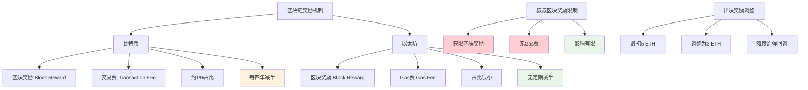

比特币发布区块实际获得两部分奖励：

1. **区块奖励（Block Reward）**：静态奖励
2. **交易费（Transaction Fee）**：动态奖励，需要执行交易才能获得交易费

以太坊类似，也有静态的区块奖励（3 个以太币），动态奖励称为 **Gas 费**（汽油费）。区块包含智能合约时，执行智能合约可获得 Gas 费。

**叔叔区块的奖励限制：**

叔叔区块获得的 7/8 奖励只限于区块奖励，即 7/8 × 3 个以太币。Gas 费无法获得，叔叔区块无法获得汽油费。

但这个问题不大，因为汽油费占比很小，大部分收益来自静态出块奖励。这与比特币情况类似，比特币的交易费也只占很小比例，约为出块奖励的 1%。

### 设计理念对比

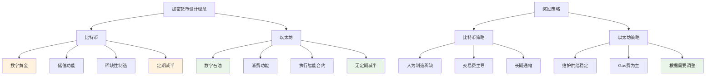

**关于出块奖励的调整：**

比特币的出块奖励每四年减半，当趋于零时，交易费将占主导地位。

以太坊没有规定定期将出块奖励减半。比特币的规定是为了人为制造稀缺性，以太坊没有这样规定。

以太坊的出块奖励从 5 个以太币降至 3 个以太币（去年下半年），不是为了制造稀缺性，而是与下个章节要讲的挖矿难度调整有关。去年 10 月左右，挖矿难度计算公式中的难度炸弹被回调了 300 万个区块，导致挖矿难度大幅下降。为了维护公平性和以太币供给量的稳定，将区块奖励从 5 个降至 3 个。这是一次性调整，并非持续下调。

**比特币与以太坊的设计理念：**

比特币通常被视为数字黄金，用于储值。

以太坊的以太币被比作石油，用于消费和执行智能合约。这个比喻并不完全恰当，因为石油消费后会消失（如汽车耗油），而以太坊执行智能合约消耗的 Gas 只是从一个账户转移到另一个账户。执行智能合约需要支付 Gas 费，执行的矿工可获得 Gas 费。

但两种加密货币的设计理念不同，以太币没有定期减半的规定。

## 叔叔区块的交易处理

### 交易执行决策

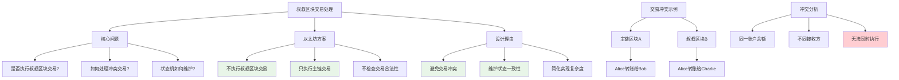

包含叔叔区块时，是否需要执行叔叔区块中的交易？

如上个章节所述，以太坊是交易驱动的状态机，比特币也是如此。在链上发布新区块时，都会使当前状态转移到下一个状态。

引入叔叔区块后，是否需要执行叔叔区块中的交易？

**答案是：不执行。**

### 验证与执行流程

```mermaid
graph TD
    A[叔叔区块处理流程] --> B[验证阶段]
    A --> C[执行阶段]
    
    B --> B1[检查挖矿难度]
    B --> B2[验证工作量证明]
    B --> B3[确认合法性]
    
    C --> C1[只执行主链交易]
    C --> C2[忽略叔叔区块交易]
    C --> C3[维护单一状态链]
    
    D[验证必要性] --> E[防止垃圾攻击]
    D --> F[确保真实挖矿]
    D --> G[维护奖励公平]
    
    H[交易后续处理] --> I[交易返回交易池]
    H --> J[等待后续区块]
    H --> K[最终被执行]
    
    style B1 fill:#e8f5e8
    style B2 fill:#e8f5e8
    style C1 fill:#e8f5e8
    style C2 fill:#e8f5e8
    style I fill:#e8f5e8
    style K fill:#e8f5e8
```

**原因：**

两个区块很可能包含冲突的交易。主链上（最长合法链上）的父区块和其叔叔区块可能存在交易冲突。

如果执行叔叔区块的交易，某些交易可能变成非法交易。叔叔区块本身不一定非法，但执行完父区块的交易后，再执行叔叔区块的交易可能导致非法。

**以太坊的处理方式：**

以太坊不采用这种方式，因为这会导致状态机混乱，不再是沿着单一链条，而是同时执行主链和分叉链上的交易。

实际上，以太坊只执行最长合法链上的交易，叔叔区块的交易不执行，甚至不检查叔叔区块交易的合法性。

**验证内容：**

收到叔叔区块时，只检查一个条件：这是否是合法发布的区块，即该区块是否符合挖矿难度要求。

这个检查是必要的，因为有了叔叔区块机制，如果不检查，任何人都可以随意发布垃圾内容，声称是叔叔区块，要求获得奖励。

只要叔叔区块符合挖矿难度要求，就认为它是合法的叔叔区块。这只需检查区块头。至于区块包含的交易是否合法，不进行检查，因为不执行叔叔区块的交易。

**交易的最终执行：**

如果某个交易被发布，但包含该交易的区块是叔叔区块，该交易本身不会被执行。矿工仍然获得奖励，但交易未执行。

主链上的节点收到该交易后会继续尝试执行，可能需要等待下一个区块，但最终会被执行。

## 叔叔区块链的限制

### 单区块vs区块链限制

```mermaid
graph TD
    A[叔叔区块链限制] --> B[当前规则]
    A --> C[假设修改]
    A --> D[安全风险]
    
    B --> B1[只有分叉第一个区块]
    B --> B2[后续区块不算叔叔]
    B --> B3[鼓励及时合并]
    
    C --> C1[整条链作为叔叔]
    C --> C2[每个区块给奖励]
    C --> C3[鼓励合并]
    
    D --> D1[分叉攻击成本降低]
    D --> D2[攻击风险减小]
    D --> D3[安全性受威胁]
    
    E[分叉攻击场景] --> F[正常情况]
    E --> G[修改后情况]
    
    F --> F1[攻击失败 = 算力白费]
    F --> F2[高风险高成本]
    F --> F3[有效威慑]
    
    G --> G1[攻击失败 = 仍有奖励]
    G --> G2[低风险低成本]
    G --> G3[威慑失效]
    
    style B1 fill:#e8f5e8
    style B3 fill:#e8f5e8
    style D1 fill:#ffcdd2
    style D2 fill:#ffcdd2
    style D3 fill:#ffcdd2
    style F3 fill:#e8f5e8
    style G3 fill:#ffcdd2
```

本章节举出的所有叔叔区块示例都有一个共同特点：都是分叉后的第一个区块。

如果分叉后还有后续区块链，如何处理？例如，主链是最长合法链，下方是分叉链，分叉链上的后续区块是否可以算作叔叔区块？

按辈份关系是可以的，为什么不设计一个协议，将整条链作为叔叔区块，给每个区块一些奖励，鼓励其合并？

### 分叉攻击风险分析

```mermaid
graph TD
    A[分叉攻击机制] --> B[攻击目标]
    A --> C[攻击过程]
    A --> D[攻击成本]
    
    B --> B1[双花攻击]
    B --> B2[A转给B大量ETH]
    B --> B3[B确认后提供服务]
    
    C --> C1[A发动分叉攻击]
    C --> C2[资金转给自己]
    C --> C3[尝试超越主链]
    
    D --> D1[当前成本: 失败=全损]
    D --> D2[修改后成本: 失败=仍有收益]
    D --> D3[攻击门槛大幅降低]
    
    E[攻击策略变化] --> F[当前策略]
    E --> G[修改后策略]
    
    F --> F1[高风险高回报]
    F --> F2[成功概率要求高]
    F --> F3[实施谨慎]
    
    G --> G1[低风险中回报]
    G --> G2[可以随意尝试]
    G --> G3[攻击频繁]
    
    style D3 fill:#ffcdd2
    style G1 fill:#ffcdd2
    style G2 fill:#ffcdd2
    style G3 fill:#ffcdd2
```

**问题分析：**

这种规定会使分叉攻击成本过低。

分叉攻击的原理：假设在某处有一个大额交易，A 转给 B 大量以太币。B 看到该交易后等待多次确认，认为交易安全。然后 A 发动分叉攻击，将资金转给自己。

分叉攻击要成功，需要使攻击链比原链更长，代价较大，风险很高。如果攻击链无法超过原链，攻击链上的所有区块都会被浪费，这是分叉攻击的成本。

但如果修改 GHOST 协议，将整条攻击链都认定为叔叔区块，每个区块都给予奖励并合并，分叉攻击的风险就会大幅降低。攻击者可以先尝试分叉攻击，成功则回滚交易，失败则被招安，仍能获得出块奖励。

**以太坊的规定：**

以太坊规定只有分叉后的第一个区块可以获得叔叔奖励（uncle reward），后续区块不可以。这与前面的设计思想一致，鼓励分叉后及时合并。如果继续沿着分叉挖矿，就是白白浪费算力。

## 实际案例分析

### 以太坊网络状态监控

```mermaid
graph TD
    A[以太坊网络监控] --> B[实时状态查看]
    A --> C[历史数据分析]
    A --> D[叔叔区块统计]
    
    B --> B1[etherscan.io网站]
    B --> B2[交易历史曲线]
    B --> B3[最新区块信息]
    B --> B4[最新交易信息]
    
    C --> C1[两周交易统计]
    C --> C2[区块生成趋势]
    C --> C3[网络健康状况]
    
    D --> D1[叔叔区块频率]
    D --> D2[分叉合并情况]
    D --> D3[奖励分配统计]
    
    E[监控意义] --> F[网络性能评估]
    E --> G[分叉情况分析]
    E --> H[协议效果验证]
    
    style B1 fill:#e8f5e8
    style D1 fill:#e8f5e8
    style D2 fill:#e8f5e8
    style H fill:#e8f5e8
```

以下分析以太坊中的一些真实情况。

### 以太坊网络状态

可以通过 etherscan.io 网站实时查看以太坊当前状态。右侧曲线显示过去两周的交易历史（此截图时间较早，为 5 月底），左下方显示最新挖出的区块，右下方显示最新交易。

### 叔叔区块的实际情况

#### 叔叔区块案例分析

```mermaid
graph TD
    A[叔叔区块实际案例] --> B[距离分析]
    A --> C[奖励计算]
    A --> D[合并效果]
    
    B --> B1[距离为2: 上两代叔叔]
    B --> B2[距离为1: 上一代叔叔]
    B --> B3[距离为3: 上三代叔叔]
    
    C --> C1["距离2: 6/8 × 3 = 2.25 ETH"]
    C --> C2["距离1: 7/8 × 3 = 2.625 ETH"]
    C --> C3["距离3: 5/8 × 3 = 1.875 ETH"]
    
    D --> D1[大多数分叉快速合并]
    D --> D2[协议效果良好]
    D --> D3[网络稳定性提高]
    
    E[统计结果] --> F[当代叔叔最多]
    E --> G[远距离叔叔较少]
    E --> H[符合激励设计]
    
    style C2 fill:#e8f5e8
    style C1 fill:#e8f5e8
    style D1 fill:#e8f5e8
    style D2 fill:#e8f5e8
    style H fill:#e8f5e8
```

以下显示叔叔区块的各种情况，每一行对应一个叔叔区块：

- **第一列 Block Height**：区块序号（Block Number）
- **第一行**：叔叔区块序号比当前区块小 2，说明是距离为 2 的叔叔区块，应获得 6/8 的奖励，即 6/8 × 3 = 2.25 个以太币
- **接下来两行**：都属于这种情况的叔叔
- **再下一行**：叔叔区块序号只比当前区块小 1，说明是当代叔叔，应获得 7/8 的奖励，即 7/8 × 3 = 2.625 个以太币
- **后续几行**：都属于当代叔叔或上一代叔叔
- **最后一行**：叔叔区块序号比当前区块小 3，应获得 5/8 的奖励，即 5/8 × 3 = 1.875 个以太币

这说明实际系统中大多数分叉都很快得到了合并。

### 奖励计算表格

#### 不同辈份叔叔奖励对照表

```mermaid
graph TD
    A[叔叔奖励对照表] --> B[距离1代]
    A --> C[距离2代]
    A --> D[距离3代]
    A --> E[距离4代]
    A --> F[距离5代]
    A --> G[距离6代]
    
    B --> B1["奖励比例: 7/8"]
    B --> B2["实际奖励: 2.625 ETH"]
    
    C --> C1["奖励比例: 6/8"]
    C --> C2["实际奖励: 2.25 ETH"]
    
    D --> D1["奖励比例: 5/8"]
    D --> D2["实际奖励: 1.875 ETH"]
    
    E --> E1["奖励比例: 4/8"]
    E --> E2["实际奖励: 1.5 ETH"]
    
    F --> F1["奖励比例: 3/8"]
    F --> F2["实际奖励: 1.125 ETH"]
    
    G --> G1["奖励比例: 2/8"]
    G --> G2["实际奖励: 0.75 ETH"]
    
    style B2 fill:#e8f5e8
    style C2 fill:#e8f5e8
    style D2 fill:#fff3e0
    style E2 fill:#fff3e0
    style F2 fill:#ffcdd2
    style G2 fill:#ffcdd2
```

不同辈份的叔叔获得的叔叔奖励如下：

| 距离 | 奖励比例 | 实际奖励（以太币） |
|------|----------|-------------------|
| 1    | 7/8      | 2.625             |
| 2    | 6/8      | 2.25              |
| 3    | 5/8      | 1.875             |
| 4    | 4/8      | 1.5               |
| 5    | 3/8      | 1.125             |
| 6    | 2/8      | 0.75              |

### 具体区块分析

#### 区块奖励详细分解

```mermaid
graph TD
    A[区块奖励详细分析] --> B[左侧区块示例]
    A --> C[右侧区块示例]
    
    B --> B1[包含1个叔叔区块]
    B --> B2[距离为2的叔叔]
    B --> B3[叔叔奖励: 2.25 ETH]
    B --> B4[区块总奖励组成]
    
    B4 --> B5[基础奖励: 3 ETH]
    B4 --> B6[Gas费: 0.16685 ETH]
    B4 --> B7[叔叔奖励: 0.09375 ETH]
    
    C --> C1[包含2个叔叔区块]
    C --> C2[距离1 + 距离2叔叔]
    C --> C3[叔叔奖励: 4.875 ETH]
    C --> C4[区块总奖励组成]
    
    C4 --> C5[基础奖励: 3 ETH]
    C4 --> C6[Gas费: 类似金额]
    C4 --> C7[叔叔奖励: 0.1875 ETH]
    
    D[奖励计算验证] --> E["1个叔叔: 1 × 1/32 × 3 = 0.09375"]
    D --> F["2个叔叔: 2 × 1/32 × 3 = 0.1875"]
    
    style B7 fill:#e8f5e8
    style C7 fill:#e8f5e8
    style E fill:#e8f5e8
    style F fill:#e8f5e8
```

以下是两个区块的具体例子：

**左侧区块：**
- 包含一个叔叔区块，应为距离为 2 的叔叔
- 倒数第二行叔叔奖励为 2.25 个以太币
- 该区块获得的奖励包含三部分：
  1. 固定的 3 个以太币出块奖励
  2. Gas 费（0.16685...），即汽油费
  3. 包含叔叔区块的奖励，1/32 的出块奖励为 0.09375 个以太币

**右侧区块：**
- 包含两个叔叔区块：一个距离为 1 的当代叔叔，另一个距离为 2 的上一代叔叔
- 倒数第二行叔叔奖励：2.25 + 2.625 = 4.875 个以太币
- 该区块获得的奖励也包含三部分
- 第三部分为 0.1875，比左侧区块的两倍，因为包含了两个叔叔区块，所以要乘以 2

这两个区块在前面的图表中都有显示，可以通过第一行的区块哈希值查找。例如，左侧区块的哈希值是 5695161，右侧区块对应下方的两行，每个叔叔区块单独占一行。

## 总结

### GHOST协议价值总结

```mermaid
graph TD
    A[GHOST协议总价值] --> B[核心价值]
    A --> C[实现效果]
    A --> D[未来意义]
    
    B --> B1[公平性]
    B --> B2[去中心化]
    B --> B3[安全性]
    B --> B4[激励相容]
    
    C --> C1[降低算力浪费]
    C --> C2[减少中心化偏见]
    C --> C3[提高矿工积极性]
    C --> C4[维护网络稳定]
    
    D --> D1[为快速出块提供保障]
    D --> D2[促进区块链技术发展]
    D --> D3[建立可持续生态]
    
    E[设计精髓] --> F[奖励机制]
    E --> G[限制机制]
    E --> H[平衡机制]
    
    F --> F1[给予安慰奖励]
    F --> F2[鼓励包含行为]
    
    G --> G1[代数限制]
    G --> G2[数量限制]
    
    H --> H1[公平与效率]
    H --> H2[安全与激励]
    
    style B1 fill:#e8f5e8
    style B2 fill:#e8f5e8
    style B3 fill:#e8f5e8
    style B4 fill:#e8f5e8
    style D1 fill:#e8f5e8
    style D2 fill:#e8f5e8
    style D3 fill:#e8f5e8
```

GHOST 协议通过给予叔叔区块适当的奖励，有效缓解了快速出块带来的挖矿中心化问题，同时保持了区块链的安全性和一致性。通过限制叔叔区块的代数和递减的奖励机制，既鼓励了及时合并，又防止了协议被滥用。

该协议的核心价值在于：

1. **公平性**：为未能进入主链的合法区块提供奖励
2. **去中心化**：降低大型矿池的中心化优势
3. **安全性**：鼓励快速合并，维护网络一致性
4. **激励相容**：设计合理的奖励机制，促进系统健康发展

GHOST 协议是以太坊共识机制的重要组成部分，为快速出块环境下的区块链安全提供了有效保障。

#### 孤立区块术语对比

| 术语 | 英文 | 所属系统 | 特点 | 奖励 |
|------|------|----------|------|------|
| **孤立区块** | Orphan Block | 比特币/以太坊 | 未被包含在主链中 | 无奖励 |
| **陈旧区块** | Stale Block | 比特币/以太坊 | 已过时的合法区块 | 无奖励 |
| **叔叔区块** | Uncle Block | 以太坊 | 可获得奖励的分叉区块 | 有奖励 |

### 以太坊奖励机制详表

| 奖励类型 | 获得者 | 计算公式 | 以太币数量 | 获得条件 |
|----------|--------|----------|------------|----------|
| **基础出块奖励** | 主链矿工 | 固定奖励 | 3 ETH | 挖出主链区块 |
| **Gas费奖励** | 主链矿工 | 动态计算 | 变动 | 执行交易获得 |
| **叔叔区块奖励** | 叔叔矿工 | 7/8 × 出块奖励 | 2.625 ETH | 被包含为叔叔 |
| **包含者奖励** | 包含矿工 | 1/32 × 出块奖励 | 0.09375 ETH | 包含1个叔叔 |
| **双叔叔奖励** | 包含矿工 | 2 × 1/32 × 出块奖励 | 0.1875 ETH | 包含2个叔叔 |
