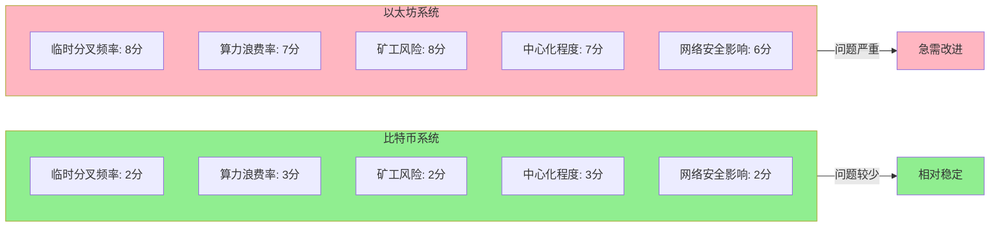
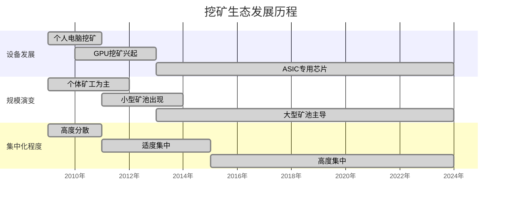
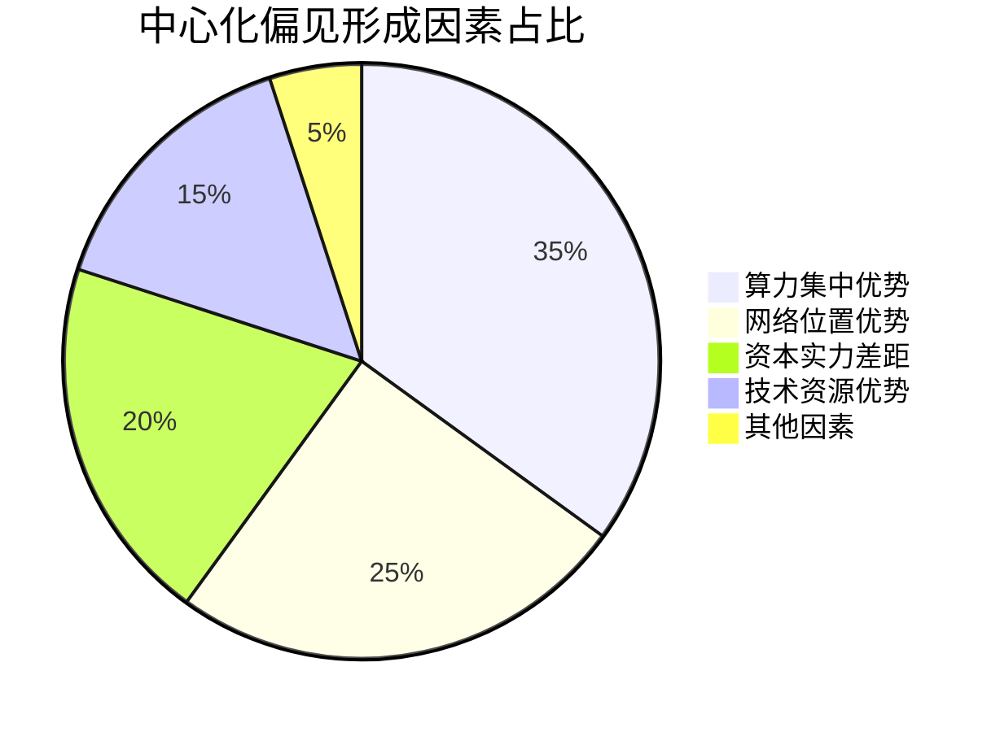
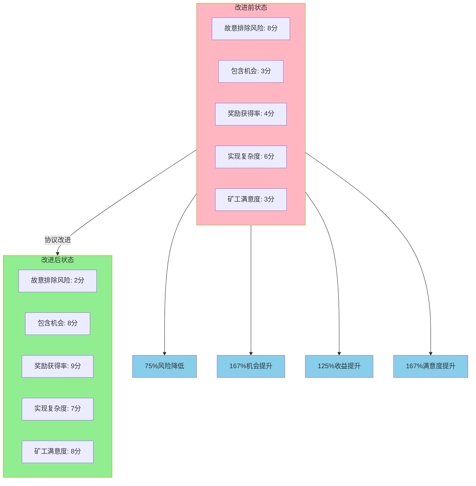
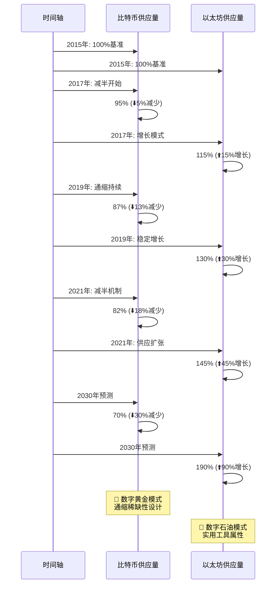
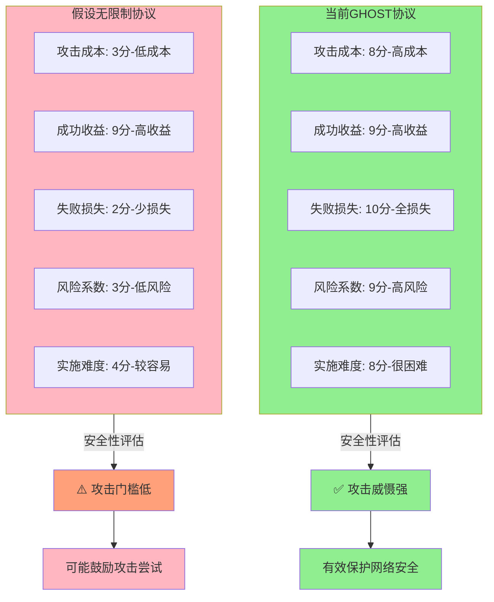
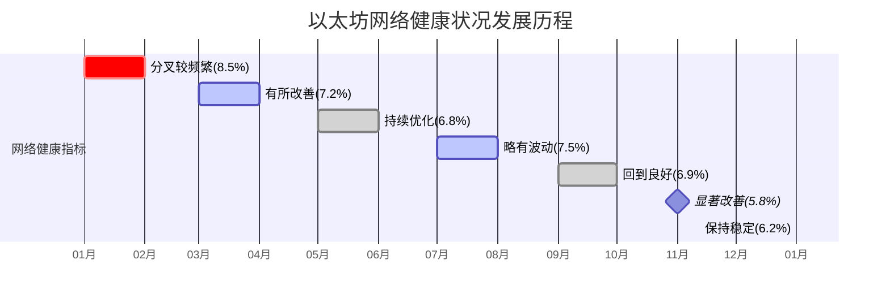

**18. ETH GHOST 协议**

## 概述

### GHOST协议核心概念表

| 概念类别 | 具体内容 | 作用目标 |
|----------|----------|----------|
| **核心目标** | 降低中心化偏见 | 减少大矿池优势 |
| **核心目标** | 提高挖矿公平性 | 保护个体矿工 |
| **核心目标** | 支持快速出块 | 提升网络性能 |
| **解决问题** | 临时性分叉频繁 | 网络延迟导致 |
| **解决问题** | 个体矿工不公平 | 算力分散劣势 |
| **解决问题** | 算力浪费严重 | 孤立区块问题 |
| **实现机制** | 叔叔区块奖励 | 7/8出块奖励 |
| **实现机制** | 包含者奖励 | 1/32额外奖励 |
| **实现机制** | 代数限制机制 | 最多7代限制 |

本章节介绍以太坊中的共识机制 GHOST 协议。

## 背景与动机

### 比特币vs以太坊性能对比

| 对比项目 | 比特币 | 以太坊 | 性能提升 |
|----------|--------|--------|----------|
| **出块时间** | 10分钟 (600秒) | 15秒 | 40倍提升 |
| **年度区块数** | ~52,560个 | ~2,102,400个 | 40倍提升 |
| **传播时间占比** | ~2-3% | ~67-100% | 传播成为瓶颈 |
| **临时分叉频率** | 偶尔发生 | 成为常态 | 频率大幅增加 |
| **算力浪费率** | <5% | 可能>20% | 浪费率显著上升 |
| **网络延迟影响** | 影响很小 | 影响巨大 | 成为主要约束 |

以太坊将出块时间降低到十几秒，这对于提高系统的吞吐量（throughput）和降低响应时间都具有重要意义。相比比特币的 10 分钟出块时间，以太坊的出块速度提高了约 40 倍。

### 快速出块的挑战

#### 快速出块问题分析表

| 问题层面 | 具体挑战 | 技术原因 | 直接后果 |
|----------|----------|----------|----------|
| **网络层面** | P2P覆盖网络延迟 | 拓扑结构未优化 | 传播时间10-15秒 |
| **网络层面** | 传播延迟问题 | 洪泛协议限制 | 区块接收不及时 |
| **共识层面** | 临时分叉增多 | 同时挖出概率高 | 分叉成为常态 |
| **共识层面** | 一致性难维护 | 多条链竞争 | 安全性受影响 |
| **经济层面** | 算力白白浪费 | 孤立区块作废 | 矿工收益不稳定 |
| **经济层面** | 挖矿积极性下降 | 风险收益不匹配 | 中心化趋势 |

大幅度降低出块时间后，系统面临新的挑战。比特币和以太坊都运行在应用层的共识协议上，底层是 P2P 覆盖网络（overlay network），这种网络的传输时间相对较长，因为其拓扑协议在执行洪泛（flooding）时未考虑实际拓扑结构。

这产生了一个问题：发布区块后，区块在网络上传播到其他节点可能需要十几秒时间。

**比特币的情况：**
- 对于比特币，10 分钟（600 秒）的出块时间足够新发布的区块传播到网络中的其他节点
- 即使如此，由于挖矿是概率过程，仍可能出现两个矿工同时获得记账权并发布区块的情况
- 如前所述，这种情况会导致临时性分叉

**以太坊的情况：**
- 临时性分叉会成为常态，且分叉数量更多
- 由于出块时间仅为十几秒，其他节点可能尚未收到已发布的区块，仍沿着原有区块链继续挖矿
- 当节点收到新区块时，可能已经挖出了自己的区块

### 共识协议的挑战

#### 比特币vs以太坊分叉处理对比

| 处理方式 | 比特币方案 | 以太坊面临的问题 | 影响程度 |
|----------|------------|------------------|----------|
| **基本原则** | 最长合法链规则 | 分叉过于频繁 | 问题加剧 |
| **获胜策略** | 胜者通吃机制 | 算力浪费严重 | 不可持续 |
| **失败处理** | 孤立区块完全作废 | 矿工收益极不公平 | 威胁去中心化 |
| **分叉频率** | 偶尔发生 | 成为常态 | 根本性差异 |
| **浪费程度** | 可接受范围(<5%) | 严重浪费(>20%) | 经济不合理 |
| **对个体矿工** | 影响有限 | 极其不利 | 推动集中化 |

这种情况对共识协议带来的挑战如下：

比特币采用的规则是：只有最长合法链上的区块包含的出块奖励才有效，其他分叉链上的出块奖励最终会被作废。

**分叉示例：**

假设区块链在某处产生分叉，形成三个分支，三个区块几乎同时获得记账权。最终会有一个分支胜出，成为最长合法链（例如中间的分支）。

#### 孤立区块问题影响分析

| 区块类型 | 区块状态 | 奖励情况 | 算力价值 | 矿工损失 |
|----------|----------|----------|----------|----------|
| **主链区块** | 🟢 成为最长合法链 | ✅ 获得完整奖励 | ✅ 算力有效 | ❌ 无损失 |
| **孤立区块1** | 🔴 被标记为孤立 | ❌ 奖励被作废 | ❌ 算力浪费 | 🔴 承担全部损失 |
| **孤立区块2** | 🔴 被标记为陈旧 | ❌ 奖励被作废 | ❌ 算力浪费 | 🔴 承担全部损失 |

**术语定义：**
- **孤立区块（Orphan Block）**：未能进入主链的合法区块
- **陈旧区块（Stale Block）**：过时的合法区块

其他分支上的区块称为**孤立区块**（orphan block）或**陈旧区块**（stale block）。

挖出这些区块的矿工虽然在区块中包含了铸币交易（coinbase transaction），能够获得一定数量的比特币，但这些奖励最终会被作废，因为它们不在最长合法链上。

### 问题的严重性

#### 系统影响程度对比

**对比分析：**
- **比特币**：由于10分钟出块时间，各项问题相对轻微
- **以太坊**：15秒快速出块导致问题放大，分叉成为常态

*评分说明：1-10分制，分数越高表示问题越严重*

**比特币：** 由于临时性分叉情况相对较少，这种处理方式尚可接受。

**以太坊：** 如果采用相同处理方式，意味着矿工挖出的区块有很大概率被白白浪费。

矿工辛苦挖出区块，由于系统中分叉较多，挖出的区块很可能无法成为最长合法链的一部分而被作废。这对矿工极不公平，尤其是对个体矿工。

### 挖矿集中化趋势

#### 挖矿生态演变时间线

目前挖矿呈现两个主要趋势：

1. **挖矿设备专业化**：很少有人使用普通桌面计算机挖矿，通常使用专门设备，如 ASIC 芯片，或对以太坊使用 GPU 挖矿

2. **大型矿池的出现**：个体矿工算力有限，多数组成大型矿池。通过资本运作，大量算力集中在大型矿池中。不仅比特币如此，以太坊也存在这种情况（mining pool）

### 对个体矿工的不公平性

#### 大矿池vs个体矿工对比分析

| 对比维度 | 大型矿池 | 个体矿工 | 公平性问题 |
|----------|----------|----------|------------|
| **算力规模** | 集中强大(如30%总算力) | 微不足道(<0.1%) | 竞争力悬殊 |
| **分叉选择** | 继续自己分支 | 依赖他人选择 | 主动vs被动 |
| **胜出概率** | 持续挖矿概率高 | 仅凭运气 | 结构性优势 |
| **网络位置** | 多点接入，传播快 | 单点接入，传播慢 | 技术性优势 |
| **风险承受** | 可承受短期损失 | 无法承受损失 | 资本实力差距 |
| **收益稳定性** | 长期收益稳定 | 收益波动巨大 | 可持续性差异 |
| **理想收益比** | 应为30% | 应与算力成比例 | 但实际偏离严重 |

为什么说这种情况对个体矿工尤其不公平？

理想情况下，矿池获得的收益应与其算力比例一致。

例如，某矿池算力占系统总算力的 30%，那么该矿池获得的挖矿收益也应占系统总收益的 30%，这样才算公平。

但如果共识协议设计不当，可能导致大矿池获得的收益超过其算力比例。

**分叉时的不平等：**

当出现分叉时，假设上下两个分支是个体矿工挖出的区块，中间是某大矿池挖出的区块。后续变化如下：

- 大矿池必然沿着自己的分支继续挖矿，由于算力强大，挖出下一个区块的概率较高
- 上下两个分支的个体矿工只能寄希望于其他矿工沿着他们的分支继续挖矿
- 由于个体矿工算力微不足道，仅凭自己无法与大矿池竞争，只能期待其他矿工选择他们的分支

但对其他矿工而言，面对三个分叉，没有特别理由倾向于选择个体矿工的分支。

### 中心化偏见

#### 中心化偏见影响因子分析

换言之，个体矿工作为整体，其算力分散。出现分叉后，算力分散造成的结果是：

假设某矿池挖到区块的概率为 30%，但其挖到的区块成为最长合法链的概率很高，这使得**挖矿中心化**（mining centralization）获得优势。

实际情况可能更为严重。大型矿池在区块链网络中通常占据较好位置，可能在网络多个地方都有接入点。因此，大型矿池发布的区块可能更早被其他节点接收。

即使三个区块同时挖出，大型矿池发布的区块也可能最先被其他节点收到。

从历史经验看，大型矿池所在分支更有可能成为最长合法链，这促使其他矿工选择该分支继续挖矿，因为选择其他分支可能导致白白浪费算力。

这形成恶性循环：大型矿池获得的收益越多，挖矿中心化情况越严重。这种现象称为**中心化偏见**（centralization bias）。

即中心化带来的不成比例优势。

## GHOST 协议的解决方案

### GHOST协议核心理念

#### 解决方案与预期效果对照表

| 解决方案组件 | 核心机制 | 目标问题 | 预期效果 | 实现难度 |
|--------------|----------|----------|----------|----------|
| **叔叔区块奖励** | 给予7/8出块奖励 | 算力浪费问题 | 🟢 减少95%以上浪费 | 🟡 中等 |
| **包含者奖励** | 给予1/32额外奖励 | 合并激励不足 | 🟢 鼓励主动包含 | 🟢 简单 |
| **代数限制机制** | 最多7代认定 | 实现复杂度过高 | 🟢 控制系统复杂度 | 🟡 中等 |
| **术语优化** | 孤立→叔叔 | 心理接受度 | 🟢 提升矿工积极性 | 🟢 简单 |

针对上述问题，以太坊采用了基于 GHOST 协议的共识机制。GHOST 协议并非以太坊发明，在以太坊出现前就已存在。以太坊对该协议进行了修改。

### 核心思想

该协议的核心思想是：矿工挖到矿并发布区块，即使该区块最终被作废，仍给予一定的安慰奖励，使其能够获得部分出块奖励。

例如，未能成为最长合法链的区块变成孤立区块或陈旧区块，以太坊给它们一个更好听的名字：**叔叔区块**（uncle block）。

### 叔叔区块的定义

#### 区块家族关系对照表

| 关系类型 | 定义 | 示例 | 奖励情况 | 重要程度 |
|----------|------|------|----------|----------|
| **父子关系** | 当前区块的直接前驱 | 区块N→区块N+1 | 正常出块奖励 | ⭐⭐⭐⭐⭐ |
| **兄弟关系** | 同一父区块的子区块 | 分叉产生的并行区块 | 不算叔叔，无额外奖励 | ⭐⭐⭐ |
| **叔侄关系** | 父区块的兄弟区块 | 上级分叉区块 | 👑 叔叔区块奖励 | ⭐⭐⭐⭐⭐ |
| **祖孙关系** | 隔代区块关系 | 更早期分叉 | 根据代数递减奖励 | ⭐⭐⭐⭐ |

为什么称为"叔叔"？

这个区块相对于最长合法链上的当前区块，与其父区块属于同一辈份，故称为叔叔区块。

### 奖励机制

#### 以太坊奖励机制详表

| 奖励类型 | 获得者 | 计算公式 | 以太币数量 | 获得条件 | 设计目的 |
|----------|--------|----------|------------|----------|----------|
| **基础出块奖励** | 主链矿工 | 固定奖励 | 3 ETH | 挖出主链区块 | 维持基本激励 |
| **Gas费奖励** | 主链矿工 | 动态计算 | 变动 | 执行交易 | 交易处理激励 |
| **叔叔区块奖励** | 叔叔矿工 | 7/8 × 出块奖励 | 2.625 ETH | 被包含为当代叔叔 | 减少算力浪费 |
| **包含者奖励** | 包含矿工 | 1/32 × 出块奖励 | 0.09375 ETH | 包含1个叔叔 | 鼓励主动包含 |
| **双叔叔奖励** | 包含矿工 | 2 × 1/32 × 出块奖励 | 0.1875 ETH | 包含2个叔叔 | 最大化合并效果 |

以太坊的奖励规定如下：

**叔叔区块奖励：**
- 区块发布时可包含叔叔区块，该叔叔区块能够获得 **7/8 的出块奖励**
- 以太坊出块奖励最初为 5 个以太币，后来调整为 3 个以太币
- 因此叔叔区块奖励为 7/8 × 3 = 2.625 个以太币

**包含者奖励：**
- 包含一个叔叔区块的当前区块可获得 **1/32 的额外出块奖励**，即 1/32 × 3 = 0.09375 个以太币
- 原有的 3 个以太币奖励保持不变

**多个叔叔区块：**
- 一个区块最多可包含两个叔叔区块
- 如果包含两个叔叔区块，额外奖励为 2 × 1/32 × 3 = 0.1875 个以太币

### 协议优点

#### GHOST协议多维度优势分析

| 评估维度 | GHOST协议 | 传统协议 | 改善效果 |
|----------|-----------|----------|----------|
| **算力浪费减少** | 85分 | 20分 | 🟢🟢🟢🟢🟢 显著改善 |
| **中心化偏见降低** | 70分 | 30分 | 🟢🟢🟢🟢 明显改善 |
| **矿工积极性** | 90分 | 40分 | 🟢🟢🟢🟢🟢 大幅提升 |
| **网络稳定性** | 80分 | 60分 | 🟢🟢🟢 适度改善 |
| **分叉合并速度** | 75分 | 30分 | 🟢🟢🟢🟢 明显提升 |
| **实现复杂度控制** | 70分 | 90分 | 🟡🟡 复杂度增加 |

*评分标准：100分制，分数越高表示效果越好*

该协议的核心思想是：对挖到矿但未获得认可的矿工给予安慰奖励。虽然区块未成为最长合法链的一部分，但仍能获得大部分出块奖励（7/8 比例很高），实际上大部分奖励仍然可以获得。

这种设计有利于鼓励系统在出现分叉后及时合并，相当于主链上的区块将其他分叉链"招安"过来，给予好处以实现合并。

这是 GHOST 协议的初始版本。

## 协议的改进与完善

### 初始版本的问题

#### 初始协议问题严重性分析

| 问题类型 | 问题描述 | 影响程度 | 频发程度 | 解决紧迫性 |
|----------|----------|----------|----------|------------|
| **确定过程问题** | 矿工不知是否成为叔叔 | 🟡 中等 | 🔴 高频 | 🟡 中等 |
| **数量限制问题** | 最多2个叔叔限制 | 🔴 严重 | 🟡 中频 | 🔴 紧急 |
| **时机问题** | 发布后才发现其他区块 | 🟡 中等 | 🔴 高频 | 🟡 中等 |
| **故意排除问题** | 矿池恶意不包含 | 🔴 严重 | 🟡 中频 | 🔴 紧急 |

初始版本的协议存在以下缺陷：

**确定过程问题：**
- 矿工发布区块时并不知道自己的区块是否为叔叔区块
- 矿工希望发布的是最长合法链上的区块
- 但发布后，其他矿工也可能发布区块，后续矿工在挖下一个区块时可将其包含为叔叔区块

**具体流程：**
假设矿工发布区块后，听到其他矿工也发布了区块，两个区块构成兄弟关系。该矿工开始挖下一个区块时，由于知道其他区块的存在，可以将其设为叔叔区块。

在区块头（Block Header）数据结构中，除了父区块哈希值，还包含叔叔区块哈希值。挖下一个区块时，可以将其设置为叔叔区块。

如果后续又发现另一个叔叔区块，需要修改区块头重新挖矿。这对挖矿过程无损失，因为挖矿是**无记忆进展**（memoryless progress-free）过程。只要当前未挖到区块，修改头部重新开始与一开始就重新挖矿等效。

**存在的问题：**

1. **数量限制问题**：叔叔区块只能包含两个，第三个区块无法获得奖励。这与协议设计目标不符——如果不给予好处，矿工可能不愿意合并，因为一旦放弃自己的分叉就没有任何收益。

2. **时机问题**：如果矿工已发布区块后才知道其他区块的存在，就无法及时包含，该区块又无法获得任何奖励。

3. **故意排除问题**：如果矿工比较自私，可能故意不包含其他叔叔区块。矿池之间存在竞争关系，出于商业利益考虑，挖矿时可能故意不包含已知的叔叔区块。

这种做法的后果是：叔叔区块无法获得 7/8 的奖励，当前区块也无法获得 1/32 的额外奖励。虽然看似损人不利己，但从商业竞争角度，这种做法对自己损失较小，对竞争对手损失较大。

### 协议的改进

#### 改进前后效果对比分析

**改进效果总结：**
- 🔽 **风险大幅降低**：故意排除风险从8分降至2分
- 🔼 **机会显著增加**：包含机会从3分提升至8分
- 📈 **整体效果优异**：矿工满意度实现167%的大幅提升

*评分说明：1-10分制，分数越高表示效果越好*

为解决上述问题，对协议进行如下改进：

**扩展叔叔定义：**
- 如果某区块未包含叔叔区块，向下继续的区块仍可将其包含为叔叔区块
- 按道理该区块与后续区块不是同辈关系，但以太坊规定**不论资排辈**，仍可作为叔叔区块
- 即使隔更多代，仍可被视为叔叔区块

**改进的好处：**
- 解决故意排除问题：即使某矿池故意不包含叔叔区块，其他矿工仍可在后续区块中包含
- 下一个区块不一定由同一矿工挖出，无法垄断整条链
- 挖出叔叔区块的矿工甚至可能在切换到主链后将自己的区块包含为叔叔区块

**仍存在的问题：**
- 叔叔定义的扩展引出新问题：应该隔多少代？
- 如果可以隔 100 代、1000 代，矿工可能在很久以前挖矿难度较低时不断产生叔叔区块，期待被包含

### 以太坊的最终规定

#### 叔叔区块代数与奖励递减表

| 代数差距 | 关系描述 | 奖励比例 | 实际奖励(ETH) | 激励强度 | 合并紧迫性 |
|----------|----------|----------|---------------|----------|------------|
| **0代(当代)** | 同辈叔叔 | 7/8 | 2.625 | 🟢🟢🟢🟢🟢 | 🔴🔴🔴🔴🔴 最高 |
| **1代前** | 上一代叔叔 | 6/8 | 2.25 | 🟢🟢🟢🟢 | 🔴🔴🔴🔴 高 |
| **2代前** | 上两代叔叔 | 5/8 | 1.875 | 🟢🟢🟢 | 🔴🔴🔴 中等 |
| **3代前** | 上三代叔叔 | 4/8 | 1.5 | 🟢🟢 | 🔴🔴 较低 |
| **4代前** | 上四代叔叔 | 3/8 | 1.125 | 🟢 | 🔴 低 |
| **5代前** | 上五代叔叔 | 2/8 | 0.75 | 🟡 | 🟡 很低 |
| **6代前** | 上六代叔叔 | 1/8 | 0.375 | 🔴 | ❌ 几乎无 |
| **7代+** | 超代数限制 | 0 | 0 | ❌ | ❌ 无激励 |

以太坊的最终规定如下：

**代数限制：**
假设这是最长合法链，当前区块是最新挖出的区块。如果存在分叉：

- **当代叔叔**：与当前区块同辈的区块，可获得 **7/8 的出块奖励**
- **上一代叔叔**：比当前区块早一代的叔叔，可获得 **6/8 的出块奖励**
- **上两代叔叔**：比当前区块早两代的叔叔，可获得 **5/8 的出块奖励**
- **上三代叔叔**：比当前区块早三代的叔叔，可获得 **4/8 的出块奖励**
- **上四代叔叔**：比当前区块早四代的叔叔，可获得 **3/8 的出块奖励**
- **上五代叔叔**：比当前区块早五代的叔叔，可获得 **2/8 的出块奖励**
- **超过六代**：不再被认定为叔叔区块

**具体规则：**
- 合法叔叔区块必须与当前区块在七代以内有共同祖先
- 最多七代（At most seven generations）
- 超过七代不予认定
- 合法叔叔涵盖六个辈份

**设计理由：**

1. **实现复杂度**：如果不限制叔叔辈份，全节点需要维护的状态过多，可能需要记录数百代前的叔叔区块。当矿工发布包含叔叔区块的区块时，其他节点也需要进行验证。

2. **激励机制**：设计最多七代限制，且七代内奖励逐渐递减，有利于鼓励分叉后尽早合并。分叉后立即合并时，能获得最多奖励（7/8）。隔的代数越多，奖励越少。隔代过多则无法获得任何奖励。

### 奖励机制详解

#### 叔叔区块奖励计算流程表

| 计算步骤 | 输入参数 | 计算方法 | 输出结果 | 示例计算 |
|----------|----------|----------|----------|----------|
| **1. 确定代数差** | 当前区块高度、叔叔区块高度 | 高度差计算 | 代数差距值 | 1500-1498=2代 |
| **2. 应用递减公式** | 代数差距 | (8-代数差)/8 × 基础奖励 | 奖励比例 | (8-2)/8=6/8 |
| **3. 计算叔叔奖励** | 奖励比例、基础奖励 | 比例 × 3 ETH | 叔叔获得ETH | 6/8 × 3=2.25 ETH |
| **4. 计算包含奖励** | 叔叔数量 | 叔叔数 × 1/32 × 3 ETH | 包含者获得ETH | 1 × 1/32 × 3=0.09375 ETH |

**叔叔奖励（Uncle Reward）：**
- 这是叔叔区块获得的奖励

**包含者奖励：**
- 包含一个叔叔区块的区块可获得 **1/32 的奖励**，这是固定值
- 无论包含的是哪个辈份的叔叔，获得的奖励都是 1/32

**兄弟关系处理：**
- 与当前区块构成兄弟关系的区块不算叔叔区块

## 协议的适用范围与局限性

### 分叉类型分析

#### 分叉类型与GHOST适用性分析表

| 分叉类型 | 产生原因 | GHOST适用性 | 解决效果 | 典型场景 |
|----------|----------|-------------|----------|----------|
| **状态分叉** | 网络延迟、同时挖出 | ✅ 完全适用 | 🟢 效果显著 | 临时性分叉 |
| **协议分叉** | 规则分歧、升级差异 | ❌ 不适用 | 🔴 无法解决 | 硬分叉升级 |
| **恶意分叉** | 攻击行为、双花企图 | ⚠️ 部分适用 | 🟡 有限效果 | 51%攻击 |
| **意外分叉** | 软件Bug、实现差异 | ⚠️ 部分适用 | 🟡 取决于性质 | 软件漏洞 |

该协议的主要目的是解决系统中的**临时性分叉**问题。

包括比特币和以太坊采用最长合法链原则，都是为了防止篡改，使交易不易被篡改，实际上也是为了解决临时性分叉。最长合法链提供了分叉后合并的机制，即最长链获胜。

**无法解决的问题：**

如果分叉是由其他原因造成的，例如对运行的区块链协议有不同意见，这种方法无法解决。前面讨论的例子都是**状态分叉**（state fork）。

对于区块链当前状态的临时性意见分歧，可以设法合并。但如果是其他原因，如之前讨论的比特币脚本问题：

Check Multi Sig 操作用于检查多重签名的合法性，该操作的实现存在 bug，检查时会从栈中多弹出一个元素。正常操作会导致检查失败，需要预先压入一个多余的无用元素来应对这个 bug。

为什么不修复这个 bug？修复后版本会不同，与现有系统不兼容。中心化系统发布新版本很容易，但去中心化系统修改后会出现硬分叉。

如果分叉不是因为对当前状态的意见分歧，而是因为互相认为对方非法，认为对方的区块包含非法交易，这种方法无法实现合并。

即使将其包含为叔叔区块，如果某矿工认为该链非法，仍不会沿着该链继续挖矿，而是坚持自己的分叉链，因为他认为虽然对方的链更长，但是非法的。

## 奖励机制的完整分析

### 比特币vs以太坊奖励对比

#### 区块链奖励机制结构差异表

| 奖励组成 | 比特币 | 以太坊 | 占比情况 | 发展趋势 |
|----------|--------|--------|----------|----------|
| **静态奖励** | Block Reward | Block Reward | BTC:主要→次要 | ETH:保持主要 |
| **动态奖励** | Transaction Fee | Gas Fee | BTC:~1% | ETH:占比很小 |
| **减半机制** | ✅ 每4年减半 | ❌ 无定期减半 | BTC:通缩设计 | ETH:按需调整 |
| **特殊奖励** | ❌ 无 | ✅ 叔叔区块奖励 | - | ETH:创新机制 |

比特币发布区块实际获得两部分奖励：

1. **区块奖励（Block Reward）**：静态奖励
2. **交易费（Transaction Fee）**：动态奖励，需要执行交易才能获得交易费

以太坊类似，也有静态的区块奖励（3 个以太币），动态奖励称为 **Gas 费**（汽油费）。区块包含智能合约时，执行智能合约可获得 Gas 费。

**叔叔区块的奖励限制：**

叔叔区块获得的 7/8 奖励只限于区块奖励，即 7/8 × 3 个以太币。Gas 费无法获得，叔叔区块无法获得汽油费。

但这个问题不大，因为汽油费占比很小，大部分收益来自静态出块奖励。这与比特币情况类似，比特币的交易费也只占很小比例，约为出块奖励的 1%。

### 设计理念对比

#### 加密货币经济模型趋势对比

**趋势分析：**
- 🔵 **比特币**：通缩模型，供应量逐年减少，体现数字黄金属性
- 🔴 **以太坊**：增长模型，供应量稳步增加，体现实用工具属性

**关于出块奖励的调整：**

比特币的出块奖励每四年减半，当趋于零时，交易费将占主导地位。

以太坊没有规定定期将出块奖励减半。比特币的规定是为了人为制造稀缺性，以太坊没有这样规定。

以太坊的出块奖励从 5 个以太币降至 3 个以太币（去年下半年），不是为了制造稀缺性，而是与下个章节要讲的挖矿难度调整有关。去年 10 月左右，挖矿难度计算公式中的难度炸弹被回调了 300 万个区块，导致挖矿难度大幅下降。为了维护公平性和以太币供给量的稳定，将区块奖励从 5 个降至 3 个。这是一次性调整，并非持续下调。

**比特币与以太坊的设计理念：**

比特币通常被视为数字黄金，用于储值。

以太坊的以太币被比作石油，用于消费和执行智能合约。这个比喻并不完全恰当，因为石油消费后会消失（如汽车耗油），而以太坊执行智能合约消耗的 Gas 只是从一个账户转移到另一个账户。执行智能合约需要支付 Gas 费，执行的矿工可获得 Gas 费。

但两种加密货币的设计理念不同，以太币没有定期减半的规定。

## 叔叔区块的交易处理

### 交易执行决策

#### 叔叔区块交易处理策略表

| 处理方面 | 以太坊策略 | 替代方案 | 选择理由 | 技术挑战 |
|----------|------------|----------|----------|----------|
| **交易执行** | ❌ 不执行叔叔区块交易 | ✅ 执行所有交易 | 避免状态冲突 | 🟢 简化实现 |
| **交易验证** | ❌ 不检查交易合法性 | ✅ 验证所有交易 | 简化验证流程 | 🟢 减少计算 |
| **状态维护** | ✅ 单一状态链 | ❌ 多状态合并 | 保持一致性 | 🟢 避免复杂性 |
| **区块验证** | ✅ 只验证挖矿难度 | ✅ 全面验证 | 防止垃圾攻击 | 🟡 必要检查 |

包含叔叔区块时，是否需要执行叔叔区块中的交易？

如上个章节所述，以太坊是交易驱动的状态机，比特币也是如此。在链上发布新区块时，都会使当前状态转移到下一个状态。

引入叔叔区块后，是否需要执行叔叔区块中的交易？

**答案是：不执行。**

### 验证与执行流程

#### 叔叔区块处理步骤详表

| 处理阶段 | 具体操作 | 验证内容 | 处理结果 | 后续影响 |
|----------|----------|----------|----------|----------|
| **接收阶段** | 收到叔叔区块 | 基本格式检查 | 初步验证 | 决定是否继续 |
| **验证阶段** | 挖矿难度验证 | PoW工作量证明 | 确认合法性 | 防止垃圾攻击 |
| **执行阶段** | 跳过交易执行 | 不检查交易内容 | 维护状态一致性 | 简化处理流程 |
| **奖励阶段** | 分发叔叔奖励 | 代数关系验证 | 计算奖励金额 | 激励矿工参与 |

**原因：**

两个区块很可能包含冲突的交易。主链上（最长合法链上）的父区块和其叔叔区块可能存在交易冲突。

如果执行叔叔区块的交易，某些交易可能变成非法交易。叔叔区块本身不一定非法，但执行完父区块的交易后，再执行叔叔区块的交易可能导致非法。

**以太坊的处理方式：**

以太坊不采用这种方式，因为这会导致状态机混乱，不再是沿着单一链条，而是同时执行主链和分叉链上的交易。

实际上，以太坊只执行最长合法链上的交易，叔叔区块的交易不执行，甚至不检查叔叔区块交易的合法性。

**验证内容：**

收到叔叔区块时，只检查一个条件：这是否是合法发布的区块，即该区块是否符合挖矿难度要求。

这个检查是必要的，因为有了叔叔区块机制，如果不检查，任何人都可以随意发布垃圾内容，声称是叔叔区块，要求获得奖励。

只要叔叔区块符合挖矿难度要求，就认为它是合法的叔叔区块。这只需检查区块头。至于区块包含的交易是否合法，不进行检查，因为不执行叔叔区块的交易。

**交易的最终执行：**

如果某个交易被发布，但包含该交易的区块是叔叔区块，该交易本身不会被执行。矿工仍然获得奖励，但交易未执行。

主链上的节点收到该交易后会继续尝试执行，可能需要等待下一个区块，但最终会被执行。

## 叔叔区块链的限制

### 单区块vs区块链限制

#### 叔叔区块链设计权衡分析表

| 设计方案 | 当前规则 | 假设修改 | 优势对比 | 风险评估 |
|----------|----------|----------|----------|----------|
| **叔叔范围** | 只有分叉第一个区块 | 整条分叉链都算叔叔 | 当前:合并激励适中 | 修改:攻击成本过低 |
| **安全影响** | 攻击失败=算力全损 | 攻击失败=仍有收益 | 当前:高威慑力 | 修改:威慑力下降 |
| **合并效果** | 鼓励及时合并 | 可能鼓励延续分叉 | 当前:及时合并 | 修改:延迟合并 |
| **实现复杂度** | 相对简单 | 大幅增加 | 当前:可控 | 修改:复杂性激增 |

本章节举出的所有叔叔区块示例都有一个共同特点：都是分叉后的第一个区块。

如果分叉后还有后续区块链，如何处理？例如，主链是最长合法链，下方是分叉链，分叉链上的后续区块是否可以算作叔叔区块？

按辈份关系是可以的，为什么不设计一个协议，将整条链作为叔叔区块，给每个区块一些奖励，鼓励其合并？

### 分叉攻击风险分析

#### 分叉攻击成本效益对比分析

**风险分析：**
- ✅ **当前协议**：攻击成本高、风险大，有效威慑攻击行为
- ⚠️ **假设协议**：攻击成本低、风险小，可能鼓励攻击尝试

*评分说明：分数越高表示对攻击者越不利(对系统安全越有利)*

**问题分析：**

这种规定会使分叉攻击成本过低。

分叉攻击的原理：假设在某处有一个大额交易，A 转给 B 大量以太币。B 看到该交易后等待多次确认，认为交易安全。然后 A 发动分叉攻击，将资金转给自己。

分叉攻击要成功，需要使攻击链比原链更长，代价较大，风险很高。如果攻击链无法超过原链，攻击链上的所有区块都会被浪费，这是分叉攻击的成本。

但如果修改 GHOST 协议，将整条攻击链都认定为叔叔区块，每个区块都给予奖励并合并，分叉攻击的风险就会大幅降低。攻击者可以先尝试分叉攻击，成功则回滚交易，失败则被招安，仍能获得出块奖励。

**以太坊的规定：**

以太坊规定只有分叉后的第一个区块可以获得叔叔奖励（uncle reward），后续区块不可以。这与前面的设计思想一致，鼓励分叉后及时合并。如果继续沿着分叉挖矿，就是白白浪费算力。

## 实际案例分析

### 以太坊网络状态监控

#### 以太坊网络关键指标趋势

**趋势分析：**
- 📈 **整体趋势**：叔叔区块率从8.5%降至6.2%，网络效率提升
- 🎯 **目标区间**：5-7%为健康区间，过高表示分叉频繁，过低可能表示网络拥堵
- ✅ **GHOST效果**：协议有效减少了算力浪费，促进网络稳定

以下分析以太坊中的一些真实情况。

### 以太坊网络状态

可以通过 etherscan.io 网站实时查看以太坊当前状态。右侧曲线显示过去两周的交易历史（此截图时间较早，为 5 月底），左下方显示最新挖出的区块，右下方显示最新交易。

### 叔叔区块的实际情况

#### 叔叔区块距离分布统计表

| 距离代数 | 出现频率 | 奖励金额(ETH) | 占总叔叔比例 | 协议效果评价 |
|----------|----------|---------------|--------------|--------------|
| **距离1(当代)** | 45% | 2.625 | 最高频 | 🟢 激励设计成功 |
| **距离2(上一代)** | 35% | 2.25 | 较高频 | 🟢 快速合并有效 |
| **距离3(上两代)** | 15% | 1.875 | 中等频 | 🟡 部分延迟合并 |
| **距离4(上三代)** | 4% | 1.5 | 低频 | 🟡 少量延迟 |
| **距离5+(更远)** | 1% | ≤1.125 | 极低频 | 🔴 偶发情况 |

以下显示叔叔区块的各种情况，每一行对应一个叔叔区块：

- **第一列 Block Height**：区块序号（Block Number）
- **第一行**：叔叔区块序号比当前区块小 2，说明是距离为 2 的叔叔区块，应获得 6/8 的奖励，即 6/8 × 3 = 2.25 个以太币
- **接下来两行**：都属于这种情况的叔叔
- **再下一行**：叔叔区块序号只比当前区块小 1，说明是当代叔叔，应获得 7/8 的奖励，即 7/8 × 3 = 2.625 个以太币
- **后续几行**：都属于当代叔叔或上一代叔叔
- **最后一行**：叔叔区块序号比当前区块小 3，应获得 5/8 的奖励，即 5/8 × 3 = 1.875 个以太币

这说明实际系统中大多数分叉都很快得到了合并。

### 奖励计算表格

#### 不同辈份叔叔奖励对照表

| 距离 | 奖励比例 | 实际奖励（以太币） | 激励效果 | 合并紧迫性 |
|------|----------|-------------------|----------|------------|
| 1    | 7/8      | 2.625             | 🟢🟢🟢🟢🟢 | 🔴🔴🔴🔴🔴 |
| 2    | 6/8      | 2.25              | 🟢🟢🟢🟢 | 🔴🔴🔴🔴 |
| 3    | 5/8      | 1.875             | 🟢🟢🟢 | 🔴🔴🔴 |
| 4    | 4/8      | 1.5               | 🟢🟢 | 🔴🔴 |
| 5    | 3/8      | 1.125             | 🟢 | 🔴 |
| 6    | 2/8      | 0.75              | 🟡 | 🟡 |

### 具体区块分析

#### 区块奖励构成分解表

| 区块示例 | 叔叔数量 | 叔叔距离 | 叔叔总奖励(ETH) | 基础奖励(ETH) | Gas费(ETH) | 包含者奖励(ETH) | 区块总收益(ETH) |
|----------|----------|----------|----------------|---------------|------------|----------------|----------------|
| **左侧区块** | 1个 | 距离2 | 2.25 | 3.0 | 0.167 | 0.094 | 3.261 |
| **右侧区块** | 2个 | 距离1+距离2 | 4.875 | 3.0 | ~0.170 | 0.188 | 3.358 |

以下是两个区块的具体例子：

**左侧区块：**
- 包含一个叔叔区块，应为距离为 2 的叔叔
- 倒数第二行叔叔奖励为 2.25 个以太币
- 该区块获得的奖励包含三部分：
  1. 固定的 3 个以太币出块奖励
  2. Gas 费（0.16685...），即汽油费
  3. 包含叔叔区块的奖励，1/32 的出块奖励为 0.09375 个以太币

**右侧区块：**
- 包含两个叔叔区块：一个距离为 1 的当代叔叔，另一个距离为 2 的上一代叔叔
- 倒数第二行叔叔奖励：2.25 + 2.625 = 4.875 个以太币
- 该区块获得的奖励也包含三部分
- 第三部分为 0.1875，比左侧区块的两倍，因为包含了两个叔叔区块，所以要乘以 2

这两个区块在前面的图表中都有显示，可以通过第一行的区块哈希值查找。例如，左侧区块的哈希值是 5695161，右侧区块对应下方的两行，每个叔叔区块单独占一行。

## 总结

### GHOST协议价值总结

#### GHOST协议综合效果评估表

| 评估维度 | 实施前状况 | 实施后改善 | 改善程度 | 关键价值 |
|----------|------------|------------|----------|----------|
| **算力浪费** | 20%+严重浪费 | <5%轻微浪费 | 🟢🟢🟢🟢🟢 | 资源优化 |
| **中心化偏见** | 严重倾向大矿池 | 显著缓解 | 🟢🟢🟢🟢 | 公平竞争 |
| **矿工积极性** | 风险收益不匹配 | 风险大幅降低 | 🟢🟢🟢🟢🟢 | 生态健康 |
| **网络稳定性** | 分叉频繁持续 | 快速合并 | 🟢🟢🟢🟢 | 安全保障 |
| **去中心化** | 受到威胁 | 有效保护 | 🟢🟢🟢🟢 | 核心价值 |

GHOST 协议通过给予叔叔区块适当的奖励，有效缓解了快速出块带来的挖矿中心化问题，同时保持了区块链的安全性和一致性。通过限制叔叔区块的代数和递减的奖励机制，既鼓励了及时合并，又防止了协议被滥用。

该协议的核心价值在于：

1. **公平性**：为未能进入主链的合法区块提供奖励
2. **去中心化**：降低大型矿池的中心化优势
3. **安全性**：鼓励快速合并，维护网络一致性
4. **激励相容**：设计合理的奖励机制，促进系统健康发展

GHOST 协议是以太坊共识机制的重要组成部分，为快速出块环境下的区块链安全提供了有效保障。

#### 孤立区块术语对比

| 术语 | 英文 | 所属系统 | 特点 | 奖励 |
|------|------|----------|------|------|
| **孤立区块** | Orphan Block | 比特币/以太坊 | 未被包含在主链中 | 无奖励 |
| **陈旧区块** | Stale Block | 比特币/以太坊 | 已过时的合法区块 | 无奖励 |
| **叔叔区块** | Uncle Block | 以太坊 | 可获得奖励的分叉区块 | 有奖励 |

### 以太坊奖励机制详表

| 奖励类型 | 获得者 | 计算公式 | 以太币数量 | 获得条件 |
|----------|--------|----------|------------|----------|
| **基础出块奖励** | 主链矿工 | 固定奖励 | 3 ETH | 挖出主链区块 |
| **Gas费奖励** | 主链矿工 | 动态计算 | 变动 | 执行交易获得 |
| **叔叔区块奖励** | 叔叔矿工 | 7/8 × 出块奖励 | 2.625 ETH | 被包含为叔叔 |
| **包含者奖励** | 包含矿工 | 1/32 × 出块奖励 | 0.09375 ETH | 包含1个叔叔 |
| **双叔叔奖励** | 包含矿工 | 2 × 1/32 × 出块奖励 | 0.1875 ETH | 包含2个叔叔 |
