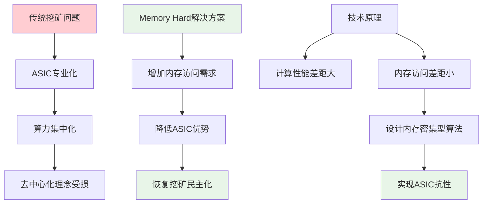
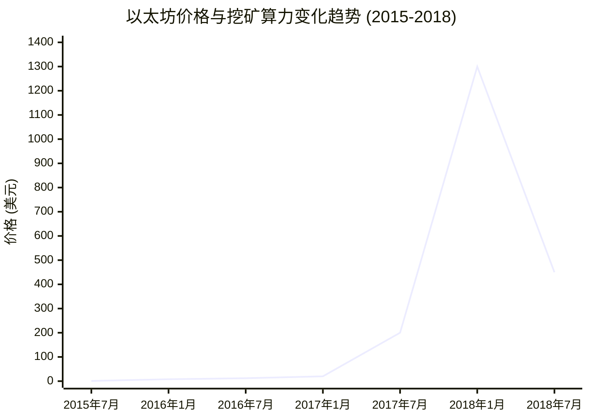
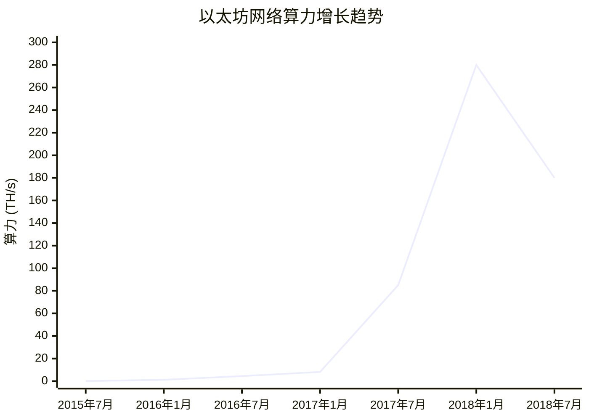

**19. ETH 挖矿算法**

本章节详细介绍以太坊中的挖矿算法设计原理和实现机制。

## 挖矿算法的重要性

对于基于工作量证明的区块链系统而言，挖矿是保障区块链安全的重要手段。正如常说的"区块链由金钱作为担保"（blockchain is secured by money），挖矿算法的设计直接影响系统的安全性和去中心化程度。

### 比特币挖矿算法评估表

| 评估维度 | 表现 | 具体说明 | 影响 |
|----------|------|----------|------|
| **安全性** | ✅ 优秀 | 经受时间检验，无重大漏洞 | 建立了强大的信任基础 |
| **抗攻击性** | ✅ 良好 | 天然漏洞赏金机制 | 激励白帽发现问题 |
| **去中心化程度** | ❌ 有限 | ASIC设备专业化严重 | 偏离设计初衷 |
| **参与门槛** | ❌ 很高 | 普通计算机无法有效参与 | 违背"One CPU, One Vote" |
| **算力集中风险** | ⚠️ 中等 | 大型矿场主导 | 51%攻击风险上升 |
| **生态健康度** | ✅ 良好 | 形成完整产业链 | 经济模型可持续 |

### 比特币挖矿算法的成功与局限

#### 成功之处

比特币采用的挖矿算法总体而言相当成功，经受了时间的检验。该算法相当于一个天然的"漏洞赏金计划"（Bug Bounty）——如果能够发现算法中的漏洞或挖矿捷径（shortcut），将能获得巨大利益。然而迄今为止，尚未有人发现可利用的安全漏洞。

#### 存在的问题

比特币挖矿算法面临的主要争议是**挖矿设备的专业化问题**。普通计算机无法有效参与挖矿，只能使用专门的ASIC芯片设备。这种现象与去中心化理念相冲突，也违背了比特币的设计初衷。

中本聪在比特币论文中提出了"One CPU, One Vote"的理念，期望普通用户能够使用桌面计算机、笔记本电脑甚至手机参与挖矿。这种设计更有利于安全性，因为算力分散后，恶意攻击者更难聚集51%的算力发动攻击。

## Memory Hard Mining Puzzle

### 设计理念



比特币之后出现的许多加密货币（包括以太坊）在设计挖矿算法时，都将**ASIC抗性**（ASIC Resistance）作为重要目标。实现这一目标的常用方法是增加挖矿过程对内存访问的需求，即所谓的**内存困难挖矿谜题**（Memory Hard Mining Puzzle）。

### 技术原理

#### ASIC vs 普通计算机性能对比

| 性能指标 | ASIC矿机 | 普通计算机 | 性能差距 |
|---------|----------|------------|----------|
| 计算能力 | 极强 | 一般 | 数千倍差距 |
| 内存访问性能 | 有限优势 | 标准配置 | 差距较小 |
| 价格效率 | 计算密集型优秀 | 通用性强 | 取决于应用场景 |
| 专用性 | 单一货币专用 | 多用途通用 | 功能灵活性差异巨大 |

因此，如果设计出对内存要求很高的挖矿谜题，就能有效遏制ASIC芯片的优势。

## 莱特币的Scrypt算法

### 算法设计

莱特币曾经是市值仅次于比特币的第二大加密货币，采用基于Scrypt的挖矿算法。Scrypt是一个对内存要求很高的哈希函数，最初用于计算机安全领域的密码相关应用。

#### Memory Hard特性分析

| 策略 | 内存需求 | 计算复杂度 | 效率 |
|------|----------|------------|------|
| 保存完整数组 | 高 | 低 | 最优 |
| 不保存数组 | 无 | 极高 | 不可行 |
| 部分保存(Time-Memory Trade-off) | 中等 | 中等 | 折中方案 |

如果不保存完整数组，挖矿的计算复杂度会大幅上升：
- 需要读取特定位置数据时，必须从第一个数重新计算到目标位置
- 为了高效挖矿，必须将整个数组保存在内存中

### 设计局限

#### 验证问题对比

| 角色 | 理想需求 | Scrypt实际情况 | 问题 |
|------|----------|----------------|------|
| 矿工 | 求解困难 | ✅ 需要大内存 | 符合设计 |
| 轻节点 | 验证容易 | ❌ 同样需要大内存 | 违背原则 |

这与挖矿谜题的基本原则相冲突：
- ✅ 求解谜题应该困难
- ❌ 验证结果应该容易

#### 实际效果评估

| 指标 | 设计目标 | 实际结果 | 评估 |
|------|----------|----------|------|
| 数组大小 | 大内存需求 | 128KB | ❌ 妥协过大 |
| ASIC抗性 | 抵制专用芯片 | 后来出现ASIC | ❌ 目标未达成 |
| GPU抗性 | 只用CPU挖矿 | 后来出现GPU挖矿 | ❌ 目标未达成 |
| 生态发展 | 民主化挖矿 | 良性循环形成 | ✅ 间接成功 |

尽管技术目标未完全实现，莱特币的"民主化挖矿"理念对解决加密货币的**冷启动问题**发挥了重要作用：
- 吸引了更多用户关注和参与
- 形成了良性循环：参与者增加 → 安全性提升 → 价值提高 → 更多参与者
- 奠定了其作为主流加密货币的地位

## 以太坊的Ethash算法

### 双数据集设计架构

以太坊采用了与莱特币不同的Memory Hard设计方案，使用**双数据集结构**来平衡挖矿效率和验证便利性：

#### 架构组成

| 数据集类型 | 大小 | 用途 | 使用者 |
|-----------|------|------|--------|
| **Cache** | 16MB | 基础数据集，用于生成DAG | 所有节点 |
| **DAG** | 1GB+ | 完整数据集，用于高效挖矿 | 矿工节点 |

#### 挖矿与验证对比

| 操作类型 | 数据需求 | 内存占用 | 计算复杂度 | 效率 |
|---------|----------|----------|------------|------|
| **挖矿** | 完整DAG | 1GB+ | 低 | 高 |
| **验证** | 仅Cache | 16MB | 高 | 中等 |

### 设计优势分析

#### 1. 解决验证难题
- **问题**：莱特币Scrypt算法验证时同样需要大内存
- **解决**：轻节点只需16MB Cache即可验证
- **效果**：验证便利性大幅提升

#### 2. 平衡效率与安全
- **矿工优势**：保存完整DAG，挖矿效率高
- **验证便利**：轻节点动态计算，节省存储
- **安全保障**：内存需求仍然很高，保持ASIC抗性

#### 3. 扩展性设计
- **动态增长**：数据集大小随时间增长
- **硬件适应**：跟上技术发展步伐
- **长期有效**：持续保持挖矿难度

### 算法流程

#### Cache生成

Cache的生成方式与前述数组生成类似：
1. 从种子节点开始，通过运算得到第一个元素
2. 依次对前一个元素取哈希，得到后续元素
3. 按顺序填充伪随机数，生成16MB的Cache

#### DAG生成

大数据集的每个元素都从Cache中按伪随机顺序生成：
1. 按伪随机顺序从Cache读取256个数
2. 不断进行迭代更新
3. 最终得到一个哈希值存储在DAG中
4. 每个DAG元素都可以独立生成

#### 挖矿过程

1. 根据区块头信息和Nonce值计算初始哈希
2. 进行64轮循环读取
3. 每轮从DAG中读取两个相邻元素
4. 读取位置由当前哈希值确定
5. 根据读取的数值更新哈希
6. 最终得到结果哈希，与难度目标比较

#### 验证过程

轻节点验证时：
1. 使用相同的64轮循环逻辑
2. 需要DAG元素时，从Cache中实时生成
3. 利用DAG元素可独立生成的特性
4. 避免保存完整大数据集

### 动态调整机制

两个数据集的大小会定期增长：
- Cache：每30,000个区块增加原始大小的1/128（128KB）
- DAG：每30,000个区块增加原始大小的1/128（8MB）
- 种子内容每30,000个区块变化一次

这种动态调整机制确保算法能够适应硬件发展。

## 算法实现细节

### 代码结构

以下是Ethash算法的伪代码实现框架：

#### Cache生成函数
```go
func generateCache(cacheSize int, seed []byte) [][]byte {
    cache := make([][]byte, cacheSize/64)
    cache[0] = hash(seed)
    for i := 1; i < len(cache); i++ {
        cache[i] = hash(cache[i-1])
    }
    return cache
}
```

#### DAG元素计算函数
```go
func calculateDataSetItem(cache [][]byte, i int) []byte {
    item := cache[i % len(cache)]
    for j := 0; j < 256; j++ {
        pos := getIntFromItem(item) % len(cache)
        item = makeItem(cache[pos], item)
    }
    return item
}
```

#### 挖矿函数
```go
func mine(header []byte, nonce uint64, fullSize int, dataSet [][]byte) []byte {
    s := initialHash(header, nonce)
    for i := 0; i < 64; i++ {
        pos := getIntFromItem(s) % fullSize
        data := [dataSet[pos], dataSet[pos+1]]
        s = updateHash(s, data)
    }
    return s
}
```

#### 验证函数
```go
func verify(header []byte, nonce uint64, fullSize int, cache [][]byte) []byte {
    s := initialHash(header, nonce)
    for i := 0; i < 64; i++ {
        pos := getIntFromItem(s) % fullSize
        data := [calculateDataSetItem(cache, pos), calculateDataSetItem(cache, pos+1)]
        s = updateHash(s, data)
    }
    return s
}
```

### 性能分析

#### 矿工计算量
- 需要保存完整1GB+数据集
- 64轮循环，每轮读取2个元素
- 主要开销在内存访问而非计算

#### 验证计算量
- 只需保存16MB Cache
- 同样64轮循环
- 每个DAG元素需从Cache的256个数计算得出
- 验证一次的计算量虽大，但仍在可接受范围内

相比之下，矿工需要尝试大量Nonce值，如果每次都重新计算DAG元素，代价将过于昂贵。

### 关键技术特点

**相邻元素读取**：每次读取DAG中两个相邻位置的哈希值，这两个值虽然位置相邻但生成过程独立，每个都由Cache中256个伪随机位置的数生成。这种设计为轻节点验证提供了便利。

## 实际效果评估

### ASIC抗性成效对比

| 项目 | 莱特币Scrypt | 以太坊Ethash | 优势对比 |
|------|--------------|--------------|----------|
| **内存需求** | 128KB | 1GB+ (现2.5GB+) | 8000+倍差距 |
| **ASIC出现时间** | 较早出现 | 至今较少 | Ethash更成功 |
| **主要挖矿设备** | ASIC主导 | GPU主导 | 实现设计目标 |
| **动态调整** | 无 | 定期增长 | 持续保持抗性 |
| **验证便利性** | 验证困难 | 16MB即可验证 | 解决核心问题 |

### 成功之处

到目前为止，以太坊挖矿主要以GPU为主，ASIC矿机很少，相比莱特币更好地实现了ASIC抗性。这主要得益于：

1. **大内存需求**：
   - 矿工需要1GB+内存（现已增长到2.5GB+）
   - 相比莱特币的128KB，差距达8000+倍
   - 即使与16MB Cache相比，也大100+倍

2. **定期增长机制**：
   - 数据集大小持续增长
   - 跟上硬件发展步伐

### 额外因素

以太坊ASIC抗性的实现还有其他重要因素：

#### 权益证明转换威胁

以太坊很早就计划从工作量证明转向权益证明（Proof of Stake）：
- 权益证明不需要挖矿
- 类似股份制公司按持股比例投票
- 对ASIC厂商构成威胁：开发周期长（1年+）、成本高，转换后设备失去价值
- 持续的转换威胁起到了威慑作用

#### 市场时机

- 以太坊成为主流加密货币是近年来的事
- 早期市值较小时，开发ASIC芯片不具经济性
- 等市值上升后，权益证明威胁已形成有效威慑

## 预挖矿机制

### 基本概念

| 概念 | 定义 | 特点 | 类比 |
|------|------|------|------|
| **预挖矿** | 货币发行时预留部分给开发者 | 早期价值分配 | 创始人股票期权 |
| **预售** | 出售预挖矿币获得开发资金 | 筹集启动资金 | 股权融资/众筹 |
| **传统挖矿** | 所有币通过挖矿产生 | 完全去中心化 | 比特币模式 |

### 与比特币的对比

比特币没有采用预挖矿模式：
- 所有比特币都通过挖矿产生
- 早期挖矿难度较低
- 更符合完全去中心化理念

## 统计数据分析

### 以太坊价格与算力历史变化趋势





### 货币供应分布

根据历史数据分析：
- 总供应量：约1亿个以太币
- 绝大部分通过预挖矿产生
- 创世区块包含大量预分配以太币
- 后续挖矿产生的币中，区块奖励占主要部分，叔叔区块奖励占较小比例

### 挖矿集中化程度

最大25个以太坊矿池的算力分布显示：
- 挖矿集中化程度较高
- 头部矿池占据较大比例
- 与比特币情况类似

#### 挖矿集中化分析

| 集中化指标 | 状况 | 影响 |
|------------|------|------|
| 头部矿池占比 | 较高 | 可能影响去中心化 |
| 矿池数量 | 25个主要矿池 | 相对集中 |
| 地理分布 | 全球分布 | 有助于网络稳定性 |
| 算力波动 | 随价格变化 | 市场驱动明显 |

### 价格和算力变化

历史数据显示：
- 早期几年价格增长有限
- 2017年开始大幅上涨，年初达到峰值（1300-1400美元）
- 随后开始下跌
- 哈希率总体呈上升趋势，与价格变化基本一致
- 不同加密货币的哈希率不可直接比较（算法差异）

## ASIC抗性的争议

### 不同观点对比分析

| 争议焦点 | 支持ASIC抗性观点 | 支持ASIC挖矿观点 | 中立分析 |
|----------|------------------|------------------|----------|
| **安全性模型** | 算力分散更安全 | 专用设备攻击成本高 | 各有合理性 |
| **参与门槛** | 普通用户可参与 | 专业化更高效 | 权衡取舍 |
| **攻击成本** | 降低51%攻击门槛 | ASIC投资无法转移用途 | 情况复杂 |
| **云服务威胁** | ASIC不受影响 | 通用设备可被云端调用 | 新兴风险 |
| **设备利用率** | 设备多用途利用 | 攻击后投资全损 | 经济威慑 |
| **技术发展** | 保持挖矿民主化 | 推动硬件技术进步 | 创新方向 |

### 支持ASIC抗性的观点

**民主化挖矿理念**：
- 让更多普通用户参与挖矿
- 算力分散提高安全性
- 降低51%攻击的可能性

### 反对ASIC抗性的观点

**专用设备更安全论**：

#### 攻击成本分析

**ASIC挖矿的攻击成本**：
1. 需要投入大量资金购买专用矿机
2. 矿机除挖矿外无其他用途
3. 只能挖特定加密货币
4. 攻击成功后，币价下跌，硬件投资无法收回

**通用设备挖矿的风险**：
1. 大型互联网公司拥有数十万台服务器
2. 可临时调用服务器参与攻击
3. 攻击结束后，服务器恢复原有用途
4. 不需要专门购买攻击设备，成本大幅降低

#### 云服务威胁

即使大公司不直接参与攻击，恶意攻击者也可能：
- 通过云服务租用大量服务器
- 临时聚集算力发动攻击
- 攻击成本显著低于购买专用设备

### 结论

关于ASIC抗性的争议反映了区块链安全性设计中的复杂权衡：
- 民主化挖矿有利于去中心化理念
- 专用设备可能提供更高的攻击成本
- 不同观点都有其合理性
- 实际选择需要综合考虑多种因素

## 总结

以太坊的挖矿算法Ethash在ASIC抗性方面取得了相对成功，主要通过：
1. 大内存需求的Memory Hard设计
2. 双数据集结构平衡挖矿和验证需求
3. 动态调整机制适应硬件发展
4. 权益证明转换威胁的心理威慑

然而，关于是否应该追求ASIC抗性仍存在争议，这反映了区块链系统在安全性、去中心化和实用性之间需要进行复杂的权衡考量。