**20. ETH 难度调整**

本章节详细介绍以太坊中的难度调整算法。

## 难度调整算法概述

### 与比特币的差异

#### 比特币vs以太坊难度调整对比

| 特征 | 比特币 | 以太坊 |
|------|--------|---------|
| **调整频率** | 每2016个区块调整一次 | 每个区块都可能调整 |
| **目标出块时间** | 10分钟 | 15秒 |
| **调整方式** | 基于时间间隔的简单调整 | 复杂的多因素调整算法 |
| **版本演进** | 相对稳定 | 经历多个版本改进 |
| **特殊机制** | 无 | 难度炸弹机制 |
| **叔叔区块影响** | 不适用 | 影响难度调整 |

比特币每隔2016个区块调整一次挖矿难度，目标是维持出块时间平均在10分钟左右。以太坊则每个区块都有可能调整挖矿难度，调整方法更加复杂，且经历了多个版本的改进。

**重要说明**：网络上的资料（包括论坛、博客）对这方面的介绍存在诸多不一致之处，甚至以太坊的黄皮书与实际代码也有差异。本章节遵循以代码为准的原则，基于以太坊的实际代码进行分析。

## 难度调整公式

### 基本公式结构

#### 难度调整公式组成

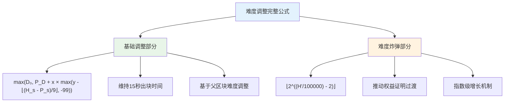

难度调整的完整公式如下：

```
D(H) = max(D_0, P_D + x * max(y - ⌊(H_s - P_s)/9⌋, -99)) + ⌊2^((H'/100000) - 2)⌋
```

#### 公式变量说明

| 变量 | 含义 | 说明 |
|------|------|------|
| `H` | 当前区块 | 正在计算难度的区块 |
| `D(H)` | 当前区块的难度 | 计算结果 |
| `D_0` | 最小难度限制 | 防止难度过低 |
| `P_D` | 父区块的难度 | 调整基准 |
| `H_s` | 当前区块的时间戳 | 用于计算时间间隔 |
| `P_s` | 父区块的时间戳 | 用于计算时间间隔 |
| `H'` | 调整后的区块号 | 用于难度炸弹计算 |
| `x` | 调整力度 | `P_D / 2048` |
| `y` | 叔叔区块系数 | 有叔叔区块=2，无=1 |

### 公式组成部分

该公式包含两个主要部分：

1. **基础部分**：`max(D_0, P_D + x * max(y - ⌊(H_s - P_s)/9⌋, -99))`
   - 目的：维持出块时间大概在15秒左右
   - 基于父区块难度和出块时间间隔进行调整

2. **难度炸弹部分**：`⌊2^((H'/100000) - 2)⌋`
   - 目的：为向权益证明过渡做准备
   - 随区块号指数级增长

## 基础部分详解

### 调整力度

#### 调整力度计算流程

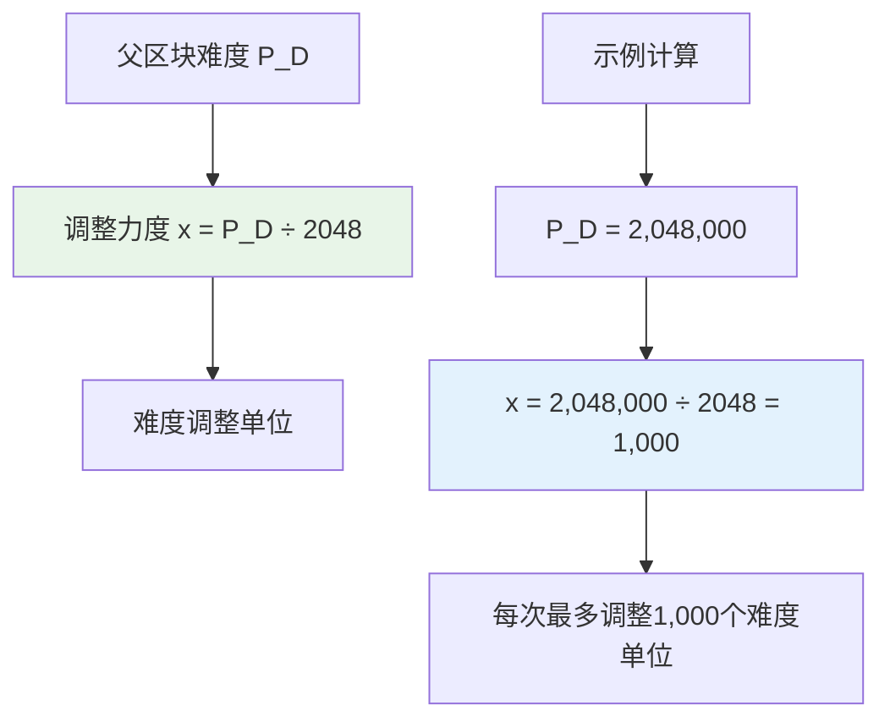

调整力度 `x` 的计算方式：
```
x = P_D / 2048
```

这意味着难度调整（无论上调还是下调）都按照父区块难度的1/2048作为基本单位进行。

### 调整系数

#### 调整系数计算逻辑

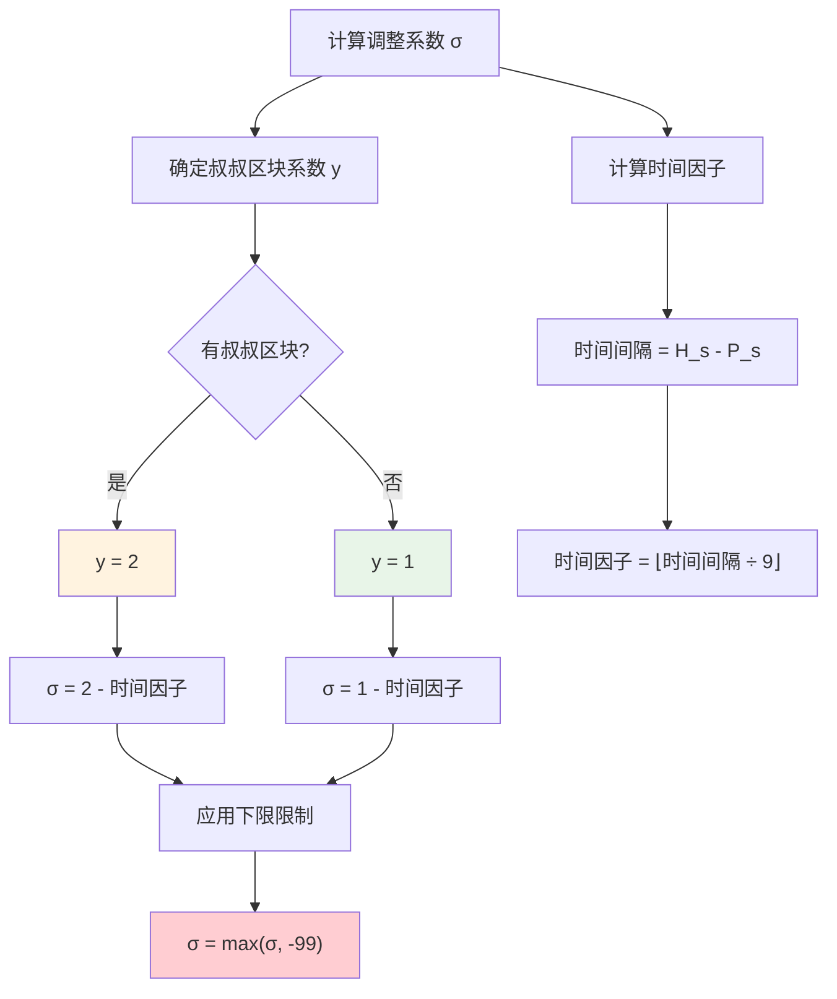

调整系数 `σ` 的计算：
```
σ = y - ⌊(H_s - P_s)/9⌋
```

其中：
- `y` 取决于是否包含叔叔区块：
  - 有叔叔区块：`y = 2`
  - 无叔叔区块：`y = 1`
- `⌊(H_s - P_s)/9⌋` 表示出块时间间隔除以9后向下取整

### 叔叔区块的影响

#### 叔叔区块对难度的影响机制

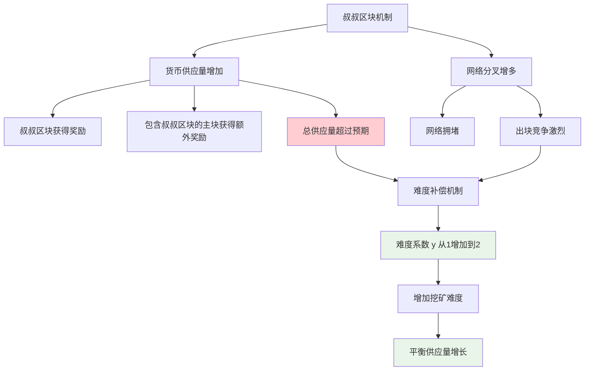

当父区块包含叔叔区块时，系统中的货币总供应量会增加（因为叔叔区块和包含它的区块都会获得奖励）。为了维持系统总供应量的平衡，当前区块的挖矿难度需要相应提高一个单位。

### 调整下限

难度调整有一个下限限制：`max(σ, -99)`，这意味着单次难度下调最多只能是99个单位，即最多下调 `99 * P_D/2048`。这种设计主要是为了防止系统异常情况下的过度调整。

## 具体调整示例

### 不同出块时间的调整情况

| 出块时间间隔 | 时间因子⌊(H_s-P_s)/9⌋ | 叔叔区块 | y值 | 调整系数σ | 难度变化 | 说明 |
|-------------|---------------------|---------|-----|---------|----------|------|
| 1-8秒 | 0 | 无 | 1 | 1-0=1 | 上调1单位 | 出块过快 |
| 1-8秒 | 0 | 有 | 2 | 2-0=2 | 上调2单位 | 出块过快+叔叔区块 |
| 9-17秒 | 1 | 无 | 1 | 1-1=0 | 不变 | 理想状态 |
| 9-17秒 | 1 | 有 | 2 | 2-1=1 | 上调1单位 | 理想时间+叔叔区块 |
| 18-26秒 | 2 | 无 | 1 | 1-2=-1 | 下调1单位 | 出块过慢 |
| 18-26秒 | 2 | 有 | 2 | 2-2=0 | 不变 | 出块过慢但有叔叔区块 |
| 27-35秒 | 3 | 无 | 1 | 1-3=-2 | 下调2单位 | 出块很慢 |
| 900+秒 | 100+ | 无 | 1 | 1-100+=-99 | 下调99单位 | 异常情况，触发下限 |

#### 调整示例流程图

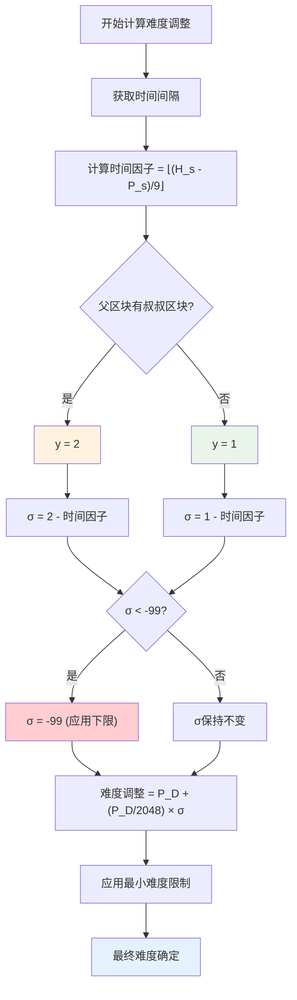

### 示例1：出块时间1-8秒

- 出块间隔：1-8秒
- `⌊(H_s - P_s)/9⌋ = 0`
- 假设无叔叔区块：`y = 1`
- 调整系数：`σ = 1 - 0 = 1`
- **结果**：难度上调1个单位（出块过快，需要增加难度）

### 示例2：出块时间9-17秒

- 出块间隔：9-17秒
- `⌊(H_s - P_s)/9⌋ = 1`
- 假设无叔叔区块：`y = 1`
- 调整系数：`σ = 1 - 1 = 0`
- **结果**：难度不变（出块时间符合预期）

### 示例3：出块时间18-26秒

- 出块间隔：18-26秒
- `⌊(H_s - P_s)/9⌋ = 2`
- 假设无叔叔区块：`y = 1`
- 调整系数：`σ = 1 - 2 = -1`
- **结果**：难度下调1个单位（出块过慢，需要降低难度）

当出块时间更长时，下调幅度会更大。但单次调整受到-99的下限限制，主要是为了防止异常情况下的过度调整。

## 难度炸弹机制

### 设计初衷

#### 难度炸弹设计逻辑

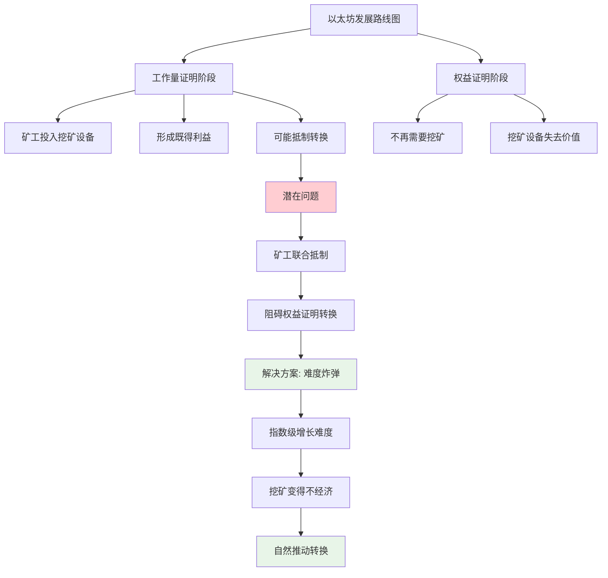

难度炸弹是以太坊设计中的一个重要机制，其目的是为了从工作量证明平滑过渡到权益证明。

**潜在问题**：已经在挖矿设备上投入大量资金的矿工可能会联合抵制向权益证明的转换，因为这会使他们的设备失去价值。

**解决方案**：通过难度炸弹机制，随着时间推移，挖矿难度会呈指数级增长，使得继续挖矿变得不经济，从而推动向权益证明的转换。

### 原始设计

#### 难度炸弹演进过程

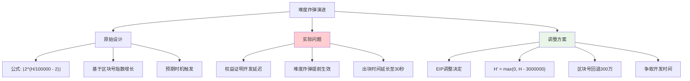

最初的难度炸弹公式：
```
⌊2^(H/100000 - 2)⌋
```

**特点**：
- 早期区块号较小时，难度炸弹影响微乎其微
- 随着区块号增长，难度炸弹呈指数级增长
- 当难度炸弹开始生效时，正好是预期转向权益证明的时机

### 实际问题与调整

#### 难度炸弹影响时间线

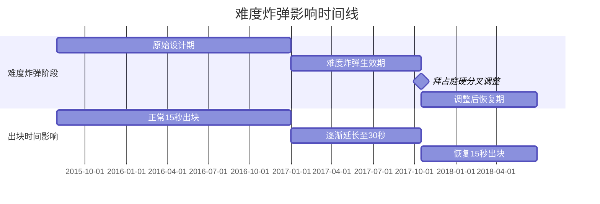

**遇到的问题**：
- 权益证明共识机制的开发比预期复杂
- 转向权益证明的时间点被一再推迟
- 难度炸弹已经生效，但仍需继续使用工作量证明

**具体表现**：
- 出块时间从15秒逐渐增长到30秒左右
- 如果不采取措施，出块时间会继续增长

**解决方案**：
通过EIP（Ethereum Improvement Proposal）决定在计算难度炸弹时，将区块号回退300万个区块：
```
H' = max(0, H - 3000000)
```

这种调整为权益证明的开发争取了更多时间。

### 难度炸弹的影响

#### 难度炸弹调整前后对比

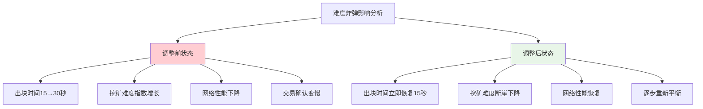

根据统计数据，难度炸弹调整前后的对比：

**调整前**：
- 出块时间从15秒逐渐增长到30秒左右
- 挖矿难度呈指数级增长

**调整后**：
- 出块时间立即恢复到15秒左右
- 挖矿难度出现断崖式下降后逐步恢复

## 以太坊发展阶段

### 发展路线图

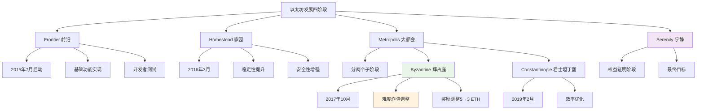

以太坊的发展被分为四个阶段：

1. **Frontier**（前沿）
2. **Homestead**（家园）
3. **Metropolis**（大都会）
   - 拜占庭阶段（Byzantine）
   - 君士坦丁堡阶段（Constantinople）
4. **Serenity**（宁静）

难度炸弹的回调是在拜占庭阶段进行的，对应的EIP（Ethereum Improvement Proposal）为相关改进提案。

### 奖励调整

#### 奖励调整的影响分析

| 调整项目 | 调整前 | 调整后 | 调整原因 |
|----------|--------|--------|----------|
| **出块奖励** | 5 ETH | 3 ETH | 难度降低的补偿 |
| **挖矿难度** | 指数级增长 | 回退300万区块 | 争取开发时间 |
| **出块时间** | ~30秒 | ~15秒 | 恢复正常运行 |
| **矿工收益** | 下降趋势 | 短期恢复后稳定 | 平衡供应量 |

在难度炸弹回调的同时，出块奖励从5个以太币降低到3个以太币。

**调整原因**：
1. **公平性考虑**：避免对回调前的矿工不公平
2. **供应量控制**：挖矿难度降低后，需要相应减少奖励以维持货币供应量平衡

**与比特币的差异**：
比特币采用定期减半的奖励机制，而以太坊的奖励调整是根据具体情况进行的一次性调整，并非定期执行。

## 代码实现

### 拜占庭阶段难度计算

#### 难度计算流程图

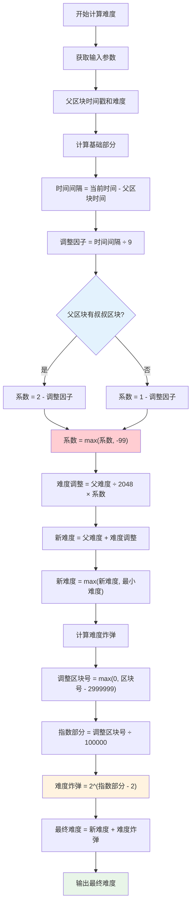

以下是拜占庭阶段计算挖矿难度调整的核心代码逻辑：

```go
// 输入：父区块时间戳、父区块难度
// 输出：当前区块难度

// 基础部分计算
blockTime := currentTime - parentTime
adjustment := blockTime / 9  // 向下取整

// 叔叔区块影响
if hasUncles {
    coefficient := 2 - adjustment
} else {
    coefficient := 1 - adjustment
}

// 调整下限
coefficient = max(coefficient, -99)

// 难度调整
difficultyAdjustment := parentDifficulty / 2048 * coefficient
newDifficulty := parentDifficulty + difficultyAdjustment

// 最小难度限制
newDifficulty = max(newDifficulty, minimumDifficulty)
```

### 难度炸弹计算

```go
// 计算调整后的区块号
fakeBlockNumber := blockNumber
if blockNumber > 2999999 {
    fakeBlockNumber = blockNumber - 2999999
}

// 难度炸弹计算
exponentialComponent := fakeBlockNumber / 100000  // 向下取整
difficultyBomb := 2^(exponentialComponent - 2)

// 最终难度
finalDifficulty := newDifficulty + difficultyBomb
```

**代码说明**：
- 使用2999999而非3000000是因为区块号从0开始计数
- 父区块序号比当前区块少1，因此需要相应调整

## 实际统计数据分析

### 挖矿难度变化

#### 挖矿难度历史趋势

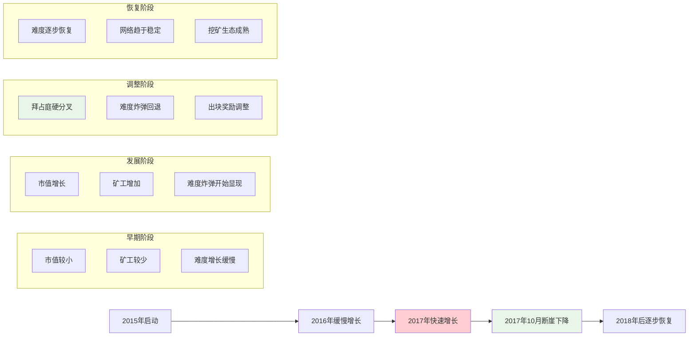

根据以太坊的历史数据：

**早期阶段**：
- 挖矿难度增长缓慢且不明显
- 当时以太坊市值较小，参与挖矿的矿工相对较少

**中期发展**：
- 从2017年开始，挖矿难度增长变得明显
- 难度炸弹效应开始显现，呈现指数级增长

**调整期**：
- 难度炸弹回调后，挖矿难度出现断崖式下降
- 随后逐步恢复到原有水平，甚至略有增加
- 目前挖矿难度基本趋于稳定

### 出块时间稳定性

#### 出块时间变化趋势对比

| 时期 | 平均出块时间 | 难度状态 | 网络表现 |
|------|-------------|----------|----------|
| **正常运行期** | ~15秒 | 稳定增长 | 良好 |
| **难度炸弹影响期** | 15秒→30秒 | 指数增长 | 性能下降 |
| **调整后恢复期** | 立即恢复~15秒 | 断崖下降后恢复 | 恢复正常 |
| **当前稳定期** | ~15秒 | 平稳 | 稳定运行 |

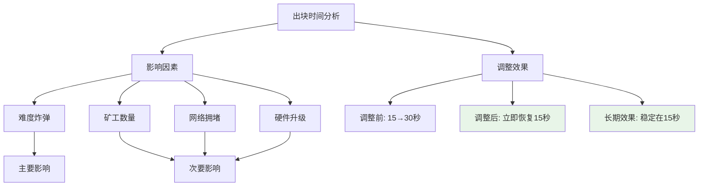

**正常运行期**：
- 出块时间基本稳定在15秒左右
- 证明难度调整算法达到了预期效果

**难度炸弹影响期**：
- 出块时间从15秒逐渐增长到30秒左右
- 严重影响了网络的正常运行

**调整后恢复期**：
- 出块时间立即恢复到15秒左右
- 持续保持稳定状态

**分析说明**：
- 难度炸弹回调后，总挖矿难度逐渐恢复到原有水平
- 这是因为挖矿变容易后有更多矿工加入，竞争更加激烈
- 但从出块时间角度来看，基本维持在15秒左右，效果良好

### 最长合法链定义

#### 最长链vs最难链概念对比

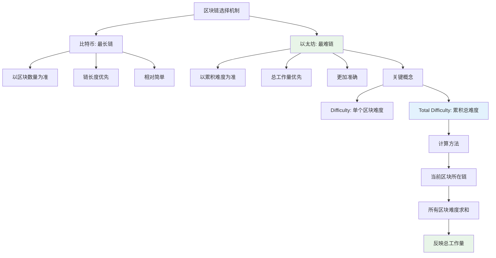

在以太坊中，"最长合法链"的概念实际上是"最难合法链"，即总难度最大的合法链。

**关键概念**：
- **Difficulty**：当前区块的难度
- **Total Difficulty**：当前区块所在链上所有区块的难度总和

每个区块的难度反映了挖出该区块所需的工作量，而总难度最大意味着挖出整条链所需的总工作量最大。通常情况下，较新的区块挖出所需的工作量也相对较大。

## 总结

### 难度调整算法特点总结

以太坊的难度调整算法是一个复杂而精密的系统，包含了基础调整机制和难度炸弹两个部分。基础部分确保了出块时间的稳定性，而难度炸弹则为向权益证明过渡提供了技术推动力。

通过对难度炸弹的适时调整，以太坊成功地为权益证明共识机制的开发争取了更多时间，同时维持了网络的正常运行。这种设计体现了以太坊团队在技术创新和实用性之间的平衡考量。

难度调整算法的成功实施证明了以太坊在技术设计上的前瞻性和灵活性，为区块链技术的发展提供了宝贵的经验。