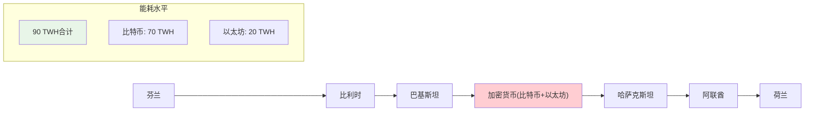
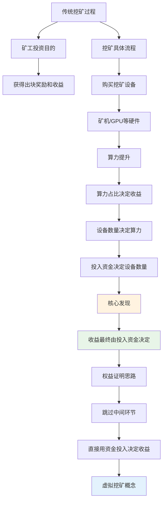
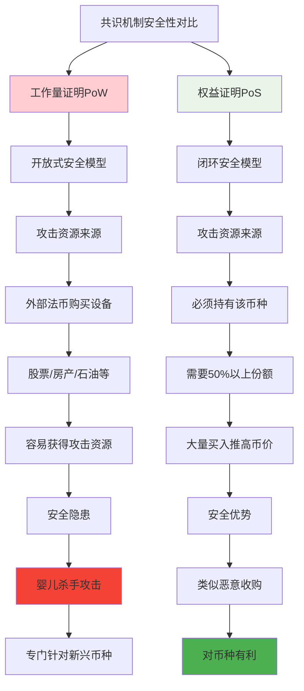
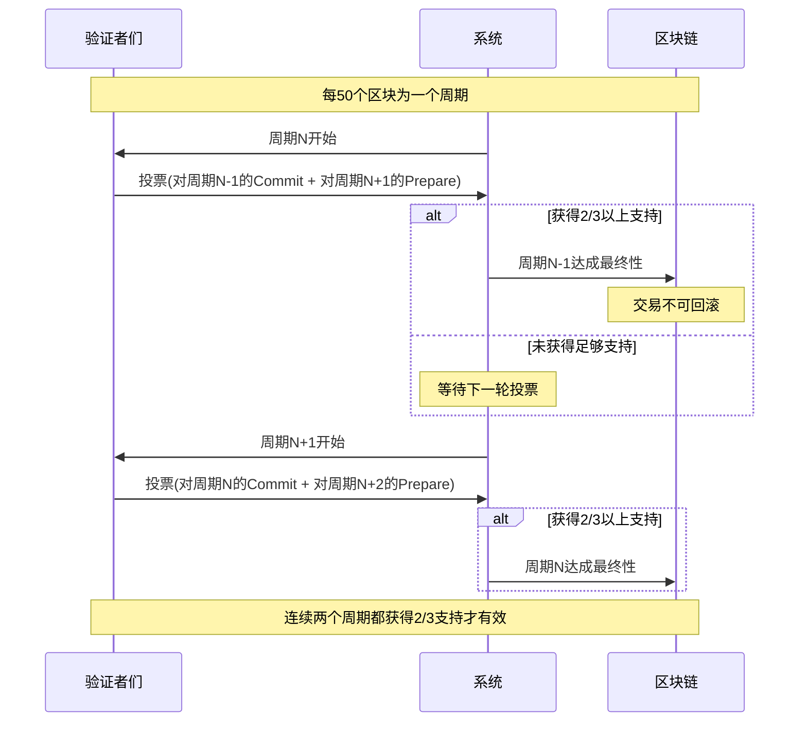
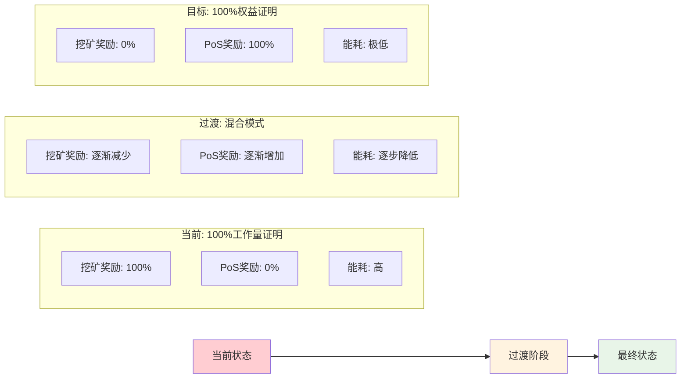

**21. 权益证明**

本章节介绍权益证明（Proof of Stake）共识机制。

## 工作量证明的能耗问题

比特币和以太坊目前采用的都是基于工作量的证明机制。这种共识机制受到了一个普遍的批评：能耗过高。

### 比特币vs以太坊能耗对比

#### 详细能耗统计表

| 对比项目 | 比特币 | 以太坊 | 差异倍数 |
|----------|--------|--------|----------|
| **年总能耗** | ~70 TWH | ~20 TWH | 3.5倍 |
| **对标国家** | 智利国家能耗 | 冰岛国家能耗 | - |
| **美国家庭等效** | 647万个家庭 | 183万个家庭 | 3.5倍 |
| **全球能耗占比** | 0.31% | 0.09% | 3.4倍 |
| **单笔交易能耗** | 1,014 KWH | 67 KWH | 15.1倍 |
| **家庭日用电等效** | 34.26个家庭/天 | 2.25个家庭/天 | 15.2倍 |
| **年挖矿收入** | ~61亿美元 | ~55亿美元 | 1.1倍 |
| **年挖矿成本** | ~35亿美元 | ~24亿美元 | 1.5倍 |
| **成本占收入比** | 57.48% | 43.64% | - |
| **出块时间** | ~10分钟 | ~15秒 | 40倍差异 |

比特币能耗随时间变化的图表显示，Y 轴单位为 TWH（十的12次方瓦时）。相比之下，千瓦时（KWH）是十的3次方瓦时，即一度电的概念。图表显示比特币的能耗随时间呈现不断增长的趋势。

### 比特币能耗统计

具体统计数据如下：

- **年总能耗**：约70 TWH，相当于智利国家的能耗
- **家庭能耗对比**：相当于647万多个美国家庭的能耗
- **全球占比**：占全世界总能耗的0.31%
- **单笔交易能耗**：平均1014千瓦时，相当于34.26个美国家庭一天的能耗

每个交易耗费约1000度电，这一数字相当惊人。相比之下，信用卡公司处理单笔交易的能耗远低于此数字。

比特币挖矿年收入约61亿美元，成本约35亿美元，占总收入的57.48%，显示挖矿利润空间较大。

### 以太坊能耗统计

以太坊的能耗同样随时间增长，但存在一些波动。具体数据如下：

- **年总能耗**：约20 TWH，相当于冰岛国家的能耗
- **家庭能耗对比**：相当于183万个美国家庭的能耗
- **全球占比**：占全世界总能耗的0.09%
- **单笔交易能耗**：平均67千瓦时，相当于2.25个美国家庭一天的能耗

以太坊挖矿年收入约55亿美元，成本接近24亿美元，挖矿利润空间同样较大。

### 能耗差异分析

尽管以太坊的交易可能包含智能合约调用，复杂度高于比特币的简单转账交易，但其单笔交易能耗（67千瓦时）远低于比特币（1000千瓦时）。

这种差异的主要原因是出块时间的不同：
- 比特币：约10分钟出一个区块
- 以太坊：约15秒出一个区块

以太坊的出块时间短，挖矿时间相对较短，因此平均到每个交易的能耗较低。

### 全球能耗排名对比

如果将比特币和以太坊的能耗合并计算，在国家能耗排行榜中的位置为：芬兰、比利时、巴基斯坦之后，位列第四位，随后是哈萨克斯坦、阿联酋、荷兰。

## 权益证明的基本思想

### 挖矿过程分析

分析挖矿过程中的能耗是否必要，需要考虑以下问题：

1. **矿工挖矿的目的**：获得出块奖励和收益
2. **出块奖励的作用**：激励矿工参与区块链维护，保证系统安全
3. **挖矿的具体过程**：
   - 投入资金购买挖矿设备（矿机、GPU等）
   - 挖矿收益由算力占比决定
   - 算力由投入的硬件设备数量决定
   - 设备数量由投入资金决定

### 权益证明的核心理念

既然挖矿收益最终由投入资金决定，那么可以直接通过资金投入来决定收益分配，而无需通过算力竞争的中间环节。

**权益证明的基本思想**：将投入的资金直接用于区块链开发，按照每个人投入资金的比例决定收益分配，省去挖矿环节。这种方法有时被称为"虚拟挖矿"。

### 权益证明的实现机制

采用权益证明的加密货币通常在正式发行前会：
1. 预留一部分货币给开发者
2. 出售一部分货币获取开发资金
3. 按照持有货币数量进行投票和收益分配

## 权益证明的优势

### 工作量证明vs权益证明安全模型对比

### 环保优势

**能耗降低**：省去挖矿过程，避免由此产生的能耗和环境影响，减少温室气体排放。

### 安全优势

**闭环安全模型**：基于工作量证明的共识系统存在安全闭环问题。

#### 工作量证明的安全隐患

工作量证明系统的安全资源不构成闭环：
- 挖矿设备使用法币（如美元）购买
- 攻击资源可以从加密货币生态系统外部获得
- 恶意组织可以利用其他领域的资源（股票、房地产、石油等）转化为挖矿算力

对于新兴的小型加密货币，这种攻击尤其致命。攻击者只需购买足够的挖矿设备，获得超过总算力一半的算力即可发动攻击。这类攻击专门针对新兴加密货币，被称为"婴儿杀手攻击"（Infant Suicide Attack）。

#### 权益证明的安全优势

权益证明构成安全闭环：
- 攻击者必须获得该币种发行量一半以上的份额
- 攻击资源只能从加密货币系统内部获得
- 外部资源（美元、股票、房地产等）不能直接用于攻击

**攻击成本分析**：
- 攻击者需要大量买入目标货币
- 大量买入会导致币价上涨
- 币价上涨对该币的开发者和早期投资者有利
- 类似于股份制公司的恶意收购情况

## 混合模型

权益证明与工作量证明并非互斥关系。一些加密货币采用混合模型：
- 仍然需要挖矿，但挖矿难度与持有的权益相关
- 持有币数量越多，挖矿难度越低
- 投入的币会被锁定一段时间，不能重复使用

这种机制有时被称为"存款证明"（Proof of Deposit）。

## 权益证明的挑战

### 双边下注问题

早期权益证明面临的主要挑战是"双边下注问题"（Nothing at Stake）。

#### 问题描述

当区块链出现分叉时：
- **工作量证明**：矿工只会在一条链上挖矿，因为算力分散会降低挖到区块的概率
- **权益证明**：验证者可以在多条分叉链上同时下注，因为在一条链上锁定的币不影响在其他链上的使用

#### 解决方案

现代权益证明协议通过惩罚机制解决双边下注问题。

## 以太坊的 Casper 协议

### 协议概述

以太坊准备采用的权益证明协议叫做 Casper，在过渡阶段与工作量证明混合使用，为工作量证明提供最终性（Finality）保障。

#### 最终性（Finality）

**定义**：包含在最终状态中的交易不会被取消。

**工作量证明的局限**：
- 基于挖矿的交易可能被回滚
- 恶意攻击者如果拥有足够算力，仍可能让分叉链变得更长
- 比特币的6个确认区块只是降低回滚概率，无法完全避免

### Casper 协议投票时序图

### 验证者（Validator）

**成为验证者的条件**：
- 投入一定数量的以太币作为保证金
- 保证金被系统锁定

**验证者职责**：
- 推动系统达成共识
- 投票决定最长合法链
- 投票权重取决于保证金数量

#### 投票机制

**类似于数据库的两阶段提交**：
1. **原始版本**：每100个区块为一个周期（Epoch），进行两轮投票
   - 第一轮：Prepare Message
   - 第二轮：Commit Message
   - 每轮投票需要2/3以上验证者通过

2. **优化版本**：
   - 每50个区块为一个周期
   - 每个周期只进行一轮投票
   - 该轮投票对上一个周期是Commit Message，对下一个周期是Prepare Message
   - 连续两个周期的投票都获得2/3以上支持才算有效

#### 激励与惩罚机制详表

| 行为类型 | 具体行为 | 惩罚程度 | 保证金处理 | 对系统影响 | 检举期 |
|----------|----------|----------|------------|------------|--------|
| **正常履职** | 按时投票，遵守规则 | 无惩罚 | 获得奖励 | 维护共识 | - |
| **消极违规** | 应投票时不投票 | 轻度惩罚 | 扣除部分保证金 | 可能阻碍共识 | 等待期检查 |
| **积极违规** | 给冲突分叉都投票 | 严厉惩罚 | 没收全部保证金 | 威胁系统安全 | 等待期检查 |
| **双边下注** | 在多条链上同时投票 | 严厉惩罚 | 没收全部保证金 | 分裂网络 | 等待期检查 |
| **违规证据确凿** | 其他节点提供证据 | 最高惩罚 | 保证金被销毁 | 减少ETH总量 | - |

**奖励机制**：
- 验证者履行职责可获得相应奖励
- 类似于矿工的出块奖励

**惩罚机制**：
1. **消极行为**：不作为（应投票时不投票）
   - 扣除部分保证金
   - 可能导致系统无法达成共识
   
2. **积极违规**：乱作为（给冲突分叉都投票）
   - 没收全部保证金
   - 保证金被销毁，减少系统中以太币总供应量

**任期与等待期**：
- 验证者有固定任期
- 任期结束后进入等待期
- 等待期用于其他节点检举违规行为
- 等待期结束且无违规，可取回保证金和奖励

### 安全性分析

#### 攻击场景分析

**单纯矿工攻击**：无法推翻已达成的最终性，因为最终性由验证者投票决定。

**验证者攻击**：
- 需要大量验证者进行双边下注
- 由于每轮投票需要2/3以上支持，至少需要1/3的验证者违规
- 违规验证者的保证金将被没收

**攻击成本**：违规验证者将损失全部保证金，使攻击成本极高。

### 以太坊过渡策略趋势图

以太坊计划逐步从工作量证明过渡到权益证明：
- 随时间推移，挖矿奖励逐渐减少
- 权益证明奖励逐渐增加
- 最终达到完全不用挖矿的状态

## 权益证明的现状与挑战

### 发展现状

**技术成熟度**：
- 工作量证明：经过时间检验，相对成熟
- 权益证明：仍在探索阶段，技术不够成熟

**实际应用**：
- 比特币和以太坊的挖矿算法经历了长期验证
- 主流加密货币仍主要使用工作量证明
- 以太坊目前仍在使用工作量证明

### EOS 的尝试

2018年6月，EOS（柚子币）上线，采用权益证明思想：
- 使用DPoS（委托权益证明）协议而非Casper
- 通过投票选出21个超级节点
- 由超级节点产生区块
- 上线后仍处于调试和完善阶段

### 不同观点争议对比

#### 能耗问题争议对比表

| 争议焦点 | 支持权益证明观点 | 支持工作量证明观点 | 客观事实 |
|----------|------------------|-------------------|----------|
| **能耗水平** | 过高，需要替代 | 占全球能耗仅0.4% | 比特币0.31%+以太坊0.09% |
| **环保影响** | 造成严重污染 | 推动清洁能源利用 | 多数矿场靠清洁能源 |
| **电力利用** | 纯粹浪费电力 | 有效利用过剩电力 | 多建在电力丰富地区 |
| **经济价值** | 没有实际价值 | 带动地方经济发展 | 创造就业和税收 |
| **技术成熟度** | 技术更先进 | 经过长期验证 | PoW运行10年，PoS仍在试验 |
| **安全性** | 更加安全 | 久经考验 | PoS理论安全，PoW实践证明 |
| **去中心化** | 避免矿池中心化 | 任何人可参与挖矿 | 两者都面临中心化挑战 |

#### 支持权益证明的观点

认为工作量证明能耗过高，需要替代方案。

#### 支持工作量证明的观点

**能耗占比有限**：
- 比特币能耗占全球总能耗0.31%
- 以太坊占0.09%
- 两者合计仅占0.4%

**挖矿的积极作用**：
1. **电能转换手段**：提供将电能转换为货币的方式
2. **电力存储与传输问题**：
   - 电力难以存储，发电站在不同时段的供需不匹配
   - 电力传输成本高，数据传输比电力传输更容易
3. **清洁能源利用**：
   - 许多风力发电站产生的电力难以回传主电网
   - 主电网通常设计为单向传输
   - 电网改造成本高昂
4. **过剩产能利用**：
   - 挖矿可以有效利用过剩电力资源
   - 多数比特币矿场建在电力资源丰富的地区（如小水电站附近）
   - 挖矿只需要电力和网络连接
   - 加密货币的存储和传输便利
5. **经济发展**：带动当地经济发展，化解过剩产能

## 总结

权益证明作为区块链共识机制的重要发展方向，在解决能耗问题和安全性方面具有明显优势。然而，技术成熟度和实际应用仍面临挑战。目前，权益证明仍处于探索和完善阶段，需要更多时间和实践验证其可行性和稳定性。

工作量证明虽然存在能耗争议，但其经过长期验证的稳定性和安全性，以及在电力资源利用方面的潜在价值，使其在当前阶段仍具有重要地位。未来区块链共识机制的发展可能会呈现多元化趋势，不同场景采用不同的共识机制。