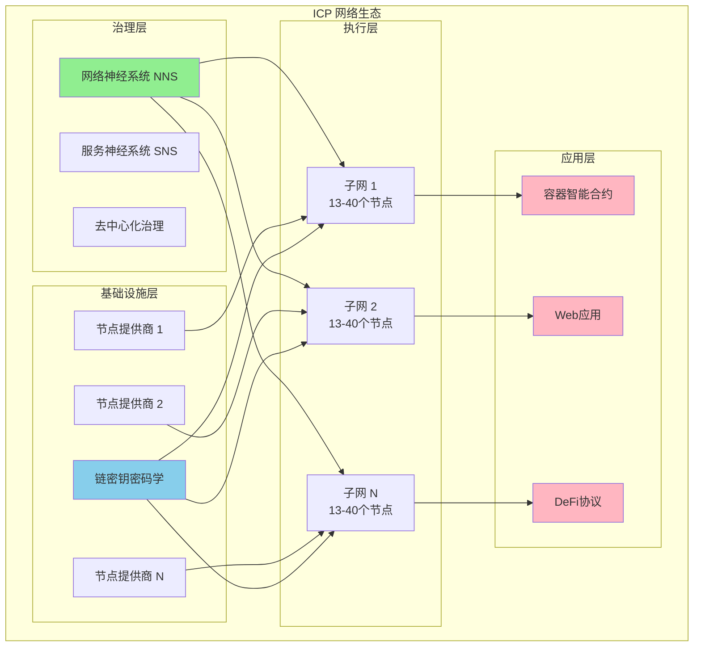
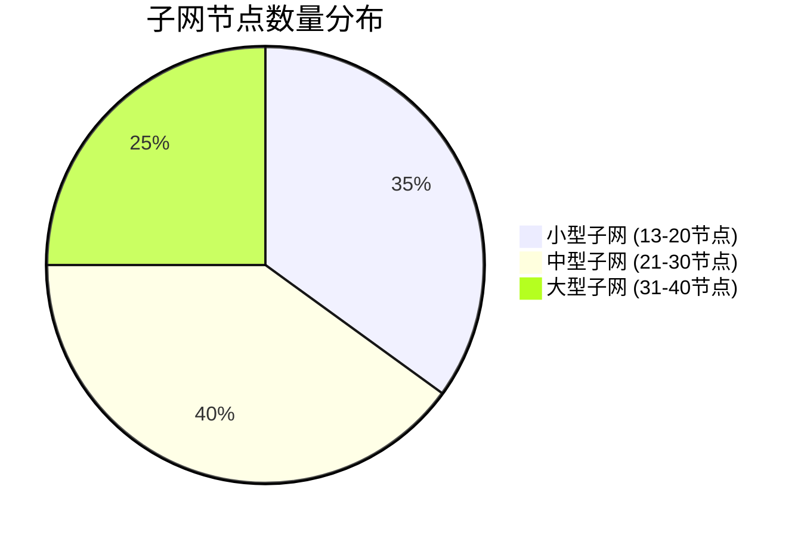
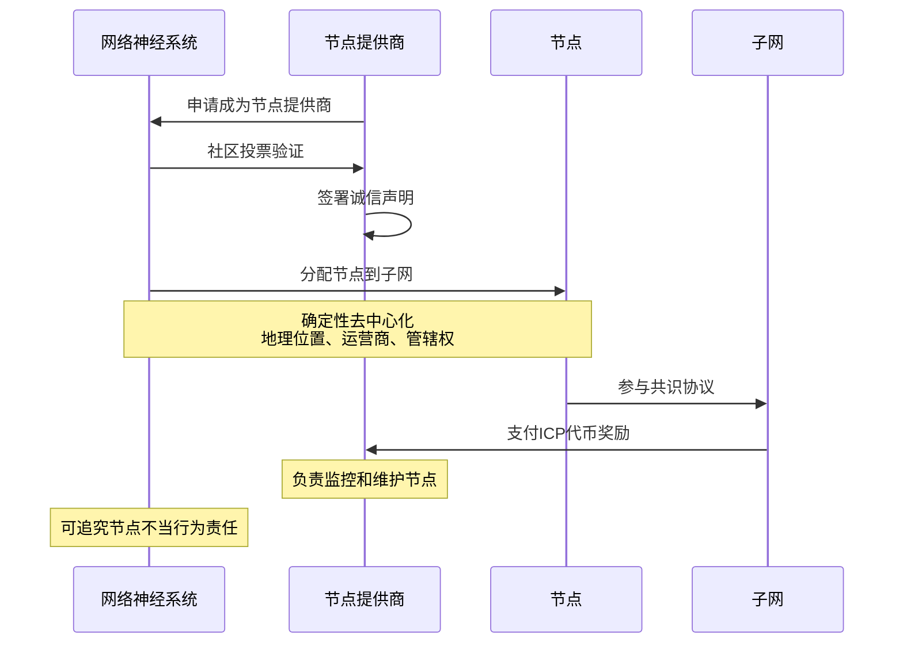
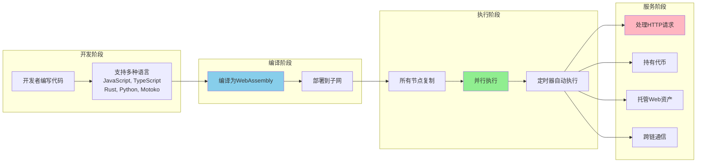
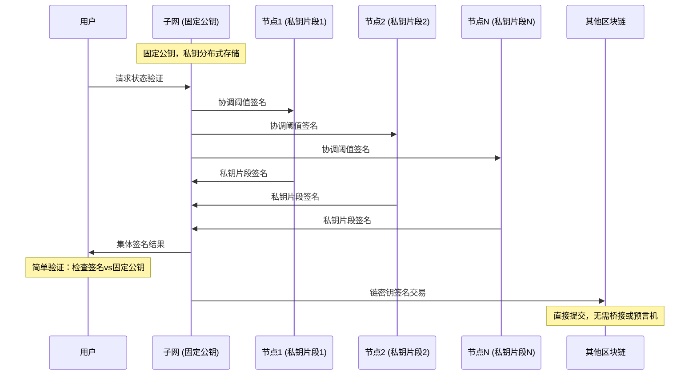
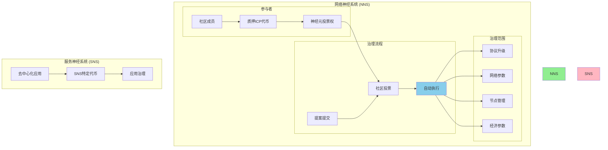
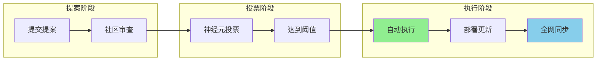

# ICP 网络架构与治理

## 概述

**Internet Computer (ICP) 是第一个"世界计算机"网络。它让您能够在100%去中心化的平台上构建Web应用程序和互联网服务，无需依赖大型科技公司和传统IT基础设施。传统区块链连存储一张手机照片都很困难，而ICP已经完全在链上托管社交网络、多个分类账本、AI等应用。**

ICP旨在为应用程序提供接近原生的性能和可扩展性，同时保持去中心化执行的安全性。ICP上的智能合约可以托管Web资产、持有代币，并为用户提供HTTP请求服务。它们还可以通过安全的HTTP请求与其他区块链上的RPC节点和Web2服务器交互，无缝且安全地与其他生态系统集成。

### ICP网络整体架构

## 子网 (Subnets)

ICP网络由多个称为子网的区块链实例组成。每个子网是一组去中心化节点，它们在彼此之间运行网络的共识算法。它们构建自己的区块链并执行智能合约。子网并行运行。部署在一个子网上的智能合约可以通过消息与另一个子网上的智能合约通信。

### 子网特性与规模分析

### 子网架构详表

| 特性维度 | 小型子网 (13-20节点) | 中型子网 (21-30节点) | 大型子网 (31-40节点) |
|----------|---------------------|---------------------|---------------------|
| **运行成本** | 💰 低成本 | 💰💰 中等成本 | 💰💰💰 高成本 |
| **最终确定时间** | ⚡ 快速 | ⚡⚡ 中等 | ⚡⚡⚡ 较慢 |
| **复制因子** | 🔄 基础复制 | 🔄🔄 中等复制 | 🔄🔄🔄 高度复制 |
| **安全性** | 🛡️ 基础安全 | 🛡️🛡️ 中等安全 | 🛡️🛡️🛡️ 高安全性 |
| **适用场景** | 测试环境、轻量应用 | 中等规模应用 | 关键业务、高价值应用 |

子网具有不同的大小，这决定了在该子网上运行智能合约的成本。子网大小还影响最终确定时间、智能合约的复制因子和安全性。目前，子网包含13到40个地理分布的节点。但是，也可以有本地化子网来支持需要遵守当地法规（GDPR合规等）的应用程序。

## 节点 (Nodes)

每个节点运行称为**副本(replica)**的软件。副本包含节点参与子网所需的协议组件。

### 节点分配与去中心化机制

节点被分配到子网中，以便在运营商、地理位置和管辖权方面最大化去中心化。这被称为**确定性去中心化**。

**节点治理机制：**

- **节点提供商**：拥有和运营节点，负责监控和维护节点
- **奖励机制**：节点提供商因向网络提供计算资源而获得ICP代币作为报酬  
- **准入控制**：节点提供商必须经过网络治理投票，确保硬件符合ICP高标准
- **身份透明**：节点提供商身份为社区所知，必须签署诚信声明
- **责任机制**：如果节点行为不当，节点提供商可能承担责任

## 容器智能合约 (Canister Smart Contracts)

在ICP的语境中，智能合约被称为容器(canisters)。当容器部署到网络时，它被部署到一个子网并在该子网的所有节点上复制。

### 容器工作流程与执行机制

**ICP容器的独特特性：**

1. **多语言支持**：使用WebAssembly作为虚拟机，支持多种编程语言
2. **并行执行**：拥抱可扩展性，容器类似于传统编程中的进程或微服务
3. **自主执行**：容器可以使用定时器调度执行，而不依赖用户发送消息
4. **Web原生**：可以直接托管Web资产和处理HTTP请求
5. **代币管理**：能够持有和管理各种代币

## 链密钥密码学 (Chain-Key Cryptography)

链密钥密码学是一套密码学机制，促进了ICP许多独特功能和能力的实现。

### 阈值签名机制

**链密钥密码学的关键组件：**

1. **阈值签名**：
   - 每个ICP子网有固定的公钥和对应的私钥
   - 私钥从不存储在单个节点上，也从不在任何节点上完整出现
   - 使用阈值密码学将私钥分割成多个秘密份额，分布在所有节点上

2. **集体签名**：
   - 节点可以使用这些秘密份额集体为用户和其他子网签署消息
   - 用户验证变得简单：只需根据固定公钥验证数字签名

3. **链密钥签名**：
   - 允许智能合约签署专门针对其他区块链（如比特币和以太坊）的交易
   - 这些交易直接提交到目标链，无需桥接或预言机来促进通信

## 治理 (Governance)

ICP由一个名为网络神经系统(NNS)的去中心化自治组织(DAO)社区治理。它作为一组在ICP本身上运行的容器来实现。

### ICP治理架构

### 治理机制详解

#### NNS (网络神经系统) 特性

| 治理维度 | 机制设计 | 实际效果 | 独特优势 |
|----------|----------|----------|----------|
| **参与方式** | 质押ICP代币获得投票权 | 💰 持币即可参与 | �� 门槛低，覆盖广 |
| **执行方式** | 自动执行通过的提案 | 🤖 无人工干预 | 🟢 避免硬分叉 |
| **治理范围** | 所有网络运营变更 | 📋 全面覆盖 | 🟢 统一治理 |
| **节点独立** | 治理与节点所有权分离 | 🔄 可独立参与 | 🟢 更大灵活性 |

#### SNS (服务神经系统) 特性

- **设计基础**：基于NNS设计，但针对特定应用
- **代币机制**：社区质押SNS特定代币到神经元
- **治理范围**：投票决定智能合约升级提案
- **应用自治**：实现应用级别的去中心化治理

### 治理流程图

## ICP网络的核心优势

### 技术创新对比分析

| 创新领域 | 传统区块链 | ICP网络 | 突破性优势 |
|----------|------------|---------|------------|
| **存储能力** | ❌ 难以存储大文件 | ✅ 可托管完整应用 | 🚀 Web级别应用 |
| **执行性能** | 🐌 缓慢处理 | ⚡ 接近原生性能 | 🚀 实用性突破 |
| **Web集成** | 🔧 需要桥接 | 🌐 原生Web服务 | 🚀 无缝体验 |
| **治理机制** | 👥 硬分叉风险 | 🤖 自动执行升级 | 🚀 平滑演进 |
| **跨链通信** | 🌉 依赖桥接 | 🔗 链密钥签名 | 🚀 安全直连 |

## 总结

ICP网络通过其创新的架构设计，实现了真正的"世界计算机"愿景：

1. **技术架构**：多子网并行、容器智能合约、链密钥密码学
2. **治理创新**：NNS自动治理、SNS应用自治、无硬分叉升级  
3. **性能突破**：Web级应用托管、接近原生性能、原生跨链能力
4. **生态完整**：从基础设施到应用层的完整解决方案

ICP代表了区块链技术向真正实用化和大规模应用的重要进展，为构建下一代去中心化互联网奠定了技术基础。

---

*参考资料：[Internet Computer Network Architecture](https://internetcomputer.org/docs/building-apps/essentials/network-overview)*
