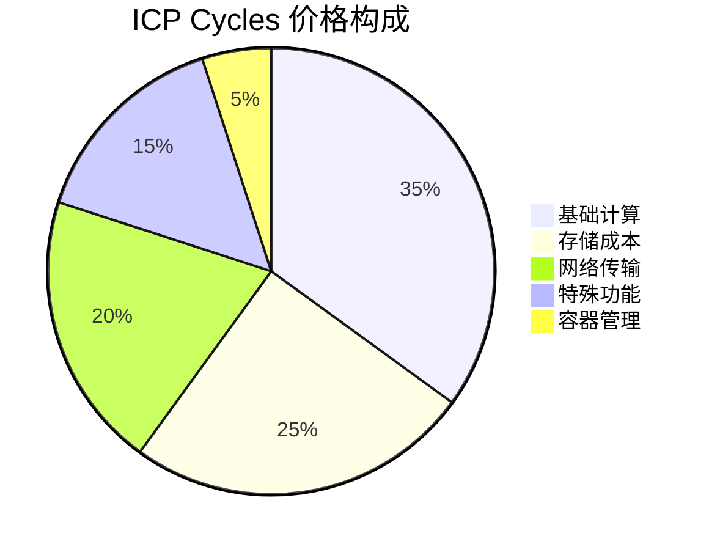
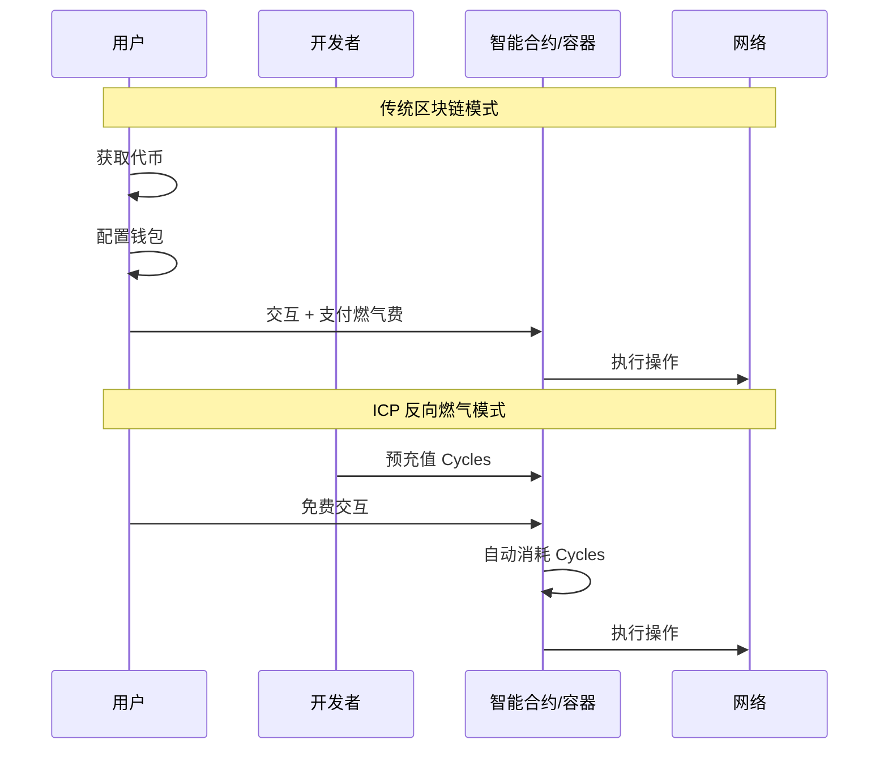
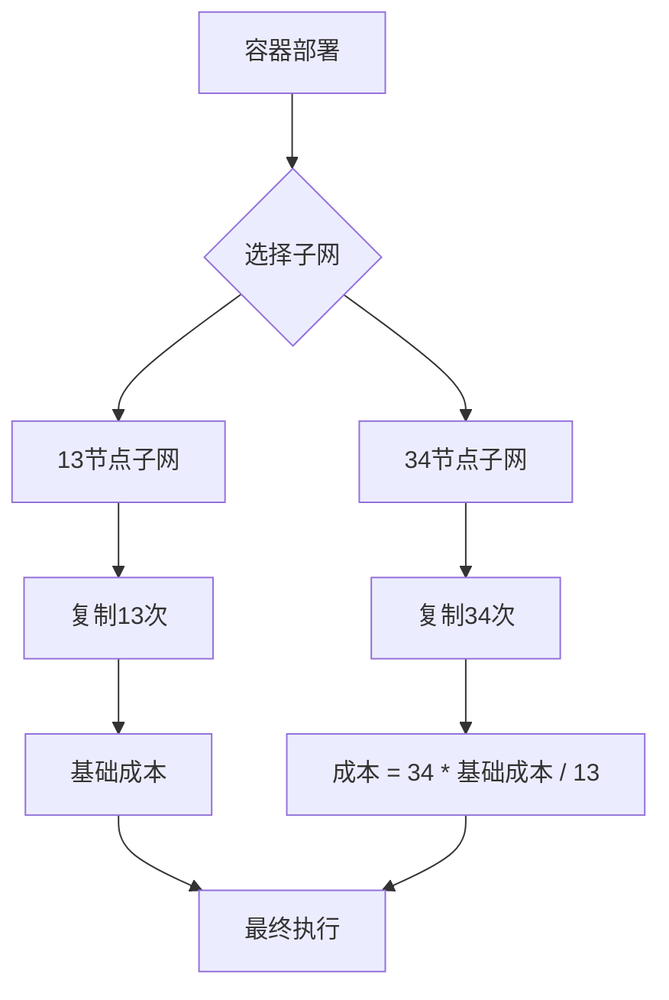
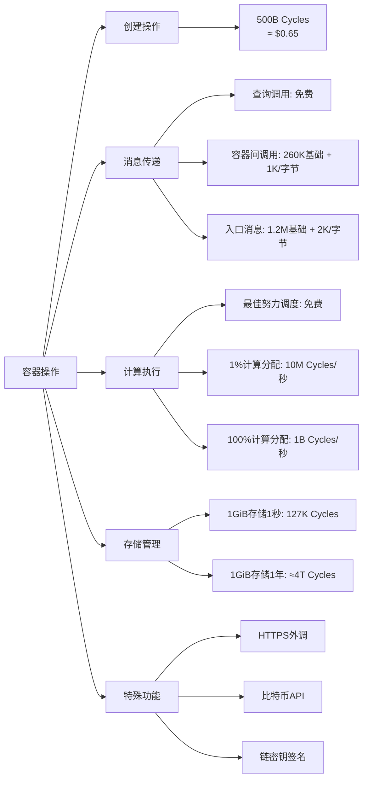
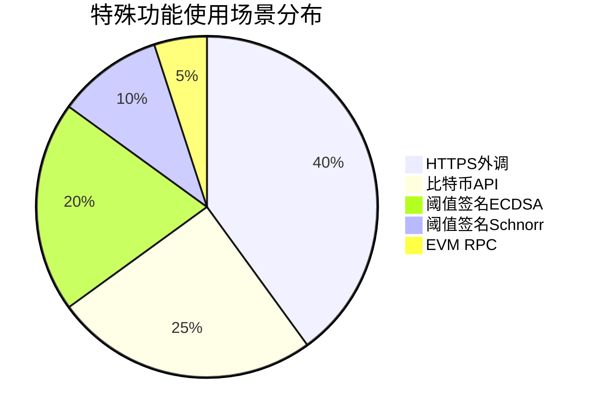
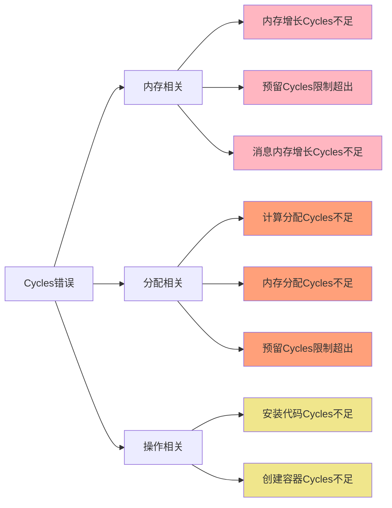
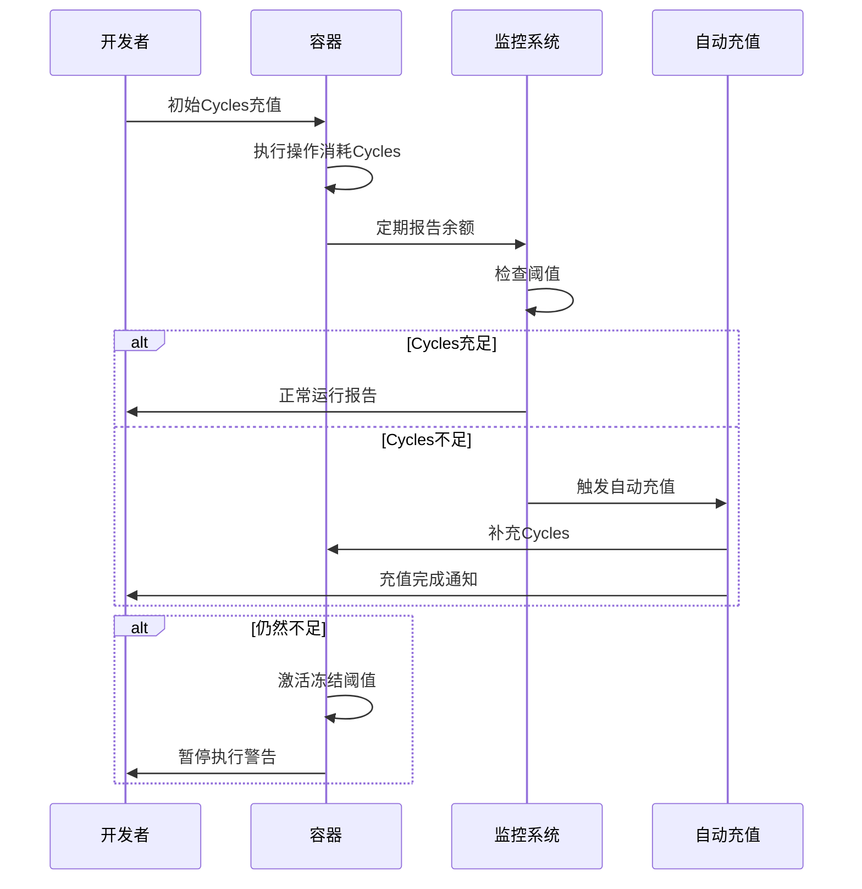

# ICP 费用明细详解

## 概述

在 Internet Computer 网络中，智能容器（Canister）通过消耗 **Cycles** 来执行各种操作，包括方法执行、消息处理、数据存储和特殊功能使用。开发者需要将 ICP 代币转换为 Cycles 来为应用程序付费。

### Cycles 价格机制



**定价标准：**
- 1 万亿 Cycles = 1 XDR（特别提款权）
- 截至 2025年5月22日：1 XDR = $1.35 USD
- USD/XDR 汇率可能波动

## 反向燃气模型

### 传统区块链 vs ICP 费用模型对比



### 反向燃气模型特点

**优势：**
- 用户体验类似 Web2，无需钱包配置
- 无需为每次交互签名和支付
- 降低用户使用门槛

**挑战：**
- 开发者需要持续维护 Cycles 余额
- 容器 Cycles 耗尽会被网络移除
- 需要设置冻结阈值或自动充值机制

## 子网复制机制

### 不同子网规模的成本计算



**成本规则：**
- 13节点子网：基础成本计算
- 34节点子网：成本系数为 34/13 ≈ 2.6倍


## 容器操作与资源消耗

### 主要操作类型及费用结构



### 消息传递费用详解

| 消息类型 | 基础费用 | 额外费用 | 付费方 |
|---------|---------|----------|--------|
| 查询调用 | 0 Cycles | 免费 | - |
| 容器间调用 | 260K Cycles | +1K Cycles/字节 | 发送方容器 |
| 入口消息 | 1.2M Cycles | +2K Cycles/字节 | 接收方容器 |

### 计算分配优势对比

```mermaid
gantt
    title 不同计算分配的调度保证
    dateFormat X
    axisFormat %s
    
    section 最佳努力
    随机调度           :active, effort, 0, 100
    
    section 1%分配
    每100轮保证调度     :crit, alloc1, 0, 100
    
    section 2%分配  
    每50轮保证调度      :alloc2, 0, 100
    
    section 50%分配
    每2轮保证调度       :alloc50, 0, 100
    
    section 100%分配
    每轮都保证调度      :alloc100, 0, 100
```



**计算分配定价：**
- 子网总可分配计算容量：299%
- 1% 计算分配费用：10M Cycles/秒（约 $0.0000135 USD）
- 100% 计算分配费用：1B Cycles/秒


## 存储资源管理

### 存储预留机制

```mermaid
flowchart TD
    A[存储分配请求] --> B{子网使用率}
    B -->|< 450GiB| C[预留 Cycles = 0]
    B -->|> 450GiB| D[线性增长预留]
    
    D --> E[最高10年费用<br/>@1TiB容量]
    
    C --> F[正常分配]
    E --> F
    
    F --> G{设置内存分配?}
    G -->|是| H[固定预留，无额外费用]
    G -->|否| I[动态预留，可能增加]
    
    style C fill:#90EE90
    style D fill:#FFB6C1
    style H fill:#87CEEB
```

### 存储成本计算

| 存储量 | 时间 | 成本 | 美元等值 |
|--------|------|------|----------|
| 1 GiB | 1 秒 | 127K Cycles | ~$0.000171 |
| 1 GiB | 1 年 | ~4T Cycles | ~$5.35 |
| 1 TiB | 1 年 | ~4,096T Cycles | ~$5,478 |

### 触发存储分配的操作

**Wasm 相关：**
- `memory.grow` 指令
- 安装新容器 Wasm
- 上传 Wasm 代码块

**系统 API：**
- `ic0.stable_grow()`
- `ic0.stable64_grow()`

**设置相关：**
- 增加 `memory_allocation`
- 创建和加载容器快照

## 特殊功能费用

### 高级网络功能成本分析



**特殊功能列表：**

1. **HTTPS 外调**
   - 与外部 Web API 通信
   - 基于请求大小和响应计费

2. **比特币 API**
   - 直接与比特币网络交互
   - 支持比特币交易和查询

3. **链密钥签名 API**
   - 阈值 ECDSA 签名
   - 阈值 Schnorr 签名
   - 提供去中心化密钥管理

4. **EVM RPC 容器**
   - 与以太坊兼容网络交互
   - 支持智能合约调用


## 常见 Cycles 相关错误

### 错误类型分析



### 常见错误解决方案

| 错误类型 | 原因 | 解决方案 |
|----------|------|----------|
| 内存增长Cycles不足 | 存储扩展时余额不够 | 增加Cycles余额或优化存储使用 |
| 预留Cycles限制超出 | 子网使用率高时分配限制 | 设置 `reserved_cycles_limit=0` 或等待使用率降低 |
| 计算分配Cycles不足 | 请求的计算资源超出余额 | 降低计算分配百分比或充值 |
| 创建容器Cycles不足 | 创建新容器时余额不够 | 确保至少有 500B Cycles |

## 资源管理最佳实践

### Cycles 生命周期管理



### 成本优化策略

**1. 选择合适的子网**
- 13节点子网：适合成本敏感应用
- 34节点子网：适合高可用性需求

**2. 计算资源优化**
- 评估是否真正需要计算分配
- 从低百分比开始，根据需要调整

**3. 存储管理**
- 设置合理的 `memory_allocation` 避免频繁预留
- 定期清理不必要的数据

**4. 特殊功能使用**
- 批量处理 HTTPS 外调
- 缓存重复的外部数据请求

### 监控和管理工具

**监控工具：**
- 容器 Cycles 余额检查
- Motoko Cycles 管理库
- 第三方监控服务

**自动化工具：**
- CycleOps：自动充值管理
- 自定义脚本：余额监控和告警

**成本分析：**
- [价格计算器](https://internetcomputer.org) 用于项目成本估算
- `countInstructions` 函数用于性能分析

## 总结

ICP 的反向燃气模型代表了区块链用户体验的重大创新，但也对开发者提出了新的挑战。通过深入理解费用结构和采用最佳实践，可以在提供优秀用户体验的同时有效控制成本。

### 关键要点

1. **成本预算**：根据预期使用量和功能需求制定 Cycles 预算
2. **监控体系**：建立实时余额监控和预警机制
3. **自动化管理**：使用工具实现自动充值和阈值管理
4. **优化策略**：选择合适的子网、计算分配和存储方案
5. **风险控制**：设置冻结阈值防止意外的 Cycles 耗尽

### 对比传统区块链

| 特性 | 传统区块链 | ICP |
|------|------------|-----|
| 用户体验 | 需要燃气费 | 免费使用 |
| 开发者责任 | 低 | 高 |
| 成本可预测性 | 低 | 高 |
| 扩展性 | 限制多 | 更灵活 |

ICP 的费用模型虽然增加了开发者的责任，但为构建真正的去中心化 Web 应用提供了可能性，使得区块链应用能够提供与传统 Web 应用相媲美的用户体验。

---

*参考文档：[ICP Fee Breakdown - Internet Computer Documentation](https://internetcomputer.org/docs/building-apps/essentials/gas-cost)*

*最后更新：2025年1月*

