# ICP 质押治理与收益机制详解

## 概述

ICP 网络采用独特的**神经元质押系统**，允许 ICP 代币持有者通过质押参与网络治理并获得收益。与传统 PoS 网络不同，ICP 的质押收益不仅来自网络安全维护，更重要的是来自**积极参与治理决策**。

### ICP 质押生态系统

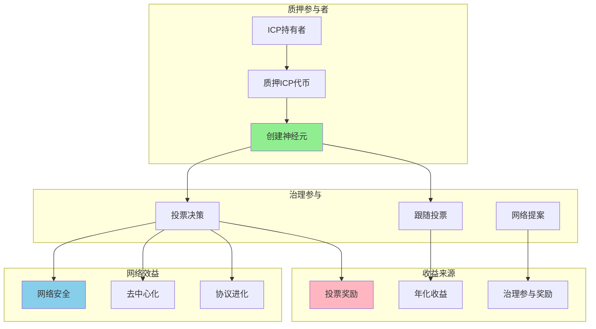

## 神经元质押机制

### 神经元创建与管理

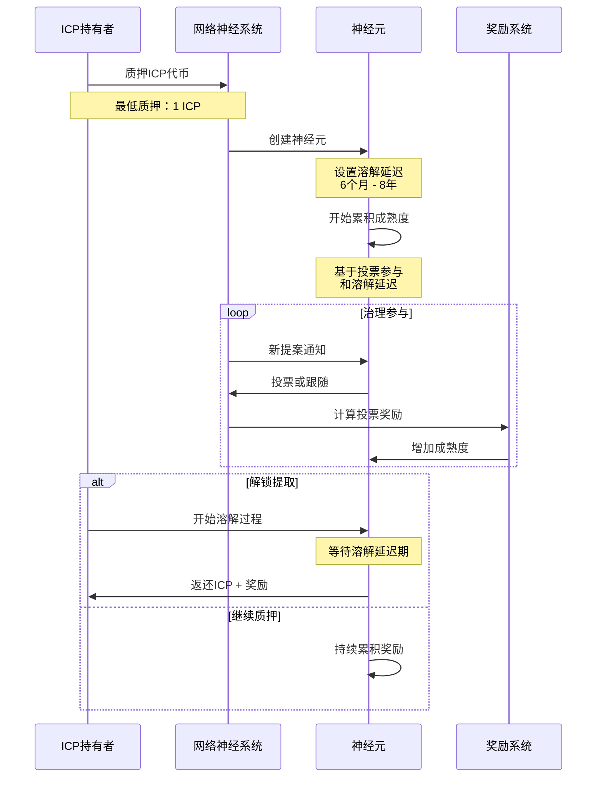

### 神经元参数详解

| 参数 | 范围 | 影响 | 推荐设置 |
|------|------|------|----------|
| **质押数量** | 1 ICP - 无上限 | 投票权重 | 根据个人能力 |
| **溶解延迟** | 6个月 - 8年 | 收益倍数 | 长期：4-8年 |
| **年龄奖励** | 0 - 4年 | 额外收益 | 持续持有 |
| **跟随设置** | 0 - 多个专家 | 自动投票 | 选择可信专家 |

## 质押收益机制

### 收益计算公式

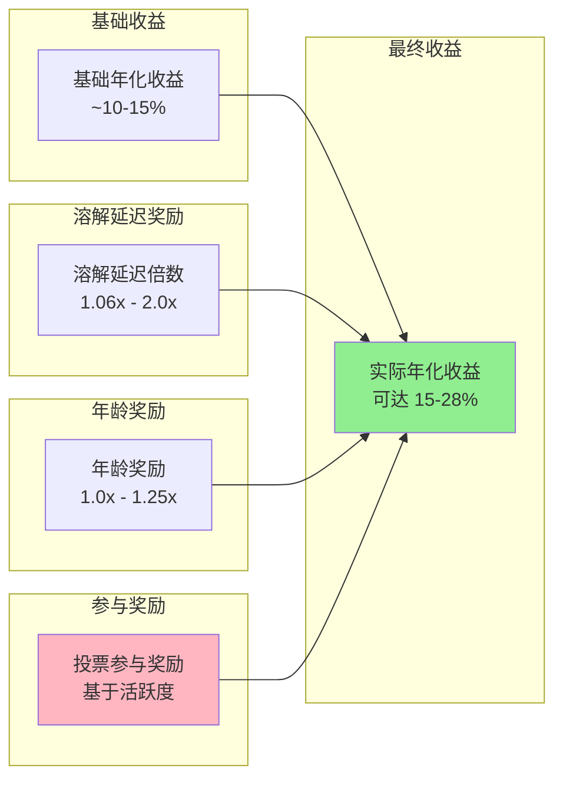

### 溶解延迟与收益关系

```mermaid
gantt
    title 溶解延迟期对收益倍数的影响
    dateFormat X
    axisFormat %s
    
    section 6个月
    1.06倍收益        :active, delay6m, 0, 20
    
    section 1年
    1.25倍收益        :delay1y, 0, 40
    
    section 2年
    1.5倍收益         :delay2y, 0, 60
    
    section 4年
    1.75倍收益        :delay4y, 0, 80
    
    section 8年
    2.0倍收益         :crit, delay8y, 0, 100
```

**溶解延迟收益倍数表：**

| 溶解延迟 | 收益倍数 | 年化收益率 | 风险评估 |
|----------|----------|------------|----------|
| 6个月 | 1.06x | ~10.6% | 💚 低风险 |
| 1年 | 1.25x | ~12.5% | 💚 低风险 |
| 2年 | 1.5x | ~15% | 💛 中等风险 |
| 4年 | 1.75x | ~17.5% | 🧡 较高风险 |
| 8年 | 2.0x | ~20%+ | 🔴 高风险 |

## 治理参与方式

### 投票类型与奖励

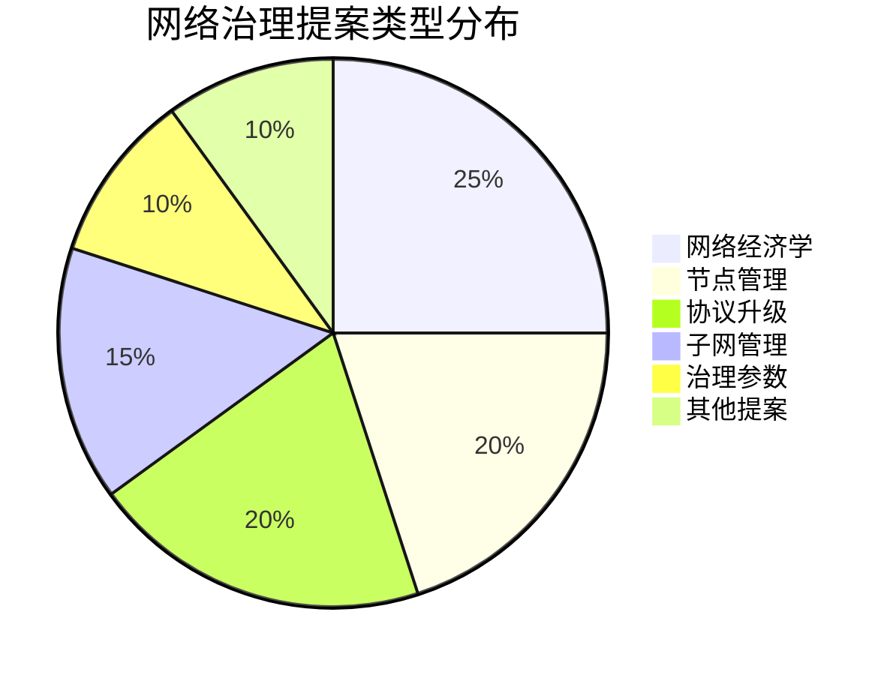

### 治理参与策略

#### 1. 主动投票策略

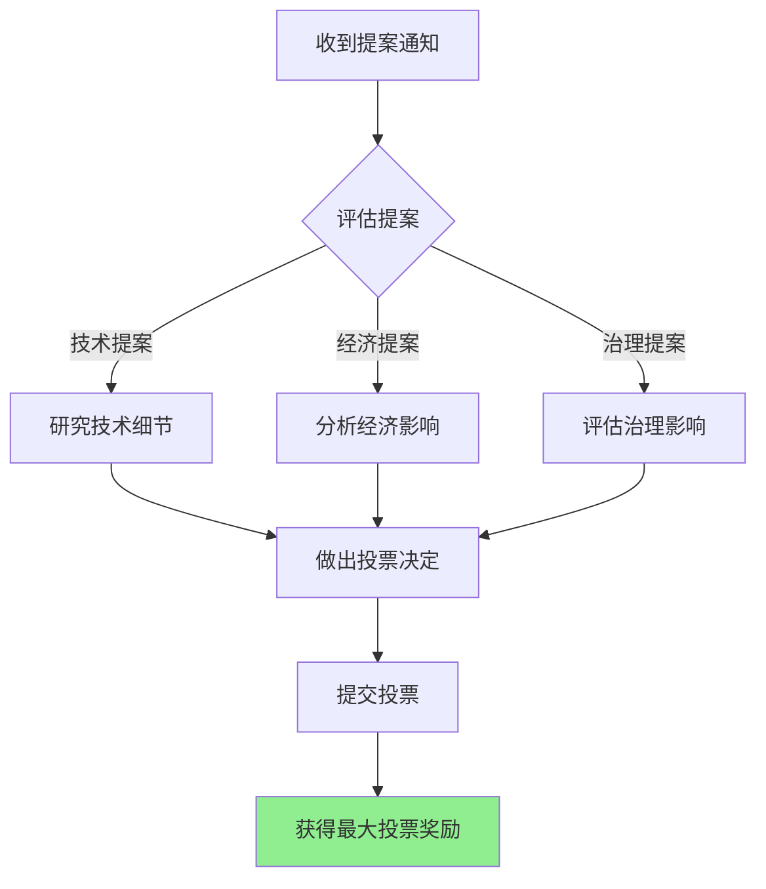

**主动投票优势：**
- 💰 获得最高投票奖励
- 🗳️ 直接影响网络发展
- 🎯 精准控制投票方向
- 📈 最大化治理参与收益

#### 2. 跟随投票策略

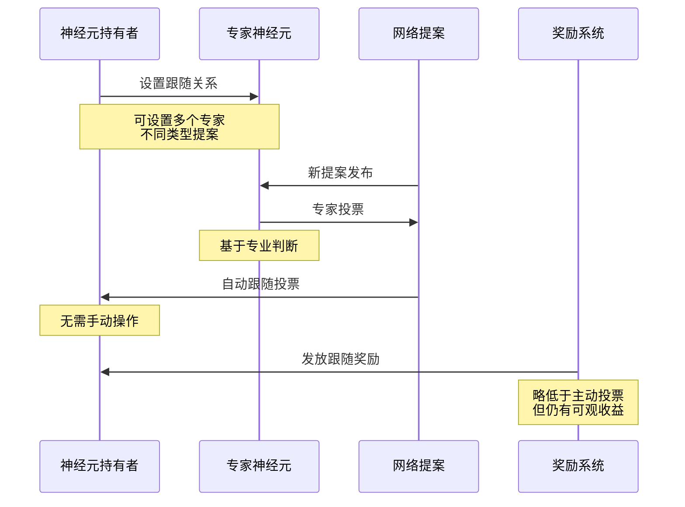

**跟随投票优势：**
- ⏰ 节省时间和精力
- 🎓 借助专家专业判断
- 🔄 自动化参与治理
- 💰 获得稳定收益

### 专家神经元选择指南

| 选择标准 | 重要性 | 评估方法 |
|----------|--------|----------|
| **投票历史** | ⭐⭐⭐⭐⭐ | 查看历史投票记录和结果 |
| **专业领域** | ⭐⭐⭐⭐ | 匹配提案类型和专家背景 |
| **社区声誉** | ⭐⭐⭐⭐ | 社区认可度和透明度 |
| **投票频率** | ⭐⭐⭐ | 积极参与程度 |
| **决策质量** | ⭐⭐⭐⭐⭐ | 投票决策的长期影响 |

## 验证治理参与详细步骤

### 步骤1：准备阶段

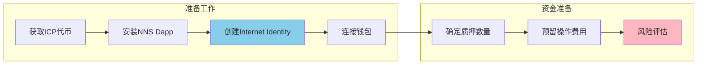

### 步骤2：创建神经元

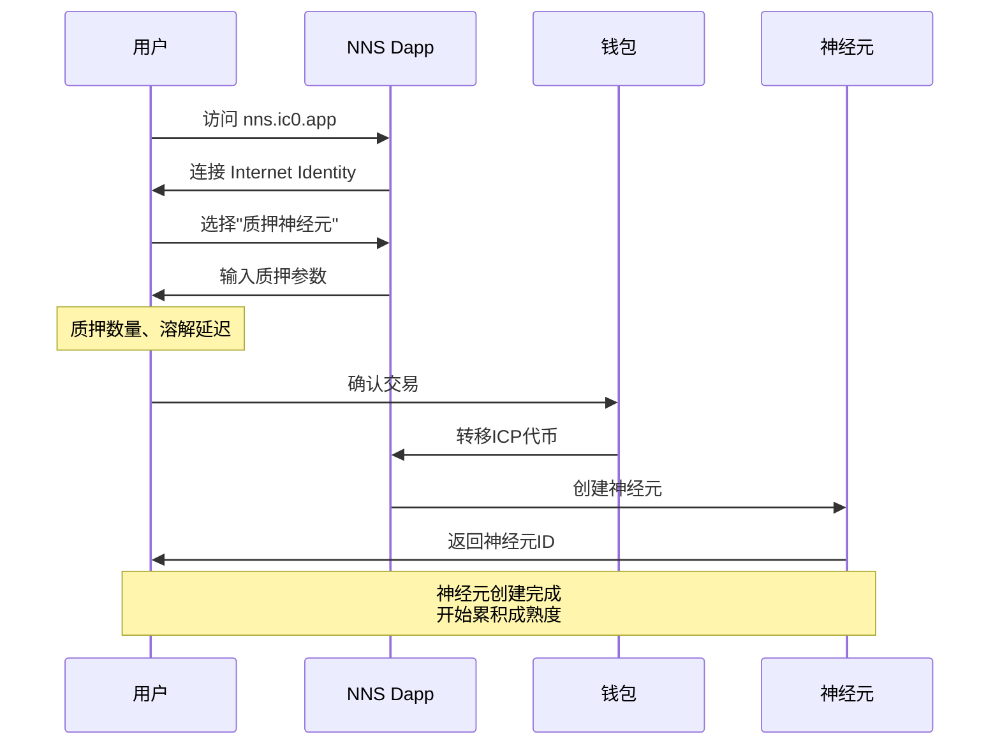

### 步骤3：配置治理参与

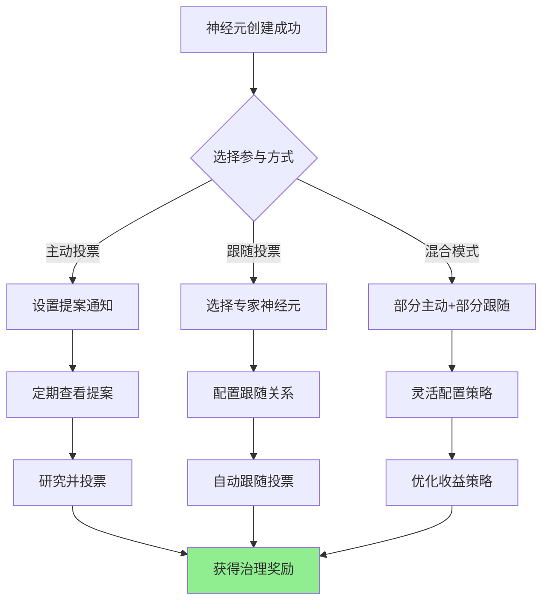

## 收益优化策略

### 长期 vs 短期策略对比

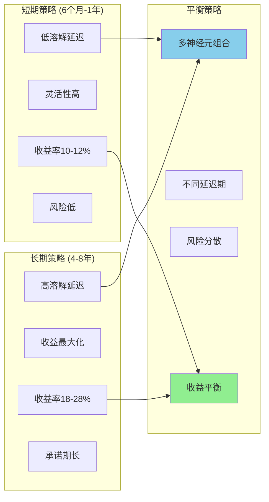

### 多神经元组合策略

| 神经元类型 | 质押比例 | 溶解延迟 | 预期收益 | 风险级别 |
|------------|----------|----------|----------|----------|
| **流动性神经元** | 20% | 6个月 | ~10% | 💚 低 |
| **平衡神经元** | 50% | 2年 | ~15% | 💛 中 |
| **长期神经元** | 30% | 6年 | ~22% | 🧡 高 |
| **总体组合** | 100% | 混合 | ~16% | 💛 中等 |

## 风险管理与注意事项

### 主要风险类型

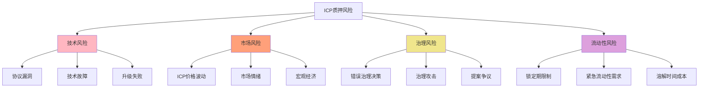

### 风险缓解策略

**1. 技术风险缓解**
- 🔍 持续关注协议更新
- 📊 监控网络健康状态
- 🛡️ 使用官方工具和接口

**2. 市场风险缓解**
- 💰 分散投资组合
- 📈 长期价值投资思维
- 🎯 定期再平衡策略

**3. 治理风险缓解**
- 📚 深入研究提案内容
- 🤝 跟随可信专家神经元
- 🗳️ 积极参与社区讨论

**4. 流动性风险缓解**
- 💧 保留部分短期神经元
- 🔄 阶梯式溶解延迟设置
- 💡 合理规划资金需求

## 实际操作指南

### NNS Dapp 使用教程

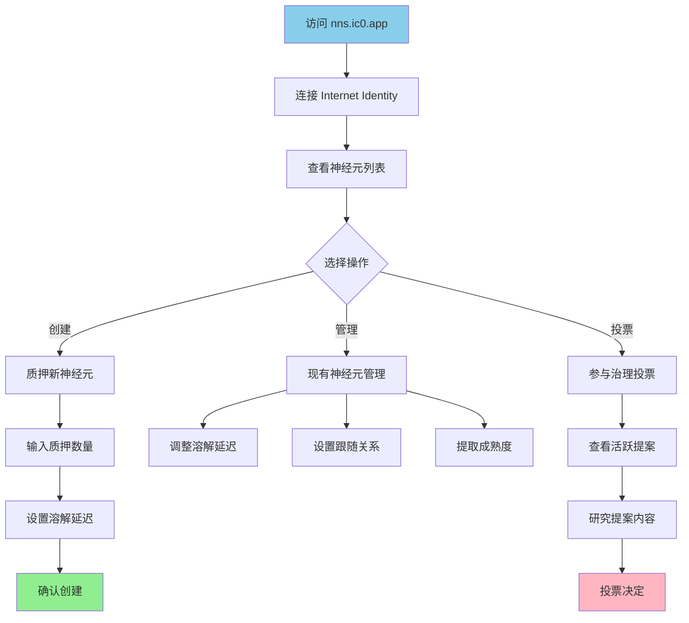

### 收益监控与管理

**定期检查项目：**
- 📊 神经元成熟度增长
- 🗳️ 投票参与率统计
- 💰 实际收益率计算
- 🔄 跟随关系效果评估

**优化建议：**
- 📈 根据市场调整策略
- 🎯 优化专家跟随选择
- 💡 考虑增加或减少质押
- 🔄 调整溶解延迟设置

## 总结

ICP 的质押治理机制代表了区块链治理的重要创新，通过将质押收益与治理参与紧密结合，创造了一个既能获得经济收益又能推动网络发展的生态系统。

### 关键收益要点

1. **收益来源多样化**：投票奖励 + 溶解延迟奖励 + 年龄奖励
2. **参与门槛低**：最低1 ICP即可开始质押
3. **收益率可观**：年化收益可达15-28%
4. **治理影响力**：直接参与网络重大决策

### 最佳实践建议

1. **新手策略**：从短期神经元开始，逐步了解治理机制
2. **进阶策略**：采用多神经元组合，平衡收益与风险
3. **专家策略**：主动参与治理，最大化收益和影响力
4. **风险管理**：分散投资，合理规划流动性需求

ICP 的质押治理机制不仅为持有者提供了可观的经济收益，更重要的是创造了一个真正去中心化、社区驱动的网络治理模式，为区块链行业的发展提供了宝贵的实践经验。

---

*参考资料：*
- *[ICP网络神经系统](https://internetcomputer.org/nns)*
- *[神经元质押指南](https://internetcomputer.org/docs/current/tokenomics/nns/neurons-fund)*
- *[治理参与教程](https://internetcomputer.org/docs/current/tokenomics/nns/governance)*

*最后更新：2025年1月* 